<!-- README.md is generated from README.Rmd. Please edit that file -->
<!-- badges: start -->

[](https://mybinder.org/v2/gh/nithecs-biomath/RBasicPack/master?urlpath=rstudio)
[](https://lifecycle.r-lib.org/articles/stages.html#stable)
[](https://github.com/macSands/dissmapr/actions/workflows/test-coverage.yaml)
[](https://app.codecov.io/gh/macSands/dissmapr)
[](https://github.com/macSands/dissmapr/actions/workflows/R-CMD-check.yaml)

<!-- badges: end -->

------------------------------------------------------------------------

# `dissmapr`

## A Novel Framework for Automated Compositional Dissimilarity and Biodiversity Turnover Analysis

------------------------------------------------------------------------

## Introduction

`dissmapr` is an R package for analysing compositional dissimilarity and
biodiversity turnover across spatial gradients. It provides scalable,
modular workflows that integrate species occurrence, environmental data,
and multi-site compositional turnover metrics to quantify and predict
biodiversity patterns. A core feature is the use of zeta diversity,
which extends beyond pairwise comparisons to capture shared species
across multiple sites - offering deeper insight into community assembly,
turnover, and connectivity, for both rare and common species. By
incorporating different regression methods within the framework of
Multi-Site Generalised Dissimilarity Modelling (MS-GDM), `dissmapr`
enables robust mapping, bioregional classification, and scenario-based
forecasting. Designed for flexibility and reproducibility, it supports
biodiversity monitoring and conservation planning at landscape to
regional scales.

------------------------------------------------------------------------

## Step-by-Step Workflow

`dissmapr` implements a structured, reproducible workflow for analysing
biodiversity patterns and delineating bioregions. Each function aligns
with a specific step in the workflow, guiding users from data
acquisition to predictive mapping. The workflow begins with sourcing
species occurrence and georeferenced environmental data, followed by
data formatting and calculation of compositional turnover using zeta
diversity metrics (via the `zetadiv` package). Multi-Site Generalized
Dissimilarity Modelling (MS-GDM) is then applied to model and predict
dissimilarity across landscapes. As part of the Dissimilarity Cube in
the [Biodiversity Building Blocks for Policy](https://b-cubed.eu/)
project, the outputs and predictions from MS-GDM are classified into
spatial clusters of species composition, representing distinct
bioregions. The workflow also supports the integration of historical and
future climate data to assess shifts in biodiversity and detect
emerging, shifting, or dissolving bioregions under global change. This
step-by-step structure, mirrored in the accompanying tutorial sections,
promotes accessibility, transparency, and ecological insight at multiple
spatial and temporal scales.

------------------------------------------------------------------------

## 1. SETUP `dissmapr`

### 1.1. Install and load `dissmapr`

Install and load the `dissmapr` package from GitHub, ensuring all
functions are available for use in the workflow.

``` r
# install remotes if needed
# install.packages("remotes")
remotes::install_github("macSands/dissmapr")
```

``` r
# Ensure the package is loaded when knitting
library(dissmapr)

# Make sure all the functions are loaded
devtools::load_all()
```

------------------------------------------------------------------------

### 1.2. Load other R libraries

Load core libraries for spatial processing, biodiversity modelling, and
visualization required across the `dissmapr` analysis pipeline.

``` r
# Load necessary libraries
library(httr)       # HTTP client  
library(geodata)    # Download geographic data  
library(data.table) # Fast large-table operations  
library(dplyr)      # Data manipulation verbs  
library(tidyr)      # Tidy data reshaping  
library(zoo)        # Time series utilities  
library(sf)         # Vector spatial data  
library(terra)      # Raster spatial operations  
library(tidyterra)  # supplies geom_spatraster()
library(zetadiv)    # Multi-site dissimilarity modelling
library(ggplot2)    # Grammar of graphics  
library(viridis)    # Perceptual color scales  
library(patchwork)  # Sequentially build up plots on one page
library(mclust)     # Clustering, Classification, and Density Estimation
library(zen4R)      # client for the Zenodo REST API
library(purrr)      # tidyverse functional-programming toolkit
library(RColorBrewer) # set of colour palettes
# library(clue)
```

------------------------------------------------------------------------

### 1.3. Get species occurrence records using `get_occurrence_data()`

To contextualise the following steps of the workflow, we use South
African butterfly data accessed from GBIF ([DOI:
10.15468/dl.jh6maj](https://www.gbif.org/occurrence/download/0006880-241024112534372)),
as a demonstration case. Ultimately, the choice for the Area of Interest
(AoI) and taxa is user-specific. This section demonstrates how to
automate the retrieval and pre-processing of biodiversity occurrence
data from a GBIF query (stored locally as a `.csv` file), however the
same workflow can ingest other sources as well (see the
`get_occurrence_data()` documentation for details). Data inputs
currently supported include:

- **Local** databases or `.csv` files
- **URLs** or `.zip` files from the Global Biodiversity Information
  Facility (GBIF)
- Future inclusion of **GBIF species occurrence cubes**. Read the
  [species occurrence cubes in
  GBIF](https://www.gbif.org/occurrence-cubes) documentation for full
  details on creating, customizing and submitting queries for occurrence
  cubes. Read the [b-cubed](https://b-cubed.eu/) documentation on
  [specification for species occurrence cubes and their
  production](https://docs.b-cubed.eu/guides/occurrence-cube/).

`get_occurrence_data()` then organises the records by the chosen
taxonomic scope and region, returning presence–absence and/or abundance
matrices that summarise species co-occurrence records with latitude and
longitude coordinates.

``` r
bfly_data = get_occurrence_data(
  data        = system.file("extdata", "gbif_butterflies.csv", package = "dissmapr"),
  source_type = 'local_csv',
  sep         = '\t'
)

# Check results but only a subset of columns to fit in console
dim(bfly_data)
#> [1] 81825    52
str(bfly_data[,c(51,52,22,23,1,14,16,17,30)]) 
#> 'data.frame':    81825 obs. of  9 variables:
#>  $ site_id               : int  1 2 3 1 4 5 5 5 5 5 ...
#>  $ pa                    : num  1 1 1 1 1 1 1 1 1 1 ...
#>  $ y                     : num  -34.4 -34 -33.9 -34.4 -34.4 ...
#>  $ x                     : num  19.2 18.8 18.4 19.2 18.5 ...
#>  $ gbifID                : num  9.23e+08 9.23e+08 9.23e+08 9.22e+08 9.22e+08 ...
#>  $ verbatimScientificName: chr  "Pieris brassicae" "Pieris brassicae" "Papilio demodocus subsp. demodocus" "Mylothris agathina subsp. agathina" ...
#>  $ countryCode           : chr  "ZA" "ZA" "ZA" "ZA" ...
#>  $ locality              : chr  "Hermanus" "Polkadraai Road" "Signal Hill" "Hermanus" ...
#>  $ eventDate             : chr  "2012-10-13T00:00" "2012-11-01T00:00" "2012-10-31T00:00" "2012-10-13T00:00" ...
head(bfly_data[,c(51,52,22,23,1,14,16,17,30)])
#>   site_id pa         y        x    gbifID             verbatimScientificName
#> 1       1  1 -34.42086 19.24410 923051749                   Pieris brassicae
#> 2       2  1 -33.96044 18.75564 922985630                   Pieris brassicae
#> 3       3  1 -33.91651 18.40321 922619348 Papilio demodocus subsp. demodocus
#> 4       1  1 -34.42086 19.24410 922426210 Mylothris agathina subsp. agathina
#> 5       4  1 -34.35024 18.47488 921650584                  Eutricha capensis
#> 6       5  1 -33.58570 25.65097 921485695            Drepanogynis bifasciata
#>   countryCode                                          locality
#> 1          ZA                                          Hermanus
#> 2          ZA                                   Polkadraai Road
#> 3          ZA                                       Signal Hill
#> 4          ZA                                          Hermanus
#> 5          ZA Cape of Good Hope / Cape Point Area, South Africa
#> 6          ZA                             Kudu Ridge Game Lodge
#>          eventDate
#> 1 2012-10-13T00:00
#> 2 2012-11-01T00:00
#> 3 2012-10-31T00:00
#> 4 2012-10-13T00:00
#> 5 2012-10-30T00:00
#> 6 2012-10-23T00:00
```

------------------------------------------------------------------------

### 1.4. Format data using `format_df()`

Use `format_df()` to *standardise and reshape* raw biodiversity tables
into the *long* or *wide* format required by later `dissmapr` steps.
Importantly, this function does not alter the spatial resolution of the
original observations - it simply tidies the data by automatically
identifying key columns (e.g., coordinates, species, and values),
assigning unique site IDs (`site_id`), renaming or removing columns, and
reformatting the data for analysis. Outputs include a cleaned `site_obs`
dataset and `site_spp` matrix for further processing:

- **site_obs**: Simplified table with unique `site_id`, `x`, `y`,
  `species` and `value` records (long format).
- **site_spp**: Site-by-species matrix for biodiversity assessments
  (wide format).

**Format data into long (`site_obs`) and wide (`site_spp`) formats**

``` r
bfly_result = format_df(
  data        = bfly_data, # A `data.frame` of biodiversity records
  species_col = 'verbatimScientificName', # Name of species column (required for `"long"`)
  value_col   = 'pa', # Name of value column (e.g. presence/abundance; for `"long"`)
  extra_cols  = NULL, # Character vector of other columns to keep
  format      = 'long' # Either`"long"` or `"wide"`. If `NULL`, inferred from `species_col` & `value_col`
)

# Check `bfly_result` structure
str(bfly_result, max.level = 1)
#> List of 2
#>  $ site_obs:'data.frame':    79953 obs. of  5 variables:
#>  $ site_spp: tibble [56,090 × 2,871] (S3: tbl_df/tbl/data.frame)

# Optional: Create new objects from list items
site_obs = bfly_result$site_obs
site_spp = bfly_result$site_spp

# Check results
dim(site_obs)
#> [1] 79953     5
head(site_obs)
#>   site_id        x         y                            species value
#> 1       1 19.24410 -34.42086                   Pieris brassicae     1
#> 2       2 18.75564 -33.96044                   Pieris brassicae     1
#> 3       3 18.40321 -33.91651 Papilio demodocus subsp. demodocus     1
#> 4       1 19.24410 -34.42086 Mylothris agathina subsp. agathina     1
#> 5       4 18.47488 -34.35024                  Eutricha capensis     1
#> 6       5 25.65097 -33.58570            Drepanogynis bifasciata     1

dim(site_spp)
#> [1] 56090  2871
head(site_spp[,1:6])
#> # A tibble: 6 × 6
#>   site_id     x     y `Mylothris agathina subsp. agathina` `Pieris brassicae`
#>     <int> <dbl> <dbl>                                <dbl>              <dbl>
#> 1       1  19.2 -34.4                                    1                  1
#> 2       2  18.8 -34.0                                    0                  1
#> 3       3  18.4 -33.9                                    0                  0
#> 4       4  18.5 -34.4                                    0                  0
#> 5       5  25.7 -33.6                                    0                  0
#> 6       6  22.2 -33.6                                    0                  0
#> # ℹ 1 more variable: `Tarucus thespis` <dbl>

#### Get parameters from processed data to use later
# Number of species
(n_sp = dim(site_spp)[2] - 3)
#> [1] 2868

# Species names
sp_cols = names(site_spp)[-c(1:3)]
sp_cols[1:10]
#>  [1] "Mylothris agathina subsp. agathina" "Pieris brassicae"                  
#>  [3] "Tarucus thespis"                    "Acraea horta"                      
#>  [5] "Danaus chrysippus"                  "Papilio demodocus subsp. demodocus"
#>  [7] "Eutricha capensis"                  "Mesocelis monticola"               
#>  [9] "Vanessa cardui"                     "Cuneisigna obstans"
```

------------------------------------------------------------------------

## 2. USER-DEFINED REGION AND RESOLUTION

### 2.1. Define area of interest and grid resolution

Defining the geographic extent and an analysis grid early ensures that
all subsequent data extraction, aggregation, and visualisation tasks are
carried out within a consistent spatial framework. In this vignette we:

1.  **Load the national boundary of South Africa** to set our area of
    interest (AoI).
2.  **Select a working resolution** of 0.5° (≈ 55 km) to balance spatial
    detail with computational cost.
3.  **Convert the AoI to a `terra` vector** so that raster operations
    run efficiently.
4.  **Create a blank raster template** using the chosen resolution and
    the AoI’s CRS (Coordinate Reference System).
5.  **Populate the raster with placeholder values** (here simply 1).
6.  **Mask the raster to the AoI** so that only cells whose centroids
    fall within South Africa remain.

``` r
# 1. Load the national boundary 
# The shapefile is shipped with the package for full reproducibility.
rsa = sf::st_read(system.file("extdata", "rsa.shp", package = "dissmapr"))
#> Reading layer `rsa' from data source 
#>   `D:\Methods\R\myR_Packages\myCompletePks\dissmapr\inst\extdata\rsa.shp' 
#>   using driver `ESRI Shapefile'
#> Simple feature collection with 1 feature and 1 field
#> Geometry type: POLYGON
#> Dimension:     XY
#> Bounding box:  xmin: 16.45802 ymin: -34.83514 xmax: 32.89125 ymax: -22.12661
#> Geodetic CRS:  WGS 84

# 2. Choose a working resolution 
# A 0.5‑degree cell size strikes a balance between computational load and
# the spatial resolution at which national‑level biodiversity patterns remain
# interpretable.
res = 0.5   # decimal degrees° (≈ 55 km at the equator)

# 3. Convert the AoI to a 'terra' vector 
# 'terra' supports fast raster operations; converting now avoids repeated
# coercion later.
rsa_vect = terra::vect(rsa)

# 4. Initialise a blank raster template 
# The template inherits the AoI’s coordinate reference system (CRS) and is
# discretised into equally‑sized cells according to the resolution chosen.
grid = terra::rast(rsa_vect, resolution = res, crs = terra::crs(rsa_vect))

# 5. Populate the raster with placeholder values 
# We simply assign the value 1 to every cell; the values themselves are
# irrelevant at this stage—the grid’s geometry is what matters.
values(grid) = 1

# 6. Clip the raster to the AoI 
# Any cells whose centroids fall outside the boundary are set to NA, thereby
# restricting subsequent computations to the AoI only.
grid_masked = terra::mask(grid, rsa_vect)
# grid_masked is now a 0.5° lattice clipped to South Africa and will serve as the common spatial denominator for all downstream summaries.
```

------------------------------------------------------------------------

### 2.2. Summarise records by grid centroid using `generate_grid()`

With the national lattice in place, we can now **condense point-level
observations to grid cells** using `generate_grid()` to:

1.  **Construct a bounding grid**: Expands the extent of input points
    and tessellates it with square cells of the chosen size (here 0.5°).
2.  **Allocate a `grid_id`**: Every record inherits the ID of the cell
    in which it falls.
3.  **Aggregate user-selected columns** within each occupied cell,
    returning:
    - `grid_spp`: species counts / abundances.  
    - `grid_spp_pa`: the same matrix recoded to presence (1) /
      absence (0) for binary dissimilarity metrics.  
    - `obs_sum`: total observations across the aggregated columns.  
    - `spp_rich`: number of columns with a non-zero count (simple
      species richness).
4.  **Compute cell centroids** and optional assign mapsheet codes
    (useful for atlasing projects).
5.  **Rasterise key layers** (`grid_id`, `obs_sum`, `spp_rich`) for fast
    map algebra.
6.  **Return four spatial objects** ready for further analysis:
    - `grid_r`: multi-layer `SpatRaster`  
    - `grid_sf`: polygon lattice with centroids & summaries  
    - `grid_spp`: abundance table (per cell × species)  
    - `grid_spp_pa`: binary presence/absence table (same dimensions as
      `grid_spp`)

Because every observation is now referenced to a regular grid, all
downstream statistics and graphics are standardised to the same sample
area.

``` r
# Generate a 0.5° grid summary for the point dataset `site_spp`
grid_list = generate_grid(
  data          = site_spp,           # point data with x/y + species columns
  x_col         = "x",                # longitude column
  y_col         = "y",                # latitude  column
  grid_size     = 0.5,                # cell size in degrees
  sum_cols      = 4:ncol(site_spp),   # columns to aggregate * could also use `names(site_spp)[4:ncol(site_spp)]`
  crs_epsg      = 4326                # WGS84
)

# Inspect the returned list 
str(grid_list, max.level = 1)
#> List of 4
#>  $ grid_r     :S4 class 'SpatRaster' [package "terra"]
#>  $ grid_sf    :Classes 'sf' and 'data.frame':    1110 obs. of  8 variables:
#>   ..- attr(*, "sf_column")= chr "geometry"
#>   ..- attr(*, "agr")= Factor w/ 3 levels "constant","aggregate",..: NA NA NA NA NA NA NA
#>   .. ..- attr(*, "names")= chr [1:7] "centroid_lon" "centroid_lat" "grid_id" "mapsheet" ...
#>  $ grid_spp   : tibble [415 × 2,874] (S3: tbl_df/tbl/data.frame)
#>  $ grid_spp_pa: tibble [415 × 2,874] (S3: tbl_df/tbl/data.frame)

# (Optional) Promote list items to named objects 
grid_sf = grid_list$grid_sf   # polygons for mapping or joins
grid_spp = grid_list$grid_spp # tabular summary per cell
grid_spp_pa = grid_list$grid_spp_pa # presence/absence summary

# Quick checks 
dim(grid_sf) #; head(grid_sf)
#> [1] 1110    8
dim(grid_spp) #; head(grid_spp[, 1:8])
#> [1]  415 2874
dim(grid_spp_pa) #; head(grid_spp_pa[, 1:8])
#> [1]  415 2874
```

`grid_spp` now serves as the **site‑level backbone** for modelling
(e.g. spatial GLMs) or visualisation (e.g. dot plots), whereas
`grid_spp_pa` slots directly into Jaccard- or Sørensen-based
beta-diversity workflows. `site_spp` retains the raw observation detail
for drill‑down analyses.

------------------------------------------------------------------------

### 2.3. Visualise observation density across South Africa

With the grid summaries in hand we can now **map the spatial
distribution of observation effort**. The recipe below layers three
geometric objects in a single `ggplot2` call:

1.  **Grid polygons (`grid_sf`)**: Outlined in semi‑transparent grey to
    give a subtle sense of the analytical lattice without overwhelming
    the figure.
2.  **Centroid points (`grid_spp`)**: Plotted using longitude/latitude
    coordinates and symbol attributes that encode sampling intensity.
    For example, below **size & colour** are mapped to `sqrt(obs_sum)`.
    We use `sqrt()` because a square‑root transform is often preferable
    when counts span large orders of magnitude as it compresses large
    values while still highlighting structure among sparsely sampled
    cells.
3.  **National border (`rsa`)**: Emphasised in solid black to anchor the
    map in a familiar outline.

A perceptually uniform `Viridis` palette (`option = "turbo"`) supports
colour‑blind accessibility, while `theme_minimal()` removes visual
clutter so the data can speak for themselves.

``` r
ggplot() +
  # 1. grid polygons as subtle backdrop 
  geom_sf(data = grid_sf, fill = NA, colour = "darkgrey", linewidth = 0.2, alpha = 0.5) +
  
  # 2. centroids sized/coloured by sampling effort 
  geom_point(
    data = grid_spp,
    aes(x = centroid_lon, y = centroid_lat,
        size  = sqrt(obs_sum),
        colour = sqrt(obs_sum)),
    alpha = 0.8
  ) +
  
  # Divergent colour scale 
  scale_colour_viridis_c(option = "turbo", name = "√ Observations") +
  scale_size_continuous(name = "√ Observations", guide = "none") +
  
  # 3. national outline 
  geom_sf(data = rsa, fill = NA, colour = "black", linewidth = 0.4) +
  
  theme_minimal() +
  labs(
    title = "Observation density across South Africa (0.5° grid)",
    x = "Longitude", y = "Latitude"
  )
```

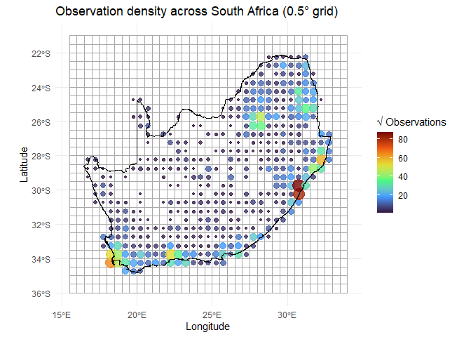

------------------------------------------------------------------------

### 2.4. Visualise sampling effort and richness

`generate_grid()` also returns a three-layer `SpatRaster` (`grid_r`)
whose second and third bands store cell-level metrics:

- `obs_sum`: Total observations aggregated across the chosen species
  columns (units = observation count)
- `spp_rich`: Number of species (non-zero columns) recorded in the cell
  (units = unique species count)

The chunk below extracts those two layers, applies a square-root stretch
(to dampen the influence of very large counts), and renders them
side-by-side with a perceptually uniform turbo palette.

``` r
# 1. Extract & stretch the layers 
effRich_r = sqrt(grid_list$grid_r[[c("obs_sum", "spp_rich")]])

# 2. Open a 1×2 layout and plot each layer + outline 
old_par = par(mfrow = c(1, 2), # multi‐figure by row: 1 row and 2 columns 
              mar = c(1, 1, 1, 2))  # margins sizes: bottom (1 lines)|left (1)|top (1)|right (2)

for (i in 1:2) {
  plot(effRich_r[[i]],
       col   = viridisLite::turbo(100),
       colNA = NA,
       axes  = FALSE,
       main  = c("Sampling effort (√obs count)",
                 "Species richness (√unique count)")[i],
       cex.main = 0.8)          # ← smaller title)
  plot(terra::vect(rsa), add = TRUE, border = "black", lwd = 0.4)
}
```

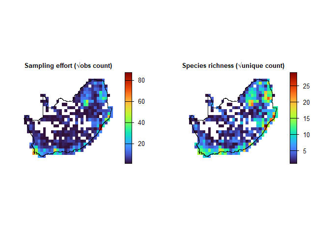

``` r

par(old_par)  # reset plotting parameters
```

These maps quickly reveal where sampling effort is concentrated and how
species richness varies across the landscape—useful diagnostics before
any downstream modelling.

------------------------------------------------------------------------

## 3. FETCH UNDERLYING ENVIRONMENTAL DATA

### 3.1. Generate site by environment matrix using `get_enviro_data()`

Spatial models are most informative when each sampling unit couples a
biological response (in this example, **sampling effort** and **species
richness**) with the same suite of environmental predictors.
`get_enviro_data()` attaches environmental predictors to each grid cell
via a six-stage routine:

- **buffer** *the analysis lattice*,  
- **retrieve** *or read the required rasters*,  
- **crop** *them to the buffered extent*,  
- **extract** *raster values at every grid-cell centroid*,  
- **interpolate** *any missing data gaps*, and  
- **append** *the finished covariate set to the grid summary*.

The subsections below implement this workflow:

1.  **Download and sample 19 WorldClim bioclim variables**: obtains the
    5-arc-min (~10 km) [WorldClim
    v2.1](https://worldclim.org/data/worldclim21.html), returns `bio`
    stack via [`geodata`](https://github.com/rspatial/geodata), crops
    it, and attaches climate values to every centroid.
2.  **Bind climate, effort, and richness into one raster stack**:
    combines √-scaled effort (`obs_sum`), √-scaled richness
    (`spp_rich`), and the 19 climate layers into a single `SpatRast`
    aligned to the 0.5° grid.
3.  **Inspect the extracted covariates**: produces a quick map
    (e.g. mean annual temperature) and previews the data to verify
    alignment and plausibility.
4.  **Assemble a modelling matrix**: consolidates coordinates, effort,
    richness, and all climate predictors into a tidy data frame
    (`grid_env`) ready for statistical modelling.
5.  *Optional \>\>* **Reproject centroids for metric-space analyses**:
    converts centroid coordinates from `WGS-84`
    ([EPSG:4326](https://epsg.io/4326)) to a `Albers Equal-Area`
    projection ([EPSG:9822](https://epsg.io/9822)) when analyses require
    distances in metres.

------------------------------------------------------------------------

**Download and sample 19 WorldClim bioclim variables**  
Fetch the 5-arc-min (~10 km) bioclim stack via `{geodata}` package and
attach values to every centroid.

``` r
# Retrieve 19 bioclim layers (≈10-km, WorldClim v2.1) for all grid centroids
data_path = "inst/extdata"               # cache folder for rasters
enviro_list = get_enviro_data(
  data       = grid_spp,                  # centroids + obs_sum + spp_rich
  buffer_km  = 10,                        # pad the AOI slightly
  source     = "geodata",                 # WorldClim/SoilGrids interface
  var        = "bio",                     # bioclim variable set
  res        = 5,                         # 5-arc-min ≈ 10 km
  path       = data_path,
  sp_cols    = 7:ncol(grid_spp),          # ignore species columns
  ext_cols   = c("obs_sum", "spp_rich")   # carry effort & richness through
)

# Quick checks 
str(enviro_list, max.level = 1)
#> List of 3
#>  $ env_rast:S4 class 'SpatRaster' [package "terra"]
#>  $ sites_sf: sf [415 × 2] (S3: sf/tbl_df/tbl/data.frame)
#>   ..- attr(*, "sf_column")= chr "geometry"
#>   ..- attr(*, "agr")= Factor w/ 3 levels "constant","aggregate",..: NA
#>   .. ..- attr(*, "names")= chr "grid_id"
#>  $ env_df  : tibble [415 × 24] (S3: tbl_df/tbl/data.frame)

# (Optional) Assign concise layer names for readability
# Find names here https://www.worldclim.org/data/bioclim.html
names_env = c("temp_mean","mdr","iso","temp_sea","temp_max","temp_min",
              "temp_range","temp_wetQ","temp_dryQ","temp_warmQ",
              "temp_coldQ","rain_mean","rain_wet","rain_dry",
              "rain_sea","rain_wetQ","rain_dryQ","rain_warmQ","rain_coldQ")
names(enviro_list$env_rast) = names_env

# (Optional) Promote frequently-used objects
env_r = enviro_list$env_rast    # cropped climate stack
env_df = enviro_list$env_df      # site × environment data-frame

# Quick checks 
env_r
#> class       : SpatRaster 
#> size        : 154, 195, 19  (nrow, ncol, nlyr)
#> resolution  : 0.08333333, 0.08333333  (x, y)
#> extent      : 16.66667, 32.91667, -34.91667, -22.08333  (xmin, xmax, ymin, ymax)
#> coord. ref. : lon/lat WGS 84 (EPSG:4326) 
#> source(s)   : memory
#> names       : temp_mean,       mdr,      iso, temp_sea, temp_max, temp_min, ... 
#> min values  :  5.158916,  5.891667, 45.32084, 143.0743,   14.832,   -6.284, ... 
#> max values  : 24.796417, 18.659584, 67.09737, 701.3335,   38.518,   13.800, ...
dim(env_df); head(env_df)
#> [1] 415  24
#> # A tibble: 6 × 24
#>   grid_id centroid_lon centroid_lat bio01 bio02 bio03 bio04 bio05 bio06 bio07
#>   <chr>          <dbl>        <dbl> <dbl> <dbl> <dbl> <dbl> <dbl> <dbl> <dbl>
#> 1 1026            28.8        -22.3  21.9  14.5  55.7  427.  32.4  6.44  26.0
#> 2 1027            29.2        -22.3  21.8  14.6  53.9  453.  33.0  5.87  27.1
#> 3 1028            29.7        -22.3  21.5  14.0  56.3  393.  31.7  6.80  24.9
#> 4 1029            30.3        -22.3  23.0  13.7  57.8  358.  32.8  9.14  23.7
#> 5 1030            30.8        -22.3  23.6  13.8  59.6  334.  33.5 10.3   23.2
#> 6 1031            31.3        -22.3  24.6  14.6  61.7  332.  34.8 11.0   23.8
#> # ℹ 14 more variables: bio08 <dbl>, bio09 <dbl>, bio10 <dbl>, bio11 <dbl>,
#> #   bio12 <dbl>, bio13 <dbl>, bio14 <dbl>, bio15 <dbl>, bio16 <dbl>,
#> #   bio17 <dbl>, bio18 <dbl>, bio19 <dbl>, obs_sum <dbl>, spp_rich <dbl>
```

`get_enviro_data()` *buffered the grid centroids by 10 km, fetched the
requested rasters, cropped them, extracted values at each centroid,
filled isolated NAs, and merged the results with `obs_sum` and
`spp_rich`.*

------------------------------------------------------------------------

### 3.2. Bind climate, effort, and richness into one raster stack

Fuse the √-scaled sampling‐effort (`obs_sum`) and richness (`spp_rich`)
layers with the 19 `bioclim` rasters into a single, co-registered
`SpatRast.` A unified stack ensures that all predictors share the same
grid, streamlining downstream map algebra, multivariate modelling, and
spatial cross-validation.

``` r
# Square-root stretch effort & richness layers (created in Section 7)
# effRich_r = sqrt(effRich_r)             # two layers: obs_sum, spp_rich

# Resample climate stack to the 0.5 ° grid and concatenate
env_effRich_r = c(
  effRich_r,                               # effort + richness
  resample(env_r, effRich_r)          # aligns 19 climate layers
)

# 2. Open a 2×2 layout and plot each layer + outline
old_par = par(mfrow = c(2, 2), # multi‐figure by row: 1 row and 2 columns 
              mar = c(1, 1, 1, 2))  # margins sizes: bottom (1 lines)|left (1)|top (1)|right (2)

titles = c("Sampling effort (√obs count)",
            "Species richness (√unique count)",
            "BIO1: Annual Mean Temperature", 
            "BIO2: Mean Diurnal Temperature Range")

for (i in 1:4) {
  plot(env_effRich_r[[i]],
       col      = viridisLite::turbo(100),
       colNA    = NA,
       axes     = FALSE,
       main     = titles[i],
       cex.main = 0.8)                        # smaller title
  plot(terra::vect(rsa), add = TRUE, border = "black", lwd = 0.4)
}
```

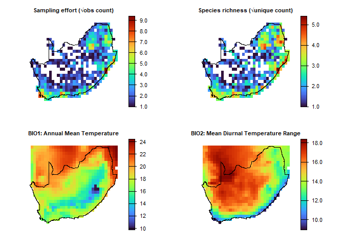

``` r
par(old_par) 
```

------------------------------------------------------------------------

### 3.3. Inspect the extracted covariates

Environmental data were linked to grid centroids using
`get_enviro_data()`, now visualise the spatial variation in selected
climate variables to check results.

``` r
# Make column headers explicit
# names(env_df)[1:5] = c("grid_id","centroid_lon","centroid_lat","obs_sum","spp_rich")

# Simple check of dimensions and first rows
dim(env_df)
#> [1] 415  24
head(env_df[, 1:6])
#> # A tibble: 6 × 6
#>   grid_id centroid_lon centroid_lat bio01 bio02 bio03
#>   <chr>          <dbl>        <dbl> <dbl> <dbl> <dbl>
#> 1 1026            28.8        -22.3  21.9  14.5  55.7
#> 2 1027            29.2        -22.3  21.8  14.6  53.9
#> 3 1028            29.7        -22.3  21.5  14.0  56.3
#> 4 1029            30.3        -22.3  23.0  13.7  57.8
#> 5 1030            30.8        -22.3  23.6  13.8  59.6
#> 6 1031            31.3        -22.3  24.6  14.6  61.7

# Quick map of mean annual temperature (√-scaled bubble size)
ggplot() +
  geom_sf(data = grid_sf, fill = NA, colour = "darkgrey", alpha = 0.4) +
  geom_point(data = env_df,
             aes(x = centroid_lon, 
                 y = centroid_lat,
                 colour = bio01),
             shape = 15,
             size = 3) +
  # scale_size_continuous(range = c(2,6)) +
  scale_colour_viridis_c(option = "turbo") +
  geom_sf(data = rsa, fill = NA, colour = "black") +
  theme_minimal() +
  labs(title = "Grid-cell mean annual temperature (√-scaled)",
       x = "Longitude", y = "Latitude")
```

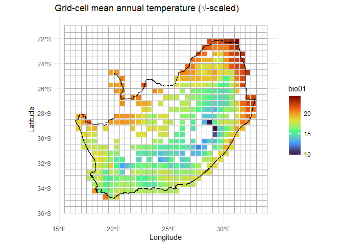

*Goal of this plot is to quickly check that the environmental predictors
(e.g. `bio01` \>\> mean annual temperature) line up with the 0.5° grid.*

------------------------------------------------------------------------

### 3.4. Assemble the modelling matrix `grid_env`

Compile a *site × environment* data frame (`grid_env`) in which each
0.5° cell contributes one row containing centroid coordinates, √-scaled
sampling effort, species richness, and the 19 `bioclim` predictors. The
resulting matrix is immediately usable for GLMs, GAMs, machine-learning,
ordination, and β-diversity analyses.

``` r
# Build the final site × environment table
grid_env = env_df %>%
  dplyr::select(grid_id, centroid_lon, centroid_lat,
                obs_sum, spp_rich, dplyr::everything())

str(grid_env, max.level = 1)
#> tibble [415 × 24] (S3: tbl_df/tbl/data.frame)
head(grid_env)
#> # A tibble: 6 × 24
#>   grid_id centroid_lon centroid_lat obs_sum spp_rich bio01 bio02 bio03 bio04
#>   <chr>          <dbl>        <dbl>   <dbl>    <dbl> <dbl> <dbl> <dbl> <dbl>
#> 1 1026            28.8        -22.3       3        2  21.9  14.5  55.7  427.
#> 2 1027            29.2        -22.3      41       31  21.8  14.6  53.9  453.
#> 3 1028            29.7        -22.3      10       10  21.5  14.0  56.3  393.
#> 4 1029            30.3        -22.3       7        7  23.0  13.7  57.8  358.
#> 5 1030            30.8        -22.3       6        6  23.6  13.8  59.6  334.
#> 6 1031            31.3        -22.3     107       76  24.6  14.6  61.7  332.
#> # ℹ 15 more variables: bio05 <dbl>, bio06 <dbl>, bio07 <dbl>, bio08 <dbl>,
#> #   bio09 <dbl>, bio10 <dbl>, bio11 <dbl>, bio12 <dbl>, bio13 <dbl>,
#> #   bio14 <dbl>, bio15 <dbl>, bio16 <dbl>, bio17 <dbl>, bio18 <dbl>,
#> #   bio19 <dbl>
```

------------------------------------------------------------------------

### 3.5. Reproject centroids for metric-space analyses using `sf::st_transform()` \[optional\]

Certain analyses (e.g. spatial clustering, variogram modelling) require
coordinates in metres rather than degrees. The snippet below converts
the centroid layer to an `Albers Equal-Area` projection.

``` r
# Convert the centroid columns to an sf object
centroids_sf = sf::st_as_sf(
  grid_env,
  coords = c("centroid_lon", "centroid_lat"),
  crs    = 4326,          # WGS-84
  remove = FALSE
)

# Reproject to Albers Equal Area (EPSG 9822)
centroids_aea = sf::st_transform(centroids_sf, 9822)

# Append projected X–Y back onto the data-frame
grid_env = cbind(
  grid_env,
  sf::st_coordinates(centroids_aea) |>
    as.data.frame() |>
    setNames(c("x_aea", "y_aea"))   # rename within the pipeline
)
names(grid_env)
#>  [1] "grid_id"      "centroid_lon" "centroid_lat" "obs_sum"      "spp_rich"    
#>  [6] "bio01"        "bio02"        "bio03"        "bio04"        "bio05"       
#> [11] "bio06"        "bio07"        "bio08"        "bio09"        "bio10"       
#> [16] "bio11"        "bio12"        "bio13"        "bio14"        "bio15"       
#> [21] "bio16"        "bio17"        "bio18"        "bio19"        "x_aea"       
#> [26] "y_aea"
head(grid_env[, c("grid_id","centroid_lon","centroid_lat","x_aea","y_aea")])
#>   grid_id centroid_lon centroid_lat   x_aea    y_aea
#> 1    1026        28.75    -22.25004 6392274 -6836200
#> 2    1027        29.25    -22.25004 6480542 -6808542
#> 3    1028        29.75    -22.25004 6568648 -6780369
#> 4    1029        30.25    -22.25004 6656587 -6751682
#> 5    1030        30.75    -22.25004 6744357 -6722482
#> 6    1031        31.25    -22.25004 6831955 -6692770
```

*At this point every grid cell has species metrics, climate predictors,
and is optionally projected into metre coordinates, all in a single tidy
object.*

------------------------------------------------------------------------

### 3.6. Diagnose and mitigate collinearity with `rm_correlated()`

Highly inter-correlated predictors inflate variance, bias coefficient
estimates, and complicate ecological inference.  
`rm_correlated()` screens the environmental matrix for pairwise
correlations that exceed a user-defined threshold (here r \> 0.70), then
iteratively prunes the variable with the highest average absolute
correlation. The routine

1.  Computes a Pearson (default) **Correlation** matrix for the supplied
    columns;  
2.  **Ranks** variables by their mean absolute correlation;  
3.  **Discards** the worst offender, recomputes the matrix, and repeats
    until all remaining pairs lie below the threshold;  
4.  *Optional \>\>* displays the final **Correlation heat-map** for
    visual QC.

The result is a reduced predictor set that retains maximal information
while minimising multicollinearity.

``` r
# (Optional) Rename BIO
names(env_df) = c("grid_id", "centroid_lon", "centroid_lat", names_env, "obs_sum", "spp_rich")
  
# Run the filter and compare dimensions
# Filter environmental predictors for |r| > 0.70
env_vars_reduced = rm_correlated(
  data       = env_df[, c(4, 6:24)],  # drop ID + coord columns
  cols       = NULL,                  # infer all numeric cols
  threshold  = 0.70,
  plot       = TRUE                   # show heat-map of retained vars
)
```

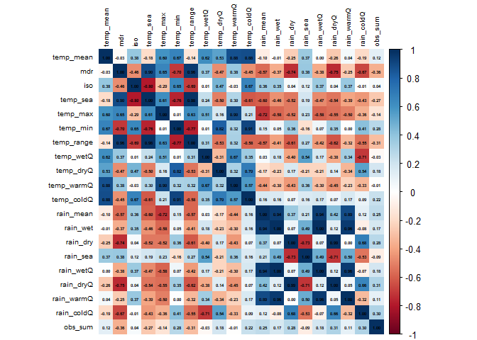

    #> Variables removed due to high correlation:
    #>  [1] "temp_range" "temp_sea"   "temp_max"   "rain_mean"  "rain_dryQ" 
    #>  [6] "temp_min"   "temp_warmQ" "temp_coldQ" "rain_wetQ"  "rain_wet"  
    #> [11] "rain_coldQ" "rain_sea"   "spp_rich"  
    #> 
    #> Variables retained:
    #> [1] "temp_mean"  "iso"        "temp_wetQ"  "temp_dryQ"  "rain_dry"  
    #> [6] "rain_warmQ" "obs_sum"

    # Before vs after
    c(original = ncol(env_df[, c(4, 6:24)]),
      reduced  = ncol(env_vars_reduced))
    #> original  reduced 
    #>       20        7

`env_vars_reduced` *now contains a decorrelated subset of climate
predictors suitable for stable GLMs, GAMs, machine-learning, or
ordination workflows.*

------------------------------------------------------------------------

## 4. ZETA-DIVERSITY

### 4.1. Zeta diversity in `dissmapr` for a multi-site view of compositional change

Classical β-diversity evaluates how species composition differs between
pairs of sites, but many ecological questions, like how wide-ranging
species structure whole landscapes, require a perspective that spans
three, four or more assemblages at once. **Zeta diversity**
(**ζ-diversity**) meets this need by counting the number of species
jointly shared by *i* sites (ζ₁, ζ₂, … ζᵢ). As *i* increases, ζ
declines; the shape of that decline summarises how rarity and commonness
are distributed across the region. *See Guillaume Latombe (2015).
zetadiv: Functions to Compute Compositional Turnover Using Zeta
Diversity. R package version 1.3.0,
[https://cran.r-project.org/web/packages/zetadiv](https://rpkg.net/package/zetadiv)*.

**\`dissmapr\`** embeds the `{zetadiv}` toolkit so that automated
pipelines of compositional dissimilarity can incorporate higher-order
turnover metrics alongside conventional pairwise indices. Four core
functions are central:

1.  **Expectation of ζ-decline** using `zetadiv::Zeta.decline.ex()`:
    Calculates the exact mean ζ for successive orders (ζ₁ … ζₖ) when the
    site × species matrix is small enough for exhaustive enumeration,
    giving the theoretical baseline against which observed patterns can
    be compared [function
    details](https://rpkg.net/packages/zetadiv/reference/Zeta.decline.ex.ob).  
2.  **Monte-Carlo ζ-decline** using `zetadiv::Zeta.decline.mc()`: Uses
    random subsampling to approximate the same decline in large matrices
    where exhaustive combinations are infeasible, trading a small
    sampling error for orders-of-magnitude speed-ups [function
    details](https://rpkg.net/packages/zetadiv/reference/Zeta.decline.mc.ob).  
3.  **ζ distance-decay** using `zetadiv::Zeta.ddecays()`: Fits a
    distance–decay curve for several ζ orders simultaneously, revealing
    how rapidly shared species drop away with spatial separation and
    whether higher-order overlap is lost faster or slower than pairwise
    similarity [function
    details](https://rpkg.net/packages/zetadiv/reference/Zeta.ddecays.ob).  
4.  **Multi-site GDM** using `zetadiv::Zeta.msgdm()`: Extends
    Generalised Dissimilarity Modelling to multi-site similarity. For a
    chosen order *i* it regresses ζᵢ against environmental gradients and
    geographic distance using GLMs, GAMs or shape-constrained splines,
    quantifying how each predictor controls the retention of shared
    species across landscapes [function
    details](https://rpkg.net/packages/zetadiv/reference/Zeta.msgdm.ob).

**Why this matters for automated turnover analysis**

- **Scale-explicit turnover**: ζ-decline distinguishes processes that
  shape local richness (ζ₁) from those structuring regional overlap (ζ₄,
  ζ₅ …), adding nuance to the pairwise β view.  
- **Process insight**: An *exponential* ζ-decline suggests stochastic
  assembly while a *power-law* decline implies niche structure or
  dispersal limitations.  
- **Predictive mapping**: `zetadiv::Zeta.msgdm()` generates response
  surfaces for ζᵢ across continuous environmental space, enabling
  `dismapr` to project multi-site similarity under current or future
  scenarios.  
- **Integrated workflow**: Within `dismapr` the outputs
  (`zetadiv::Zeta.decline.*`, `zetadiv::Zeta.ddecays()`,
  `zetadiv::Zeta.msgdm()`) slot directly into the same
  site-by-environment matrices and raster stacks already produced for
  GLM/GAM pipelines, ensuring a seamless transition from data wrangling
  to advanced turnover modelling.

In summary, **ζ-diversity counts the species that an entire network of
sites share**. Imagine moving from one natural area to the next across a
region. In the first few nearby places most species still overlap, but
as you add more, especially those separated by greater distance or
harsher conditions, the list of species found everywhere quickly
narrows. ζ-diversity tracks how fast that shared list shrinks,
highlighting which species are resilient and widespread versus those
confined to only a handful of sites. The faster the shared-species list
shrinks, the clearer it becomes which species are robust and occur
almost everywhere, and which persist only in a few isolated spots.
Viewing many sites at once exposes conservation gaps that simple
pairwise comparisons can overlook.

The next sections offer a simple, step-by-step guide to spot where
shared biodiversity is weakest and direct protection where it’s needed
most.

------------------------------------------------------------------------

### 4.2. Expectation curve for ζ-diversity decline using `zetadiv::Zeta.decline.ex()`

`zetadiv::Zeta.decline.ex()` calculates the theoretical number of
species that should be shared by 1, 2, … k sites (orders 1–15 here)
using a closed-form formula based solely on each species’ occupancy
frequency. Because no resampling is involved, the output is an exact
expectation of how ζ-diversity ought to fall as more sites are
considered, assuming site identity plays no role. The function also fits
exponential and power-law models to the expected curve, yielding
parameters and fit statistics that provide a baseline against which
observed or Monte-Carlo ζ-decline patterns can be evaluated.

``` r
zeta_decline_ex = Zeta.decline.ex(grid_spp_pa[,7:ncol(grid_spp_pa)], # Only species columns
                                  orders = 1:15)
```

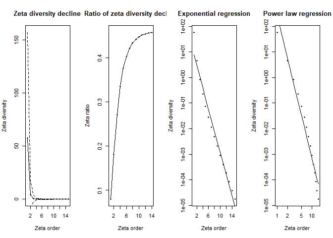

> - **Panel 1 (Zeta diversity decline)**: Shows how rapidly species that
>   are common across multiple sites decline as you look at groups of
>   more and more sites simultaneously (increasing zeta order). The
>   sharp drop means fewer species are shared among many sites compared
>   to just a few.
> - **Panel 2 (Ratio of zeta diversity decline)**: Illustrates the
>   proportion of shared species that remain as the number of sites
>   compared increases. A steeper curve indicates that common species
>   quickly become rare across multiple sites.
> - **Panel 3 (Exponential regression)**: Tests if the decline in shared
>   species fits an exponential decrease. A straight line here indicates
>   that species commonness decreases rapidly and consistently as more
>   sites are considered together. Exponential regression represents
>   **stochastic assembly** (randomness determining species
>   distributions).
> - **Panel 4 (Power law regression)**: Tests if the decline follows a
>   power law relationship. A straight line suggests that the loss of
>   common species follows a predictable pattern, where initially many
>   species are shared among fewer sites, but rapidly fewer are shared
>   among larger groups. Power law regression represents **niche-based
>   sorting** (environmental factors shaping species distributions).
>
> **Interpretation**: *The near‐perfect straight line in the exponential
> panel (high R²) indicates that an exponential model provides the most
> parsimonious description of how species shared across sites decline as
> you add more sites, which is consistent with a stochastic, memory-less
> decline in common species. A power law will also fit in broad strokes,
> but deviates at high orders, suggesting exponential decay is the
> better choice for these data.*

------------------------------------------------------------------------

### 4.3. Empirical ζ-diversity decline via Monte-Carlo using `zetadiv::Zeta.decline.mc()`

`zetadiv::Zeta.decline.mc()` estimates how the number of species shared
by 1, 2, … k sites drops when exhaustive combinations are impractical.
It repeatedly draws random sets of sites (Monte-Carlo sampling),
averages the shared-species count for each order, and reports both the
mean and its variability. The resulting curve is then fitted with
exponential and power-law models, providing parameter estimates and
confidence bands that capture real-world turnover while accounting for
sampling uncertainty. In other words, a **sharp drop** in the curve
means species change quickly from place to place (**communities are
unique**), while a **gentle drop** means many species are found in most
places (**communities are similar**).

``` r
zeta_mc_utm = Zeta.decline.mc(grid_spp_pa[,-(1:7)], # Different way to get only species columns
                              # grid_env[, c("centroid_lon", "centroid_lat")], # WGS84 - decimal degrees
                              grid_env[, c("x_aea", "y_aea")], # AEA - meters
                              orders = 1:15,
                              sam = 100, # Sample size
                              NON = TRUE,
                              normalize = "Jaccard")
```

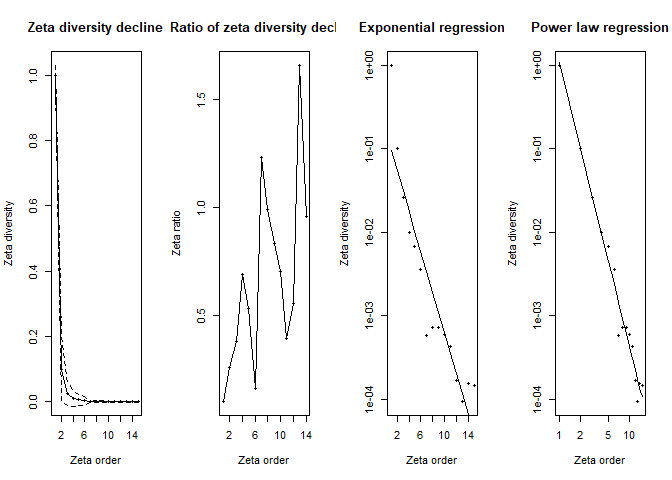

> - **Panel 1 (Zeta diversity decline)**: Rapidly declining zeta
>   diversity, similar to previous plots, indicates very few species
>   remain shared across increasingly larger sets of sites, emphasizing
>   strong species turnover and spatial specialization.
> - **Panel 2 (Ratio of zeta diversity decline)**: More irregular
>   fluctuations suggest a spatial effect: nearby sites might
>   occasionally share more species by chance due to proximity. The
>   spikes mean certain groups of neighboring sites have
>   higher-than-average species overlap.
> - **Panel 3 & 4 (Exponential and Power law regressions)**: Both remain
>   linear, clearly indicating the zeta diversity declines consistently
>   following a predictable spatial pattern. However, the exact pattern
>   remains similar to previous cases, highlighting that despite spatial
>   constraints, common species become rare quickly as more sites are
>   considered.  
>
> **Interpretation**: *This result demonstrates clear spatial
> structuring of biodiversity i.e. species are locally clustered, not
> randomly distributed across the landscape. Spatial proximity
> influences which species co-occur more frequently. In general
> `zetadiv::Zeta.decline.mc()` is used for real‐world biodiversity
> data—both because it scales and because the Monte Carlo envelope is
> invaluable when ζₖ gets noisier at higher orders.*

------------------------------------------------------------------------

### 4.4. ζ-diversity distance-decay (orders 2–8) using `zetadiv::Zeta.ddecays()`

`zetadiv::Zeta.ddecays()`measures the **drop in shared species as
geographic distance increases**. In this example it evaluates **orders 2
through 8** by first binning site pairs (or groups) into many distance
classes, then computing the average number of species they share in each
class, and finally fitting an **exponential distance-decay model** via a
generalized linear regression. The function returns the slope and
intercept of each fitted curve, goodness-of-fit statistics, and
diagnostic plots that together show **how quickly multisite similarity
breaks down with space at different zeta orders**.

``` r
# Calculate Zeta.ddecays
zeta_decays = Zeta.ddecays(#grid_env[, c("centroid_lon", "centroid_lat")],  # WGS84 - decimal degrees
                           grid_env[, c("x_aea", "y_aea")], # AEA - meters
                           grid_spp_pa[,-(1:7)],
                           sam = 1000, # Sample size
                           orders = 2:8,
                           plot = TRUE,
                           confint.level = 0.95
)
#> [1] 2
#> [1] 3
#> [1] 4
#> [1] 5
#> [1] 6
#> [1] 7
#> [1] 8
```

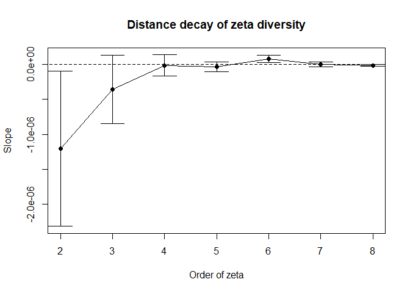

> This plot shows how zeta diversity (remember, it’s a metric that
> captures shared species composition among multiple sites) changes with
> spatial distance across different orders of zeta (i.e., the number of
> sites considered at once).
>
> - On the **x-axis**, we have the **order of zeta** (from 2 to 8).  
>   For example, zeta order 2 looks at pairs of sites, order 3 at
>   triplets, etc.
> - On the **y-axis**, we see the slope of the **relationship between
>   zeta diversity and distance** (i.e., how quickly species similarity
>   declines with distance).
> - A **negative slope** means that **sites farther apart have fewer
>   species in common** — so there’s a clear distance decay of
>   biodiversity.
> - A **slope near zero** means **distance doesn’t strongly affect how
>   many species are shared among sites**.
>
> **Interpretation**: *When you look at just two or three sites,
> distance really matters because sites far apart share far fewer
> species, so the decay curve is steep. Once you include four or more
> sites, that curve flattens out: most widespread species still overlap
> no matter the distance, so spatial separation has little effect. The
> tighter confidence bands at higher orders show these broader‐scale
> patterns are more reliable because they average over many sites. In
> plain terms, rare or localized species drive strong turnover at small
> scales, but a core of common species holds communities together across
> larger regions.*

------------------------------------------------------------------------

### 4.5. Model drivers of compositional turnover with `zetadiv::Zeta.msgdm()`

`Zeta.msgdm()` extends **Generalised Dissimilarity Modelling** (GDM)
from simple pairwise similarity to any order of ζ-diversity. Order 2 is,
by definition, the pairwise case as it counts the species shared by two
sites. In other words, the results are directly comparable to
conventional β-diversity models. The advantage of the ζ framework is
that you can raise the order (ζ₃, ζ₄, …) with the same function to
reveal higher-order patterns without changing tools.

**Here we fit an order-2 model to ask**:  
- How strongly do climate, geography, or other predictors control the
chance that two sites share species?  
- How does that control change along each environmental gradient?

**`Zeta.msgdm()` proceeds in three stages**:

1.  **Sampling**: draws 1 000 random site pairs (`sam = 1000`) to keep
    computation tractable.  
2.  **Normalisation**: converts order-2 counts to a Jaccard similarity
    (`normalize = "Jaccard"`) so coefficients range between 0 and 1.  
3.  **Regression**: fits an I-spline MSGDM (`reg.type = "ispline"`) that
    separates monotonic environmental effects from Euclidean geographic
    distance (`distance.type = "Euclidean"`).

The fitted model (`zeta2`) contains partial I-splines for every
predictor (note: higher splines imply stronger turnover per unit
change).

``` r
# Fit order-2 MSGDM on the presence–absence matrix and reduced covariate set
set.seed(123)
zeta2 = Zeta.msgdm(
  grid_spp_pa[,-(1:7)],                            # species matrix (rows = sites, cols = spp)
  env_vars_reduced,                                # decorrelated environmental variables
  # env_vars_reduced[,-7],                         # without sampling effort included
  grid_env[, c("centroid_lon", "centroid_lat")],   # longitude & latitude (°)
  # grid_env[, c("x_aea", "y_aea")],               # longitude & latitude (meters)
  sam           = 1000,
  order         = 2,
  distance.type = "Euclidean",
  normalize     = "Jaccard",
  reg.type      = "ispline"
)

# Extract and plot the fitted I-splines
# splines = Return.ispline(zeta2, env_vars_reduced[,-7], distance = TRUE) # Without sampling effort
splines = Return.ispline(zeta2, env_vars_reduced, distance = TRUE)
Plot.ispline(splines, distance = TRUE)
```

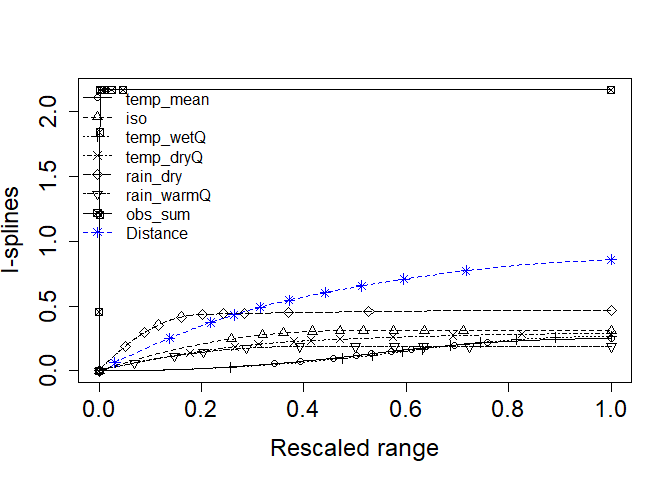

**General Interpretation**

- **I-spline height**: The taller the curve, the more a variable drives
  species turnover.
- **Curve shape**: Steep early rises mark thresholds where small
  environmental changes cause large compositional shifts; flatter tails
  suggest saturation.
- **Distance spline**: Shows the residual spatial decay once
  environmental effects are removed, highlighting dispersal limits or
  unmeasured factors.

By isolating each driver’s effect, this MSGDM pinpoints which gradients
most erode shared biodiversity and where management actions could most
effectively slow that loss.

> **Specific Interpretation**: This figure shows the fitted I-splines
> from a multi-site generalized dissimilarity model (via
> `zetadiv::Zeta.msgdm`), which represent the partial, monotonic
> relationship between each predictor and community turnover
> (ζ-diversity) over its 0–1 rescaled range. A few key take-aways:
>
> 1.  **Distance** (blue asterisks) has by far the largest I-spline
>     amplitude—rising from ~0 at zero distance to ~0.05 at the maximum.
>     That tells us spatial separation is the strongest driver of
>     multi‐site turnover, and even small increases in distance yield a
>     substantial drop in shared species.
> 2.  **Sampling intensity** (`obs_sum`, open circles) comes next, with
>     a gentle but steady rise to ~0.045. This indicates that sites with
>     more observations tend to share more species (or, conversely, that
>     incomplete sampling can depress apparent turnover).
> 3.  **Precipitation variables** like **rain in the warm quarter**
>     (`rain_warmQ`, squares) and **rain in the dry quarter**
>     (`rain_dry`, triangles-down) both show moderate effects (I-spline
>     heights ~0.02–0.03). This means differences in seasonal rainfall
>     regimes contribute noticeably to changes in community composition.
> 4.  **Temperature metrics** like **mean temperature** (`temp_mean`,
>     triangles-up), **wet‐quarter temperature** (`temp_wetQ`, X’s),
>     **dry‐quarter temperature** (`temp_dryQ`, diamonds), and the
>     **isothermality index** (`iso`, plus signs) all have very low,
>     almost flat I-splines (max heights ≲0.01). In other words, these
>     thermal variables explain very little additional turnover once
>     you’ve accounted for distance and rainfall.
>
> **Key point:** Spatial distance is the dominant structuring factor in
> these data i.e. sites further apart share markedly fewer species.
> After accounting for that, differences in observation effort and, to a
> lesser degree, seasonal rainfall still shape multisite community
> similarity. Temperature and seasonality metrics, by contrast, appear
> to have only a minor independent influence on zeta‐diversity in this
> landscape.

``` r
# Deviance explained summary results
with(summary(zeta2$model), 1 - deviance/null.deviance) 
#> [1] 0.3006643
# [1] 0.3733073
# 0.3733073 means that approximately 37% of the variability in the response
# variable is explained by your model. This is relatively low, suggesting that the
# model may not be capturing much of the underlying pattern in the data.

# Model summary results
summary(zeta2$model)
#> 
#> Call:
#> glm.cons(formula = zeta.val ~ ., family = family, data = data.tot, 
#>     control = control, method = "glm.fit.cons", cons = cons, 
#>     cons.inter = cons.inter)
#> 
#> Coefficients:
#>             Estimate Std. Error z value Pr(>|z|)   
#> (Intercept) -1.75622    0.73280  -2.397   0.0165 * 
#> temp_mean1   0.00000    5.35410   0.000   1.0000   
#> temp_mean2  -0.12901    1.80366  -0.072   0.9430   
#> temp_mean3   0.00000    2.45052   0.000   1.0000   
#> iso1        -0.12769    1.82815  -0.070   0.9443   
#> iso2         0.00000    1.32845   0.000   1.0000   
#> iso3         0.00000    1.84405   0.000   1.0000   
#> temp_wetQ1   0.00000    1.46571   0.000   1.0000   
#> temp_wetQ2  -0.21001    1.24872  -0.168   0.8664   
#> temp_wetQ3  -0.35297    1.96909  -0.179   0.8577   
#> temp_dryQ1   0.00000    4.60011   0.000   1.0000   
#> temp_dryQ2  -0.28917    1.52155  -0.190   0.8493   
#> temp_dryQ3   0.00000    1.64760   0.000   1.0000   
#> rain_dry1   -0.08475    1.08271  -0.078   0.9376   
#> rain_dry2   -0.22911    1.22210  -0.187   0.8513   
#> rain_dry3    0.00000    1.61694   0.000   1.0000   
#> rain_warmQ1 -0.38844    1.16271  -0.334   0.7383   
#> rain_warmQ2 -0.18553    1.50201  -0.124   0.9017   
#> rain_warmQ3 -0.34562    2.29405  -0.151   0.8802   
#> obs_sum1    -2.12828    0.66640  -3.194   0.0014 **
#> obs_sum2    -0.11889    2.16925  -0.055   0.9563   
#> obs_sum3     0.00000    3.25547   0.000   1.0000   
#> distance1   -0.52361    1.23063  -0.425   0.6705   
#> distance2   -0.29026    1.57052  -0.185   0.8534   
#> distance3   -0.14665    2.42153  -0.061   0.9517   
#> ---
#> Signif. codes:  0 '***' 0.001 '**' 0.01 '*' 0.05 '.' 0.1 ' ' 1
#> 
#> (Dispersion parameter for binomial family taken to be 1)
#> 
#>     Null deviance: 65.233  on 999  degrees of freedom
#> Residual deviance: 45.620  on 975  degrees of freedom
#> AIC: 98.771
#> 
#> Number of Fisher Scoring iterations: 7
```

------------------------------------------------------------------------

### 4.6. Uneven sampling can disguise the true drivers of biodiversity

**With sampling effort** (`obs_sum`) included, all sites with lots of
records suddenly look far more alike than poorly sampled ones, and the
climate curves flatten, and distance drops too.

``` r
# Fit order-2 MSGDM on the presence–absence matrix and reduced covariate set
set.seed(123) # set.seed to generate exactly the same random results i.e. sam=100
zeta2_noEff = Zeta.msgdm(
  grid_spp_pa[,-(1:7)],                            # species matrix (rows = sites, cols = spp)
  # env_vars_reduced,                              # decorrelated environmental variables
  env_vars_reduced[,-7],                           # without sampling effort included
  grid_env[, c("centroid_lon", "centroid_lat")],   # longitude & latitude (°)
  # grid_env[, c("x_aea", "y_aea")],               # longitude & latitude (meters)
  sam           = 1000,
  order         = 2,
  distance.type = "Euclidean",
  normalize     = "Jaccard",
  reg.type      = "ispline"
)

# Extract and plot the fitted I-splines
splines_noEff = Return.ispline(zeta2_noEff, env_vars_reduced[,-7], distance = TRUE) # Without sampling effort
Plot.ispline(splines_noEff, distance = TRUE)
```

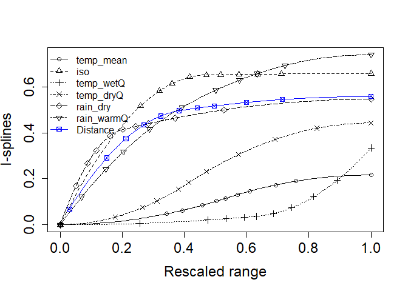

``` r

# Deviance explained summary results
with(summary(zeta2_noEff$model), 1 - deviance/null.deviance) 
#> [1] 0.08242748
# [1] 0.09495599
# 0.09495599 means that approximately 1% of the variability in the response
# variable is explained by your model. This is relatively low, suggesting that the
# model may not be capturing much of the underlying pattern in the data.

# Model summary results
summary(zeta2_noEff$model)
#> 
#> Call:
#> glm.cons(formula = zeta.val ~ ., family = family, data = data.tot, 
#>     control = control, method = "glm.fit.cons", cons = cons, 
#>     cons.inter = cons.inter)
#> 
#> Coefficients:
#>              Estimate Std. Error z value Pr(>|z|)   
#> (Intercept) -2.305658   0.721582  -3.195   0.0014 **
#> temp_mean1   0.000000   5.272991   0.000   1.0000   
#> temp_mean2  -0.007174   1.832546  -0.004   0.9969   
#> temp_mean3   0.000000   2.455489   0.000   1.0000   
#> iso1        -0.725370   1.979859  -0.366   0.7141   
#> iso2         0.000000   1.361778   0.000   1.0000   
#> iso3         0.000000   1.855347   0.000   1.0000   
#> temp_wetQ1   0.000000   1.590495   0.000   1.0000   
#> temp_wetQ2  -0.171049   1.323547  -0.129   0.8972   
#> temp_wetQ3  -0.245476   2.004934  -0.122   0.9026   
#> temp_dryQ1   0.000000   4.616249   0.000   1.0000   
#> temp_dryQ2  -0.383202   1.607839  -0.238   0.8116   
#> temp_dryQ3   0.000000   1.705136   0.000   1.0000   
#> rain_dry1   -0.393967   1.102892  -0.357   0.7209   
#> rain_dry2   -0.100666   1.235870  -0.081   0.9351   
#> rain_dry3    0.000000   1.648879   0.000   1.0000   
#> rain_warmQ1 -0.305181   1.152039  -0.265   0.7911   
#> rain_warmQ2 -0.282461   1.498674  -0.188   0.8505   
#> rain_warmQ3  0.000000   2.172390   0.000   1.0000   
#> distance1   -0.566322   1.239954  -0.457   0.6479   
#> distance2   -0.245610   1.595757  -0.154   0.8777   
#> distance3    0.000000   2.453390   0.000   1.0000   
#> ---
#> Signif. codes:  0 '***' 0.001 '**' 0.01 '*' 0.05 '.' 0.1 ' ' 1
#> 
#> (Dispersion parameter for binomial family taken to be 1)
#> 
#>     Null deviance: 65.233  on 999  degrees of freedom
#> Residual deviance: 59.856  on 978  degrees of freedom
#> AIC: 106.99
#> 
#> Number of Fisher Scoring iterations: 7
```

**Without sampling effort** (`obs_sum`) temperature and rainfall curves
climb high and fast: climate looks like the main reason sites stop
sharing species. Distance (blue line) still matters, but less than
several climate variables. Furthermore, when sampling effort is removed
the model only explains ≈ 8% of the deviance, compared to 37% when it’s
included. In other words, after discounting chance, less than one-tenth
of the variation in shared-species counts is captured by climate and
distance alone, confirming that survey effort had been the primary
driver of the much higher explanatory power in the full model.

**Key takeaway**: Uneven sampling can hide the real drivers of
biodiversity. Without accounting for effort, the model attributes most
turnover to climate. Adding effort shows that well-surveyed sites appear
more similar simply because thorough searches record more species, while
lightly sampled sites miss many and seem distinct. Correcting for effort
is essential; only then can we see how climate and distance truly shape
species turnover.

------------------------------------------------------------------------

## 5. FULLY AUTOMATED ζ-MSGDM WORKFLOW

### 5.1. Automated ζ-MSGDM with I-spline Models and Visualization

To streamline the exploration of multi‐site turnover drivers, we now
introduce an **automated sub-workflow** that fits, extracts and
visualizes I-spline models for any set of zeta orders in just three
function calls. Rather than manually looping over orders, binding
tables, and crafting bespoke plots, you can:

1.  **Run and combine** all ispline GLMs via `run_ispline_models()`,
    which:\>
    - Calls `Zeta.msgdm()` for each order of interest (e.g. ζ₂…ζ₆)
    - Extracts both the raw covariates (including geographic distance)
      and their spline bases
    - Returns one tidy tibble tagged by `zOrder`, ready for plotting or
      further analysis
2.  **Inspect partial-dependence curves** with `plot_ispline_lines()`,
    which:\>
    - Automatically locates the spline column matching any chosen
      covariate (e.g. “dist” → `dist_is`)
    - Draws each zeta-order’s I-spline curve with thin lines
    - Overlays small markers at user-specified quantiles of the raw
      predictor and a larger symbol at each curve’s minimum
3.  **Summarize overall variation** using `plot_ispline_boxplots()`,
    which:
    - Detects every `_is` spline column in your data
    - Pivots to long format and produces facetted boxplots for each term
    - Applies a color-blind–safe Viridis palette with independent scales
      per facet

By packaging these steps into self-documented functions, we embed
ispline modeling and visualization into our RMarkdown workflow with a
single, transparent call. The parameters (orders, covariate name,
colors, shapes, etc.) are fully customizable, while sensible defaults
minimize boilerplate, ensuring reproducibility, readability and ease of
maintenance in automated biodiversity turnover analyses.

------------------------------------------------------------------------

### 5.2. Fit and combine ispline models

The following chunk uses our `run_ispline_models()` helper to fit
`Zeta.msgdm(reg.type = “ispline”)` for orders 2–6, extract both raw
covariates (including distance) and their spline bases, and bind
everything into one tidy table tagged by `zOrder`.

``` r
# Fit & gather ispline outputs for orders 2:6
set.seed(123) # set.seed to generate exactly the same random results i.e. sam=100
ispline_gdm_tab = run_ispline_models(
  spp_df    = grid_spp_pa[,-(1:7)],
  env_df    = env_vars_reduced,
  xy_df     = grid_env[, c("centroid_lon", "centroid_lat")],
  orders    = 2:6,
  sam       = 100, # Set really low to run fast
  normalize = "Jaccard",
  reg_type  = "ispline"
)
str(ispline_gdm_tab, max.level=1)
#> List of 2
#>  $ zeta_gdm_list:List of 5
#>  $ ispline_table:'data.frame':   500 obs. of  17 variables:

ispline_tabs_all = ispline_gdm_tab$ispline_table
head(ispline_tabs_all)
#>   temp_mean        iso  temp_wetQ temp_dryQ   rain_dry rain_warmQ obs_sum
#> 1 0.0000000 0.00000000 0.00000000 0.0000000 0.00000000 0.00000000       0
#> 2 0.2896355 0.09884044 0.01960870 0.1041687 0.00000000 0.00877193       0
#> 3 0.3842598 0.15863757 0.03114836 0.1160104 0.00000000 0.01096491       0
#> 4 0.3874364 0.16800387 0.06060482 0.1609354 0.00000000 0.02412281       0
#> 5 0.3927655 0.17380612 0.09836887 0.1903078 0.00000000 0.02631579       0
#> 6 0.3973209 0.18186992 0.11965861 0.2000578 0.02272727 0.03070175       0
#>     distance temp_mean_is iso_is temp_wetQ_is temp_dryQ_is rain_dry_is
#> 1 0.03214127            0      0            0   0.02831627   0.1529665
#> 2 0.03214127            0      0            0   0.04242732   0.1529665
#> 3 0.04545457            0      0            0   0.04380618   0.1529665
#> 4 0.09642380            0      0            0   0.04861907   0.1529665
#> 5 0.09642380            0      0            0   0.05140793   0.1529665
#> 6 0.10163911            0      0            0   0.05227112   0.2890950
#>   rain_warmQ_is obs_sum_is distance_is zOrder
#> 1             0          0   0.2105816 Order2
#> 2             0          0   0.2105816 Order2
#> 3             0          0   0.2935477 Order2
#> 4             0          0   0.5881165 Order2
#> 5             0          0   0.5881165 Order2
#> 6             0          0   0.6161951 Order2
```

------------------------------------------------------------------------

### 5.3. Plot Partial‐Dependence Curves for All Covariates

Here we produce a unified, multi‐panel display of each predictor’s
I‐spline partial‐dependence curve using our `plot_ispline_lines()`
helper. That function will:

- Auto‐detect the spline column for each covariate (e.g. “dist” →
  `dist_is`).
- Draw a thin line for each zeta‐order.
- Mark selected quantiles along the raw covariate with small symbols.
- Highlight each curve’s minimum value with a larger marker.

We then loop over all raw covariates (those ending in `_is`), generate a
separate plot per variable, and assemble them into a cohesive
multi‐panel layout using the `patchwork` package. This makes it possible
to compare turnover responses across the full suite of environmental
drivers.

``` r
# 1. Identify all raw covariates with a spline term
raw_vars = sub("_is$", "",
                grep("_is$", names(ispline_tabs_all), value = TRUE))

# 2. Generate one plot per covariate
plots = lapply(raw_vars, function(var) {
  plot_ispline_lines(
    ispline_data = ispline_tabs_all,
    x_var        = var,
    orders       = paste("Order", 2:6),
    cols         = c('green','cyan','purple','blue','black'),
    shapes       = c(15,16,17,18,19)
  ) +
  ggtitle(paste("I-Spline Partial Effect of", var))
})

# 3. Combine into a grid (2 columns here; adjust ncol as needed)
wrap_plots(plots, ncol = 2) +
  plot_annotation(
    title = "Multi-Panel I-Spline Curves Across Covariates",
    theme = theme(plot.title = element_text(size = 16, face = "bold"))
  )
```

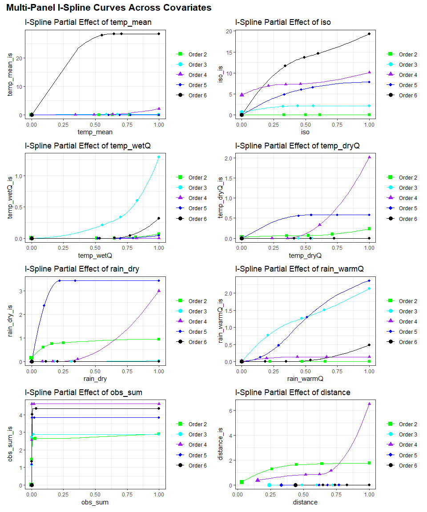

``` r

# # Simle single covariate line plot for "dist"
# plot_ispline_lines(
#   ispline_data = ispline_tabs_all,
#   x_var        = "dist",  
#   orders       = paste("Order", 2:6),
#   cols         = c('green','cyan','purple','blue','black'),
#   shapes       = c(15,16,17,18,19)
# )
```

**Ecological Interpretation and Conservation Implications**

- **Two-sites**: **Distance** dominates. Shared species drop off steeply
  as sites become farther apart.
- **Three-sites**: **Isothermality** (stable day–night vs. seasonal
  temperature swings) is most important, suggesting communities in areas
  with steady daily temperatures stay more similar.
- **Four-sites**: Mean **temperature** and wet-quarter temperature have
  the strongest effects, indicating thermal limits filter species across
  moderate clusters of sites.
- **Five-sites**: **Sampling effort** peaks in influence, warning that
  uneven survey intensity can masquerade as real ecological turnover at
  this scale.
- **Six-sites**: **Rainfall** variables—especially warm-quarter and
  dry-season rainfall—become the key filters, showing that moisture
  availability during extreme seasons governs species overlap in larger
  site groups.

**Key takeaway**: At the smallest scale, dispersal barriers (distance)
set the stage for which species can overlap. As you expand to three,
four or more sites, environmental filters (first thermal, then hydric)
sequentially take over. This scale‐dependent shift reveals that
different ecological processes dominate community assembly at different
spatial extents, with direct implications for how we design surveys and
target conservation under changing climates.

------------------------------------------------------------------------

### 5.4. Facetted boxplots of all spline terms

Finally, we summarize the distribution of every `_is` basis across
orders using `plot_ispline_boxplots()`. Each spline term is facetted
with free scales, and fills are mapped to `zOrder` via a
color-blind–friendly `Viridis` palette.

``` r
# Facetted boxplots of all *_is columns
plot_ispline_boxplots(
  ispline_data   = ispline_tabs_all,
  ispline_suffix = "_is",
  order_col      = "zOrder",
  palette        = "viridis",
  direction      = -1,
  ncol           = 3
)
```

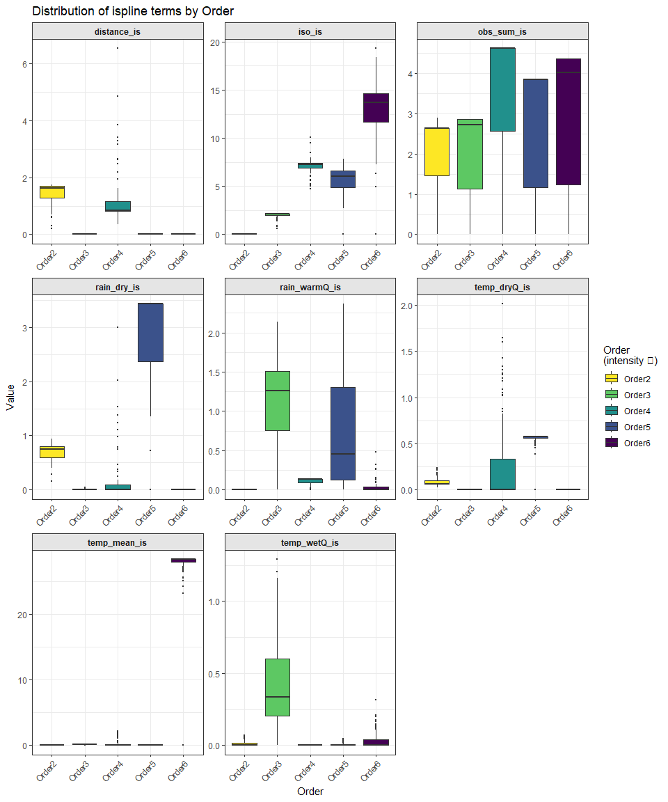

**Ecological perspective on shifting predictor influence across
ζ-orders**: As we step from Order 2 (pairwise similarity) up to Order 6
(overlap among six sites at once) we are effectively widening the
spatial lens through which we view community structure. This expansion
changes what matters:

- **Low orders focus on local contrasts**: At Order 2 most variation
  comes from very **fine-scale processes** like geographic separation,
  small environmental mismatches, and sampling effort. These factors
  explain why two neighbouring grid cells may already differ.
- **Intermediate orders integrate the landscape mosaic**: By Order 3–4
  we are asking “Which species persist across whole clusters of sites?”
  Now a species must tolerate not just one but several micro-habitats,
  so **meso-scale climatic gradients** begin to outweigh sheer distance.
  Predictors that were trivial at low orders gain influence because they
  capture the broader ecological envelope required for multi-site
  coexistence.
- **High orders highlight the region-wide common core**: At Order 5–6
  only the **most generalist or widespread species** remain shared.
  Fine-scale distance variation loses power (communities either share
  the core set or they don’t), while predictors linked to overall
  habitat suitability and survey completeness dominate. In other words,
  once you are comparing many sites simultaneously, turnover is governed
  less by how far sites are apart and more by whether they all fall
  within the fundamental climatic space of the common species—and
  whether those species were actually recorded.

**Key takeaway**: the ecological drivers of compositional overlap are
**order-dependent** because each higher ζ-order filters out another
layer of local idiosyncrasy. What emerges is a hierarchy:

1.  **Proximity and micro-heterogeneity** dictate similarity between
    pairs.
2.  **Landscape-scale climate** shapes overlap across small clusters.
3.  **Broad climatic envelopes and sampling completeness** control the
    sparse set of species found everywhere.

Recognising this hierarchy helps match conservation or monitoring
actions to the scale at which different processes structure
biodiversity.

------------------------------------------------------------------------

## 6. PREDICT ZETA DIVERSITY

### 6.1. Predict current Zeta Diversity (zeta2) using `predict_dissim()`

In this step we use our fitted order-2 GDM (`zeta2`) to generate a
spatial map of pairwise compositional turnover (ζ₂) under current
conditions. `predict_dissim()` embeds `zetadiv::Predict.msgdm()` and
runs through the following steps:

1.  Compute each site’s **species richness** (adjusted by
    sampling‐effort) and **mean distance** to all other sites  
2.  Apply the same **environmental I-spline transformations** used in
    the model  
3.  **Predict the Jaccard-scaled turnover** (ζ₂) on the 0–1 scale  
4.  Optionally **plot the resulting heatmap** with your study boundary
    overlaid

We set a random seed for reproducibility (so Monte Carlo sampling inside
`predict_dissim()` yields the same results each time), pull out just the
species columns once, then inspect the returned `predictors_df` to
confirm its dimensions, column names, and a quick peek at the key model
outputs.

``` r
# Predict current zeta diversity using `predict_dissim` with sampling effort, geographic distance and environmental variables
# Only non-colinear environmental variables used in `zeta2` model
set.seed(123) # set.seed to generate exactly the same random results i.e. sam=100
spp_cols = names(grid_spp_pa[,-(1:7)])
predictors_df   = predict_dissim(
  grid_spp      = grid_spp_pa,
  species_cols  = spp_cols,
  env_vars      = env_vars_reduced,# env_vars_reduced[,-8]
  zeta_model    = zeta2, # From simple order 2 run above
  # zeta_model = ispline_gdm_tab$zeta_gdm_list[[1]], # From list of Zeta.msgdm models
  grid_xy       = grid_env,
  x_col         = "centroid_lon",
  y_col         = "centroid_lat",
  bndy_fc       = rsa, # Optional feature collection to plot as boundary
  show_plot     = TRUE
)
```

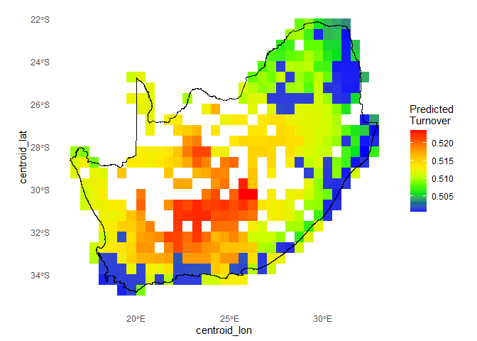

``` r

# Check results
dim(predictors_df)
#> [1] 415  14
names(predictors_df)
#>  [1] "temp_mean"        "iso"              "temp_wetQ"        "temp_dryQ"       
#>  [5] "rain_dry"         "rain_warmQ"       "obs_sum"          "distance"        
#>  [9] "richness"         "pred_zeta"        "pred_zetaExp"     "log_pred_zetaExp"
#> [13] "centroid_lon"     "centroid_lat"
head(predictors_df[,5:11])
#>    rain_dry rain_warmQ    obs_sum distance richness  pred_zeta pred_zetaExp
#> 1 -1.171906 -0.2222718 -0.2926985 903.0437        2 0.03351645    0.5083783
#> 2 -1.171906 -0.1743223 -0.2340532 915.4655       31 0.03717936    0.5092938
#> 3 -1.051673  0.1852987 -0.2818954 931.1100       10 0.02307935    0.5057696
#> 4 -1.171906  0.2572229 -0.2865253 949.9390        7 0.01872533    0.5046812
#> 5 -1.051673  0.4889786 -0.2880686 971.8672        6 0.01686626    0.5042165
#> 6 -1.051673  0.5449196 -0.1321955 996.7561       76 0.01456113    0.5036402
```

------------------------------------------------------------------------

### 6.2. Predict future Zeta Diversity using `predict_dissim()`

Below we expand our workflow to forecast how ζ₂ respond to three extreme
climate futures (2030, 2040, 2050) alongside the current scenario.
First, we define and center-scale each future by adding large
temperature increments and rainfall multipliers, then bundle them into a
named list of four environmental data frames:

``` r
## 1. variable groups
spp_cols   = names(grid_spp_pa)[-(1:7)]
all_vars   = names(env_vars_reduced)

temp_vars  = grep("^temp", all_vars, value = TRUE)
iso_vars   = grep("^iso",  all_vars, value = TRUE)
rain_vars  = grep("^rain", all_vars, value = TRUE)
obs_var    = "obs_sum" 

## 2. realistic ∆ per horizon
temp_delta   = c("2030" =  +2,   "2040" =  +4,   "2050" =  +6)   # °C
iso_delta    = c("2030" = +0.5,  "2040" = +1.0,  "2050" = +1.5)  # unitless index
rain_factor  = c("2030" =  0.9,  "2040" =  0.8,  "2050" =  0.7)  # × current
# new_obs      = max(env_vars_reduced$obs_sum) # Maximum survey effort from current
effort_mult  = c("2030" = 1.3, "2040" = 1.6,"2050" = 2.0)      # ↑ effort

## 3. original centering / scaling
mu     = attr(scale(env_vars_reduced), "scaled:center")
sigma  = attr(scale(env_vars_reduced), "scaled:scale")

## 4. build future tables
env_futures = purrr::map(names(temp_delta), function(yr) {

  df = env_vars_reduced

  ## apply the deltas / factors
  df[temp_vars] = df[temp_vars] + temp_delta[yr]
  df[iso_vars]  = df[iso_vars]  + iso_delta[yr]
  df[rain_vars] = df[rain_vars] * rain_factor[yr]
  # df[[obs_var]] = new_obs
  df[[obs_var]] = df[[obs_var]] * effort_mult[yr] # preserve spatial pattern but raise mean
  ## clamp to 50–8000 to avoid absurd values
  df[[obs_var]] = pmax(pmin(df[[obs_var]], 8000), 50)
  df
})
names(env_futures) = names(temp_delta)

## 5. prepend present-day baseline
env_scenarios = c(list(current = env_vars_reduced), env_futures)
str(env_scenarios, max.level = 1)
#> List of 4
#>  $ current: tibble [415 × 7] (S3: tbl_df/tbl/data.frame)
#>  $ 2030   : tibble [415 × 7] (S3: tbl_df/tbl/data.frame)
#>  $ 2040   : tibble [415 × 7] (S3: tbl_df/tbl/data.frame)
#>  $ 2050   : tibble [415 × 7] (S3: tbl_df/tbl/data.frame)
```

Next, we loop through each scenario, re-apply the original centering and
scaling, and call our `predict_dissim()` helper to compute ζ₂. We tag
each result with its scenario name and combine them into one tidy data
frame:

``` r
set.seed(123)
## split → predict → add scenario tag
scenario_dfs <- imap(env_scenarios, ~ {
  df_scaled <- sweep(sweep(.x, 2, mu, "-"), 2, sigma, "/") |> as.data.frame()
  predict_dissim(
    grid_spp     = grid_spp_pa,
    species_cols = spp_cols,
    env_vars     = df_scaled,
    zeta_model   = zeta2,
    grid_xy      = grid_env,
    x_col        = "centroid_lon",
    y_col        = "centroid_lat",
    bndy_fc      = rsa,
    show_plot    = FALSE,
    skip_scale   = TRUE
  ) |>
  mutate(scenario = .y)
})

## bind & set factor levels — use names(env_scenarios) instead of temp_shifts
all_preds <- bind_rows(scenario_dfs) |>
  mutate(scenario = factor(scenario,
                           levels = names(env_scenarios)))  # "current", "2030", …
# by(all_preds, all_preds$scenario, summary)
summary(all_preds)
#>    temp_mean            iso            temp_wetQ          temp_dryQ      
#>  Min.   :-4.8892   Min.   :-2.7147   Min.   :-2.83685   Min.   :-2.8916  
#>  1st Qu.: 0.2746   1st Qu.:-0.5428   1st Qu.: 0.01453   1st Qu.:-0.1552  
#>  Median : 1.1874   Median : 0.2099   Median : 0.85086   Median : 0.5655  
#>  Mean   : 1.2047   Mean   : 0.2344   Mean   : 0.73636   Mean   : 0.6741  
#>  3rd Qu.: 2.1583   3rd Qu.: 0.9342   3rd Qu.: 1.54618   3rd Qu.: 1.4288  
#>  Max.   : 5.2195   Max.   : 3.6594   Max.   : 3.29015   Max.   : 3.7682  
#>     rain_dry         rain_warmQ         obs_sum            distance    
#>  Min.   :-1.2921   Min.   :-1.6392   Min.   :-0.29579   Min.   :513.2  
#>  1st Qu.:-0.8112   1st Qu.:-1.0240   1st Qu.:-0.22016   1st Qu.:594.8  
#>  Median :-0.4265   Median :-0.2830   Median :-0.22016   Median :675.9  
#>  Mean   :-0.1938   Mean   :-0.2551   Mean   : 0.14440   Mean   :690.0  
#>  3rd Qu.: 0.1507   3rd Qu.: 0.4027   3rd Qu.:-0.03281   3rd Qu.:771.2  
#>  Max.   : 4.1183   Max.   : 3.6377   Max.   :12.04905   Max.   :996.8  
#>     richness        pred_zeta         pred_zetaExp    log_pred_zetaExp 
#>  Min.   :  1.00   Min.   :0.001602   Min.   :0.5004   Min.   :-0.6923  
#>  1st Qu.:  4.00   1st Qu.:0.021060   1st Qu.:0.5053   1st Qu.:-0.6827  
#>  Median : 15.00   Median :0.045229   Median :0.5113   Median :-0.6708  
#>  Mean   : 57.58   Mean   :0.041808   Mean   :0.5104   Mean   :-0.6725  
#>  3rd Qu.: 76.00   3rd Qu.:0.060646   3rd Qu.:0.5152   3rd Qu.:-0.6633  
#>  Max.   :853.00   Max.   :0.093702   Max.   :0.5234   Max.   :-0.6474  
#>   centroid_lon    centroid_lat       scenario  
#>  Min.   :16.75   Min.   :-34.75   current:415  
#>  1st Qu.:22.25   1st Qu.:-31.75   2030   :415  
#>  Median :26.25   Median :-29.25   2040   :415  
#>  Mean   :25.57   Mean   :-29.10   2050   :415  
#>  3rd Qu.:29.25   3rd Qu.:-26.75                
#>  Max.   :32.75   Max.   :-22.25

# 1) Split your combined predictions by scenario into a named list
by_scn = split(all_preds, all_preds$scenario)
```

We can then compare the predicted ζ₂ surfaces under each future
scenario:

``` r
ggplot(all_preds,
       aes(centroid_lon, centroid_lat, fill = pred_zetaExp)) +
  geom_tile() +
  facet_wrap(~ scenario, ncol = 2) +
  scale_fill_viridis_c(direction = -1, name = expression(zeta[2])) +
  geom_sf(data = rsa, fill = NA, color = "black", inherit.aes = FALSE) +
  coord_sf() +
  labs(x = "Longitude", y = "Latitude",
       title = expression("Predicted ζ"[2] * " under current & future scenarios")) +
  theme_minimal() +
  theme(strip.text = element_text(face = "bold"),
        panel.grid = element_blank())
```

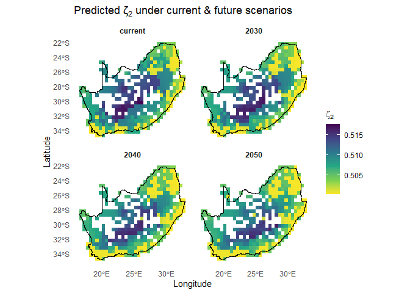

------------------------------------------------------------------------

## 7. MAP COMMUNITY BIOREGIONS

### 7.1. Run clustering analyses using `map_bioreg()` to map bioregions

In this step we translate our site‐level ζ₂ predictions into spatial
bioregions. A bioregion here is a cluster of grid cells that are both
geographically adjacent and compositionally similar i.e. they share a
high proportion of species and therefore form a coherent ecological unit
at the 0.5 ° resolution. In other words, a bioregion is simply a group
of neighbouring grid cells whose plants/wildlife communities look much
the same, so we can treat them as one ecologically distinct patch on the
map. Calling `map_bioreg()` on the `predictors_df` does the following:

1.  **Scales** the predicted turnover, longitude and latitude
2.  **Fits** four clustering algorithms (k-means, PAM, hierarchical and
    GMM)
    - `k-means` partitions points around centroids and is fast for large
      data sets.
    - `PAM` (Partitioning Around Medoids) is a medoid-based analogue of
      k-means that is more robust to outliers.
    - `Hierarchical` agglomerative clustering builds a dendrogram and
      then “cuts” it at the chosen k, capturing nested structure in the
      data.
    - `GMM` (Gaussian Mixture Model) treats clusters as multivariate
      normal distributions and assigns each point by maximum likelihood.
3.  **Realigns** each method’s cluster **labels** to the k-means
    solution for consistency
4.  **Builds** both nearest-neighbour and thin-plate-spline
    **interpolated surfaces**
5.  **Returns** the raw **cluster** assignments and gridded **rasters**,
    and plots a 2×2 panel of **maps** (`show_plot=TRUE`)

The result is a set of complementary bioregion maps and rasters you can
use to compare how different algorithms partition the landscape based on
compositional turnover and geography.

------------------------------------------------------------------------

### 7.2. Map current bioregions using `map_bioreg()`

Mapping present-day bioregions translates ζ-diversity predictions into
discrete, spatially coherent units that are easy to visualise and
compare. Here we run `map_bioreg()` on the grid-level ζ₂ surface
(`predictors_df`), scaling turnover and coordinates, and letting four
complementary clustering algorithms delineate regions. The function
returns both raw cluster assignments and smoothed interpolations,
producing a quick 2×2 panel that highlights areas where the different
methods agree and/or where biogeographic boundaries are more uncertain.

``` r
# Add this to {, fig.width=11.25, fig.height=9, warning=FALSE, message=FALSE}
# Run `map_bioreg` function to generate and plot clusters
bioreg_current = map_bioreg(
  data = predictors_df,
  scale_cols = c("pred_zetaExp", "centroid_lon", "centroid_lat"),
  method = 'all', # Options: c("kmeans","pam","hclust","gmm","all"),
  k_override  = 8,
  interpolate = 'nn', # Options: c("none","nn","tps","all"),
  x_col ='centroid_lon',
  y_col ='centroid_lat',
  res = 0.5, 
  crs = "EPSG:4326",
  plot = TRUE,
  bndy_fc = rsa)
```

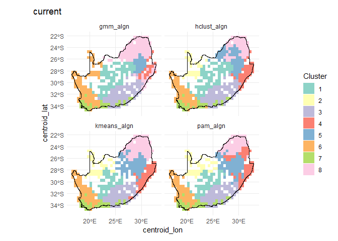

``` r

# Check results
str(bioreg_current, max.level=1)
#> List of 6
#>  $ none   :List of 1
#>  $ nn     :List of 1
#>  $ tps    : NULL
#>  $ table  :'data.frame': 415 obs. of  24 variables:
#>  $ plots  :List of 1
#>  $ methods: chr [1:4] "kmeans" "pam" "hclust" "gmm"
```

------------------------------------------------------------------------

### 7.3. Map future bioregions using `map_bioreg()`

Below we expand our workflow to map the forecasted ζ₂ bioregions under
three extreme climate futures (2030, 2040, 2050) alongside the current
scenario. To see how the bioregional partitions shift, we split
`all_preds` by scenario and apply `map_bioreg()` to each. We then
extract the hierarchical cluster layers, mask them to our study area,
and plot all four maps in a 2×2 layout. Results shows how predicted
turnover patterns and resulting bioregions might shift as climate warms
and rainfall changes, highlighting potential future reorganization of
biodiversity hotspots.

``` r
# Split your combined predictions by scenario into a named list
by_scn = split(all_preds, all_preds$scenario)

# For each scenario, call map_bioreg() with all algorithms
bioreg_future = map_bioreg(
  data = by_scn,
  scale_cols = c("pred_zetaExp", "centroid_lon", "centroid_lat"),
  method = 'all', # Options: c("kmeans","pam","hclust","gmm","all"),
  k_override  = 8,
  interpolate = 'nn', # Options: c("none","nn","tps","all"),
  x_col ='centroid_lon',
  y_col ='centroid_lat',
  res = 0.5, 
  crs = "EPSG:4326",
  plot = TRUE,
  bndy_fc = rsa)
```

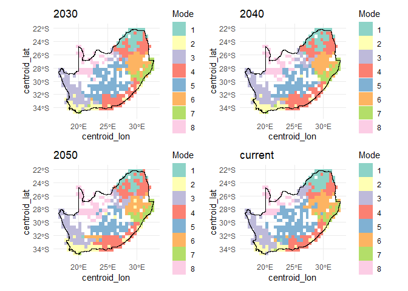

``` r

# Check results
str(bioreg_future, max.level=1)
#> List of 6
#>  $ none   :List of 4
#>  $ nn     :List of 4
#>  $ tps    : NULL
#>  $ table  :'data.frame': 1660 obs. of  24 variables:
#>  $ plots  :List of 4
#>  $ methods: chr [1:4] "kmeans" "pam" "hclust" "gmm"
```

Below we visualise the nearest-neighbour interpolated future‐scenario
cluster outputs. First, we list the structure of the `bioreg_future`
result to confirm available components. We then combine the k-means
nearest-neighbour rasters for “current” and each future year into a
single `SpatRaster` stack (`future_nn`), and resample, then mask it to
the RSA boundary (`mask_future_nn`). Finally, we lay out a 2×2 plot
grid, compute a discrete colour palette for each layer based on its
unique classes, and render each masked layer with its boundary overlay
for a quick inspection of bioregion changes across time.

``` r
# Check results
str(bioreg_future, max.level=1)
#> List of 6
#>  $ none   :List of 4
#>  $ nn     :List of 4
#>  $ tps    : NULL
#>  $ table  :'data.frame': 1660 obs. of  24 variables:
#>  $ plots  :List of 4
#>  $ methods: chr [1:4] "kmeans" "pam" "hclust" "gmm"

# Create SpatRast
future_nn = c(bioreg_future$nn$current$kmeans_current,
             bioreg_future$nn$`2030`$kmeans_2030,
             bioreg_future$nn$`2040`$kmeans_2040,
             bioreg_future$nn$`2050`$kmeans_2050)
names(future_nn)
#> [1] "kmeans_current" "kmeans_2030"    "kmeans_2040"    "kmeans_2050"

# 4) Mask `result_bioregDiff` to the RSA boundary
mask_future_nn = terra::mask(resample(future_nn, grid_masked, method = "mod"), grid_masked)

# 5) Quick visual QC in a 2×2 layout
old_par = par(mfrow = c(2, 2), mar = c(1, 1, 1, 5))
titles = c("Current",
            "2030",
            "2040",
            "2050")

for (i in 1:4) {
  ## 1. how many distinct classes in this layer?
  cls  = sort(unique(values(mask_future_nn[[i]])))
  cls  = cls[!is.na(cls)]
  n    = length(cls)

  ## 2. build a discrete palette of n colours
  pal = if (n <= 12) {
           RColorBrewer::brewer.pal(n, "Set3")                      # native Set3
         } else {
           colorRampPalette(brewer.pal(12, "Set3"))(n) # extended Set3
         }

  ## 3. plot
  plot(mask_future_nn[[i]],
       col      = pal,
       type     = "classes",          # treats values as categories
       colNA    = NA,
       axes     = FALSE,
       legend   = TRUE,
       main     = titles[i],
       cex.main = 0.8)

  plot(terra::vect(rsa), add = TRUE, border = "black", lwd = .4)
}
```

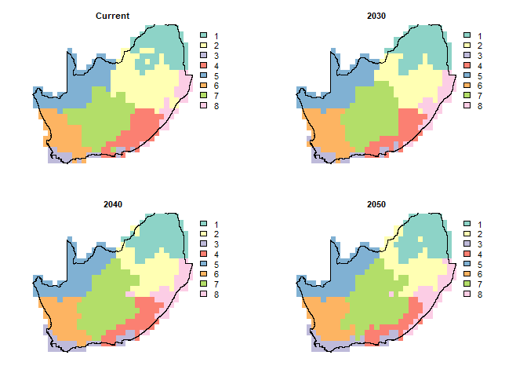

``` r

par(old_par)
```

------------------------------------------------------------------------

## 8. MAP BIOREGION SENSITIVITY TO CHANGE

### 8.1. Sensitivity of bioregion delineation to clustering method using `map_bioregDiff()`

In the sections below we use `map_bioregDiff()` to assess how much our
four clustering algorithms disagree (a sensitivity check). Here we treat
the various cluster maps generated with `map_bioreg()` as a sensitivity
analysis. By feeding all four algorithm outputs into `map_bioregDiff()`,
we quantify where and how much those methods disagree. This shows which
areas are robust to algorithm choice and which are method‐dependent.

**Change-metric options in `map_bioregDiff()` include** (`approach`
argument):

- **difference_count**: counts how many times a cell’s label deviates
  from the first layer.  
- **shannon_entropy**: Shannon entropy of the label sequence, a measure
  of within-cell diversity.  
- **stability**: proportion of layers in which the label is unchanged (1
  = always stable, 0 = always different).  
- **transition_frequency**: total number of label flips between
  consecutive layers, showing how often change occurs.  
- **weighted_change_index**: cumulative change weighted by a
  dissimilarity matrix so rare or large transitions score higher.  
- **all** (default): returns a five-layer `SpatRaster` containing every
  metric.

``` r
# Create SpatRast
current_nn = c(bioreg_current$nn$current$kmeans_algn_current,
             bioreg_current$nn$current$pam_algn_current,
             bioreg_current$nn$current$hclust_algn_current,
             bioreg_current$nn$current$gmm_algn_current)
names(current_nn)
#> [1] "kmeans_algn_current" "pam_algn_current"    "hclust_algn_current"
#> [4] "gmm_algn_current"

# Run `map_bioregDiff`
# 'approach', specifies which metric to compute:
sens_bioregDiff = map_bioregDiff(
  current_nn,
  approach = "all"
)

# Inspect the output layers
sens_bioregDiff
#> class       : SpatRaster 
#> size        : 25, 32, 5  (nrow, ncol, nlyr)
#> resolution  : 0.5, 0.4999984  (x, y)
#> extent      : 16.75, 32.75, -34.75, -22.25004  (xmin, xmax, ymin, ymax)
#> coord. ref. : lon/lat WGS 84 (EPSG:4326) 
#> source(s)   : memory
#> names       : Differ~_Count, Shanno~ntropy, Stability, Transi~quency, Weight~_Index 
#> min values  :             0,      0.000000,         0,             0,       0.00000 
#> max values  :             3,      1.039721,         1,             3,       2.97973

# Crop to our study area and prepare for plotting
mask_sens_bioregDiff = terra::mask(
  terra::resample(sens_bioregDiff, grid_masked, method = "near"),
  grid_masked
)

# Quick visual QC in a 3×2 layout
old_par = par(mfrow = c(3, 2), mar = c(1, 1, 1, 5))
titles = c("Difference count", "Shannon entropy", "Stability",
           "Transition frequency", "Weighted change index")

for (i in seq_along(titles)) {
  plot(mask_sens_bioregDiff[[i]],
       col      = viridis(100, direction = -1),
       colNA    = NA,
       axes     = FALSE,
       main     = titles[i],
       cex.main = 0.8)
  plot(terra::vect(rsa), add = TRUE, border = "black", lwd = 0.4)
}
par(old_par)
```

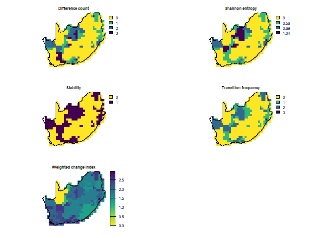

------------------------------------------------------------------------

### 8.2. Map bioregion sensitivity to future change using `map_bioregDiff()`

Here we use `map_bioregDiff()` to track how the hierarchical‐cluster map
itself changes under three future climate scenarios. Focusing solely on
the hierarchical solution we map bioregion change across time. First we
stack the hierarchical clusters for today, 2030, 2040 and 2050, run
`map_bioregDiff()` on that series, and highlight how bioregions shift
under these future climate projections. In this way we isolate
climate-driven reorganization in the hierarchical map itself.

``` r
# 1. Build a multi‐layer SpatRaster of hierarchical clusters for each scenario
# Create SpatRast
future_hclt = c(bioreg_future$nn$current$hclust_current,
             bioreg_future$nn$`2030`$hclust_2030,
             bioreg_future$nn$`2040`$hclust_2040,
             bioreg_future$nn$`2050`$hclust_2050)
names(future_hclt)
#> [1] "hclust_current" "hclust_2030"    "hclust_2040"    "hclust_2050"

# 2. Compute change metrics across those four layers
future_bioregDiff = map_bioregDiff(future_hclt, approach = "all")

# 3. Mask to your RSA boundary (assuming 'grid_masked' is your template)
mask_future_bioregDiff = terra::mask(
  terra::resample(future_bioregDiff, grid_masked, method = "near"),
  grid_masked
)

# 4. Plot all five metrics in a 3×2 panel
old_par = par(mfrow = c(3, 2), mar = c(1, 1, 1, 5))
titles = c(
  "Difference count",
  "Shannon entropy",
  "Stability",
  "Transition frequency",
  "Weighted change index"
)
for (i in seq_along(titles)) {
  plot(
    mask_future_bioregDiff[[i]],
    # col      = viridisLite::turbo(100),
    col      = viridis(100, direction = -1),
    colNA    = NA,
    axes     = FALSE,
    main     = titles[i],
    cex.main = 0.8
  )
  plot(terra::vect(rsa), add = TRUE, border = "black", lwd = 0.4)
}
par(old_par)
```

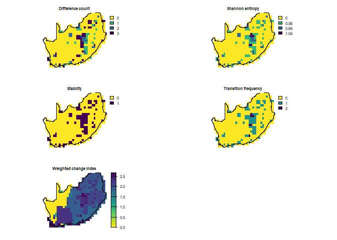

------------------------------------------------------------------------

## 9. SHARE AND DISSEMINATE RESULTS

### 9.1. Deposit all results into Zenodo

All data frames, tables, maps, and standard metadata can be deposited
into Zenodo using [`zen4R`](https://github.com/eblondel/zen4R/wiki) or
[Zenodo UI](https://zenodo.org/records/10715460). Below is a minimal
`zen4R` workflow showing how to create a new deposition, upload a file,
and publish it to Zenodo:

- Make sure `ZENODO_TOKEN` is set in your environment with
  `deposit:write` (and if plan to publish, `deposit:actions`) scope.  
- `createDeposition()`, `uploadFile()`, and `publishDeposition()` are
  all methods of the R6 `ZenodoManager` object.  
- Use `downloadFiles()` to pull back any/all files from a given record
  ID.

**NOTE**: This will only work if you have an existing Zenodo account.
For step‐by‐step guidance on creating and managing your personal access
token, consult the official [Zenodo Developers documentation under
Authentication](https://developers.zenodo.org/#authentication). For a
tutorial on using `zen4R` to upload (and download) data, see the
official [zen4R
vignette](https://cran.r-project.org/web/packages/zen4R/vignettes/zen4R.html).

``` r
# # Install and load zen4R if you haven’t already
# # install.packages("zen4R")
# library(zen4R)
# 
# # 1. Authenticate (expects your token in ZENODO_TOKEN)
# token  = Sys.getenv("ZENODO_TOKEN")
# zenodo = ZenodoManager$new(token = token)
# 
# # 2. Create a new (empty) deposition with basic metadata
# dep = zenodo$createDeposition(
#   metadata = list(
#     title       = "My Example Dataset",
#     upload_type = "dataset",
#     description = "A demo upload via zen4R",
#     creators    = list(list(name = "Doe, Jane"))
#   )
# )
# 
# # 3. Upload your local file into that deposition
# zenodo$uploadFile(deposition = dep, file = "path/to/my_data.csv")
# 
# # 4. Publish the deposition (this mints a DOI)
# published = zenodo$publishDeposition(deposition = dep)
# message("Published DOI: ", published$doi)
# 
# # 5. Later on: download all files from that record into a folder
# zenodo$downloadFiles(record_id = dep$id, path = "downloads/")
```

------------------------------------------------------------------------
