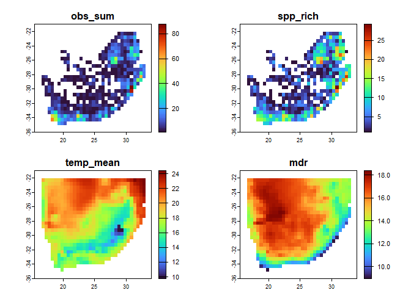
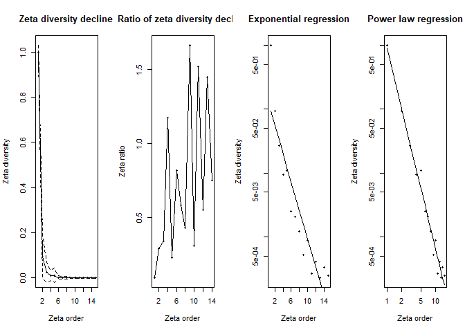

- [`dissmapr: Compositional Dissimilarity and Biodiversity Turnover Analysis`](#dissmapr)  
- [Introduction](#introduction)
- [Step-by-Step Workflow](#step-by-step-workflow)
  - [1. Install and load `dissmapr`](#1-install-and-load-dissmapr)
  - [2. Load other R libraries](#2-load-other-r-libraries)
  - [3. User-defined area of interest and grid resolution](#3-user-defined-area-of-interest-and-grid-resolution)
  - [4. Get species occurrence records using `get_occurrence_data`](#4-get-species-occurrence-records-using-get_occurrence_data)
  - [5. Format data using `format_df`](#5-format-data-using-format_df)
  - [6. Summarise records by grid centroid using `generate_grid`](#6-summarise-records-by-grid-centroid-using-generate_grid)
    - [Example 1 – Species Richness](#example-1---species-richness)
    - [Example 2 – Community Turnover](#example-2---community-turnover)
  - [7. Generate site by species matrix - `site_spp`](#7-generate-site-by-species-matrix---site_spp)
  - [8. Generate site by environment matrix using `get_enviro_data`](#8-generate-site-by-environment-matrix-using-get_enviro_data)
  - [9. Change coordinates projection using `sf::st_transform`](#9-change-coordinates-projection-using-sfst_transform)
  - [10. Check for colinearity using `rm_correlated`](#10-check-for-colinearity-using-rm_correlated)
  - [11. Calculate Zeta decline for orders 2:15](#11-calculate-zeta-decline-for-orders-215)
  - [12. Calculate Zeta decay for orders 2:8](#12-calculate-zeta-decay-for-orders-28)
  - [13. Run a Multi-Site Generalised Dissimilarity Model for order 2](#13-run-a-multi-site-generalised-dissimilarity-model-for-order-2)
  - [14. Predict current Zeta Diversity (zeta2) using `predict_dissim`](#14-predict-current-zeta-diversity-zeta2-using-predict_dissim)
  - [15. Run clustering analysesusing `map_bioreg`](#15-run-clustering-analyses-using-map_bioreg)
  - [16. Predict future Zeta Diversity and map bioregion change using `map_bioregDiff`](#16-predict-future-zeta-diversity-and-map-bioregion-change-using-map_bioregDiff)
  - [17. Deposit all results into Zenodo](#17-deposit-all-results-into-Zenodo)

<!-- README.md is generated from README.Rmd. Please edit that file -->
<!-- badges: start -->

[](https://mybinder.org/v2/gh/nithecs-biomath/RBasicPack/master?urlpath=rstudio)
[](https://lifecycle.r-lib.org/articles/stages.html#stable)
[](https://github.com/macSands/dissmapr/actions/workflows/test-coverage.yaml)
[](https://app.codecov.io/gh/macSands/dissmapr)
[](https://github.com/macSands/dissmapr/actions/workflows/R-CMD-check.yaml)

<!-- badges: end -->

------------------------------------------------------------------------

# `dissmapr`

## A Novel Framework for Automated Compositional Dissimilarity and Biodiversity Turnover Analysis

------------------------------------------------------------------------

## Introduction

`dissmapr` is an R package for analysing compositional dissimilarity and
biodiversity turnover across spatial gradients. It provides scalable,
modular workflows that integrate species occurrence, environmental data,
and multi-site metrics to quantify and predict biodiversity patterns. A
core feature is the use of zeta diversity, which extends beyond pairwise
comparisons to capture shared species across multiple sites—offering
deeper insight into community assembly, turnover, and connectivity. By
incorporating modern approaches such as multi-site Generalised
Dissimilarity Modelling (MS-GDM), `dissmapr` enables robust mapping,
bioregional classification, and scenario-based forecasting. Designed for
flexibility and reproducibility, it supports biodiversity monitoring and
conservation planning at landscape to regional scales.

------------------------------------------------------------------------

## Step-by-Step Workflow

`dissmapr` implements a structured, reproducible workflow for analysing
biodiversity patterns and delineating bioregions. Each function aligns
with a specific step, guiding users from data acquisition to predictive
mapping. The workflow begins with sourcing species occurrence and
georeferenced environmental data, followed by data formatting and
calculation of compositional turnover using zeta diversity metrics (via
the `zetadiv` package). Multi-Site Generalized Dissimilarity Modelling
(MS-GDM) is then applied to model and predict dissimilarity across
landscapes. These predictions feed into the Dissimilarity Cube, which
classifies spatial clusters of species composition into distinct
bioregions. The framework supports the integration of historical and
future climate data to assess shifts in biodiversity and detect
emerging, shifting, or dissolving bioregions under global change. This
step-by-step structure, mirrored in the accompanying tutorial sections,
promotes accessibility, transparency, and ecological insight at multiple
spatial and temporal scales.

------------------------------------------------------------------------

### 1. Install and load `dissmapr`

Install and load the `dissmapr` package from GitHub, ensuring all
functions are available for use in the analysis workflow.

``` r
# install remotes if needed
# install.packages("remotes")
remotes::install_github("macSands/dissmapr")
```

``` r
# Ensure the package is loaded when knitting
library(dissmapr)

# Make sure all the functions are loaded
devtools::load_all()
```

------------------------------------------------------------------------

### 2. Load other R libraries

Load core libraries for spatial processing, biodiversity modelling, and
visualization required across the `dissmapr` analysis pipeline.

``` r
# Load necessary libraries
library(httr)       # HTTP client  
library(geodata)    # Download geographic data  
library(data.table) # Fast large-table operations  
library(dplyr)      # Data manipulation verbs  
library(tidyr)      # Tidy data reshaping  
library(zoo)        # Time series utilities  
library(sf)         # Vector spatial data  
library(terra)      # Raster spatial operations  
library(zetadiv)    # Multi-site biodiversity turnover  
library(ggplot2)    # Grammar of graphics  
library(viridis)    # Perceptual color scales  
```

------------------------------------------------------------------------

### 3. User-defined area of interest and grid resolution

Load the spatial boundary data for South Africa to serve as the
geographic reference for all subsequent biodiversity analyses and
visualizations.

``` r
# Read RSA shape file
rsa = sf::st_read('inst/extdata/rsa.shp')
#> Reading layer `rsa' from data source 
#>   `D:\Methods\R\myR_Packages\myCompletePks\dissmapr\inst\extdata\rsa.shp' using driver `ESRI Shapefile'
#> Simple feature collection with 1 feature and 1 field
#> Geometry type: POLYGON
#> Dimension:     XY
#> Bounding box:  xmin: 16.45802 ymin: -34.83514 xmax: 32.89125 ymax: -22.12661
#> Geodetic CRS:  WGS 84

# Define your resolution and create mask to use later
res = 0.5 # 0.5 degrees is roughly 55km

# Convert to a terra vector
rsa_vect = vect(rsa)

# Create an empty raster over RSA at your desired resolution
grid = rast(rsa_vect, resolution = res, crs = crs(rsa_vect))
values(grid) = 1   # fill with dummy values

# Mask everything outside the RSA boundary
grid_masked = mask(grid, rsa_vect)
```

------------------------------------------------------------------------

### 4. Get species occurrence records using `get_occurrence_data`

This section focuses on automating the retrieval and pre-processing of
biodiversity occurrence data from various sources, including:

1)  local `databases`.csv\` files,
2)  URLs or `.zip` files from the Global Biodiversity Information
    Facility (GBIF), and
3)  species occurrence cubes from B3 (specification) \[*work in
    progress*\].

The function assembles data on species distributions across specified
taxonomic groups and regions, producing presence-absence or abundance
matrices that quantify species co-occurrence within locations.

``` r
bfly_data = get_occurrence_data(
  data        = 'inst/extdata/gbif_butterflies.csv',
  source_type = 'local_csv',
  sep         = '\t'
)

# Check results
dim(bfly_data)
#> [1] 81825    52
head(bfly_data, n=5)
#>      gbifID                           datasetKey occurrenceID  kingdom     phylum   class
#> 1 923051749 6ac3f774-d9fb-4796-b3e9-92bf6c81c084              Animalia Arthropoda Insecta
#> 2 922985630 6ac3f774-d9fb-4796-b3e9-92bf6c81c084              Animalia Arthropoda Insecta
#> 3 922619348 6ac3f774-d9fb-4796-b3e9-92bf6c81c084              Animalia Arthropoda Insecta
#> 4 922426210 6ac3f774-d9fb-4796-b3e9-92bf6c81c084              Animalia Arthropoda Insecta
#> 5 921650584 6ac3f774-d9fb-4796-b3e9-92bf6c81c084              Animalia Arthropoda Insecta
#>         order        family     genus            species infraspecificEpithet  taxonRank
#> 1 Lepidoptera      Pieridae    Pieris   Pieris brassicae                         SPECIES
#> 2 Lepidoptera      Pieridae    Pieris   Pieris brassicae                         SPECIES
#> 3 Lepidoptera  Papilionidae   Papilio  Papilio demodocus                         SPECIES
#> 4 Lepidoptera      Pieridae Mylothris Mylothris agathina             agathina SUBSPECIES
#> 5 Lepidoptera Lasiocampidae  Eutricha  Eutricha capensis                         SPECIES
#>                       scientificName             verbatimScientificName
#> 1  Pieris brassicae (Linnaeus, 1758)                   Pieris brassicae
#> 2  Pieris brassicae (Linnaeus, 1758)                   Pieris brassicae
#> 3      Papilio demodocus Esper, 1798 Papilio demodocus subsp. demodocus
#> 4        Mylothris agathina agathina Mylothris agathina subsp. agathina
#> 5 Eutricha capensis (Linnaeus, 1767)                  Eutricha capensis
#>   verbatimScientificNameAuthorship countryCode                                          locality
#> 1                               NA          ZA                                          Hermanus
#> 2                               NA          ZA                                   Polkadraai Road
#> 3                               NA          ZA                                       Signal Hill
#> 4                               NA          ZA                                          Hermanus
#> 5                               NA          ZA Cape of Good Hope / Cape Point Area, South Africa
#>   stateProvince occurrenceStatus individualCount                     publishingOrgKey         y
#> 1                        PRESENT              NA bb646dff-a905-4403-a49b-6d378c2cf0d9 -34.42086
#> 2                        PRESENT              NA bb646dff-a905-4403-a49b-6d378c2cf0d9 -33.96044
#> 3                        PRESENT              NA bb646dff-a905-4403-a49b-6d378c2cf0d9 -33.91651
#> 4                        PRESENT              NA bb646dff-a905-4403-a49b-6d378c2cf0d9 -34.42086
#> 5                        PRESENT              NA bb646dff-a905-4403-a49b-6d378c2cf0d9 -34.35024
#>          x coordinateUncertaintyInMeters coordinatePrecision elevation elevationAccuracy depth
#> 1 19.24410                           250                  NA        NA                NA    NA
#> 2 18.75564                           250                  NA        NA                NA    NA
#> 3 18.40321                           250                  NA        NA                NA    NA
#> 4 19.24410                           250                  NA        NA                NA    NA
#> 5 18.47488                           250                  NA        NA                NA    NA
#>   depthAccuracy        eventDate day month year taxonKey speciesKey     basisOfRecord
#> 1            NA 2012-10-13T00:00  13    10 2012  1920506    1920506 HUMAN_OBSERVATION
#> 2            NA 2012-11-01T00:00   1    11 2012  1920506    1920506 HUMAN_OBSERVATION
#> 3            NA 2012-10-31T00:00  31    10 2012  1938125    1938125 HUMAN_OBSERVATION
#> 4            NA 2012-10-13T00:00  13    10 2012 11374894    5137998 HUMAN_OBSERVATION
#> 5            NA 2012-10-30T00:00  30    10 2012  6113873    6113873 HUMAN_OBSERVATION
#>   institutionCode collectionCode catalogNumber recordNumber identifiedBy dateIdentified   license
#> 1     naturgucker    naturgucker    -190723441                                          CC_BY_4_0
#> 2     naturgucker    naturgucker    2051102952                                          CC_BY_4_0
#> 3     naturgucker    naturgucker    1565945073                                          CC_BY_4_0
#> 4     naturgucker    naturgucker   -1879976251                                          CC_BY_4_0
#> 5     naturgucker    naturgucker   -1022055456                                          CC_BY_4_0
#>   rightsHolder recordedBy typeStatus establishmentMeans          lastInterpreted  mediaType
#> 1               591374253         NA                 NA 2024-03-15T23:20:20.346Z           
#> 2               591374253         NA                 NA 2024-03-15T23:22:38.206Z           
#> 3               591374253         NA                 NA 2024-03-15T23:26:59.721Z           
#> 4               591374253         NA                 NA 2024-03-15T23:23:55.839Z StillImage
#> 5               591374253         NA                 NA 2024-03-15T23:22:38.836Z StillImage
#>                                                                                                                              issue
#> 1                        COORDINATE_ROUNDED;GEODETIC_DATUM_ASSUMED_WGS84;CONTINENT_DERIVED_FROM_COORDINATES;MULTIMEDIA_URI_INVALID
#> 2                        COORDINATE_ROUNDED;GEODETIC_DATUM_ASSUMED_WGS84;CONTINENT_DERIVED_FROM_COORDINATES;MULTIMEDIA_URI_INVALID
#> 3 COORDINATE_ROUNDED;GEODETIC_DATUM_ASSUMED_WGS84;CONTINENT_DERIVED_FROM_COORDINATES;TAXON_MATCH_HIGHERRANK;MULTIMEDIA_URI_INVALID
#> 4                                               COORDINATE_ROUNDED;GEODETIC_DATUM_ASSUMED_WGS84;CONTINENT_DERIVED_FROM_COORDINATES
#> 5                                               COORDINATE_ROUNDED;GEODETIC_DATUM_ASSUMED_WGS84;CONTINENT_DERIVED_FROM_COORDINATES
#>   site_id pa
#> 1       1  1
#> 2       2  1
#> 3       3  1
#> 4       1  1
#> 5       4  1
```

------------------------------------------------------------------------

### 5. Format data using `format_df`

Use `format_df` to standardise and reshape biodiversity data into long
or wide formats. The function automatically identifies key columns
(e.g., coordinates, species, and values), assigns missing site IDs, and
reformats the data for analysis. Outputs include a cleaned dataset and
species-site matrices for further processing:

• site_xy: Holds spatial coordinates of sampled sites.  
• site_sp: Site-by-species matrix for biodiversity assessments.

#### Format data into long and wide formats

``` r
bfly_result = format_df(
  data        = bfly_data,
  species_col = 'verbatimScientificName',
  value_col   = 'pa',
  extra_cols  = NULL,
  format      = 'long'
)

# Optional: Create new objects from list items
site_obs = bfly_result$site_obs
site_spp = bfly_result$site_sp

# Check results
dim(site_obs)
#> [1] 79953     5
head(site_obs, n=5)
#>   site_id        x         y                            species value
#> 1       1 19.24410 -34.42086                   Pieris brassicae     1
#> 2       2 18.75564 -33.96044                   Pieris brassicae     1
#> 3       3 18.40321 -33.91651 Papilio demodocus subsp. demodocus     1
#> 4       1 19.24410 -34.42086 Mylothris agathina subsp. agathina     1
#> 5       4 18.47488 -34.35024                  Eutricha capensis     1

dim(site_spp)
#> [1] 56090  2871
head(site_spp, n=5)
#> # A tibble: 5 × 2,871
#>   site_id     x     y Mylothris agathina subsp.…¹ `Pieris brassicae` `Tarucus thespis` `Acraea horta`
#>     <int> <dbl> <dbl>                       <dbl>              <dbl>             <dbl>          <dbl>
#> 1       1  19.2 -34.4                           1                  1                 1              0
#> 2       2  18.8 -34.0                           0                  1                 0              0
#> 3       3  18.4 -33.9                           0                  0                 0              2
#> 4       4  18.5 -34.4                           0                  0                 0              0
#> 5       5  25.7 -33.6                           0                  0                 0              0
#> # ℹ abbreviated name: ¹​`Mylothris agathina subsp. agathina`
#> # ℹ 2,864 more variables: `Danaus chrysippus` <dbl>, `Papilio demodocus subsp. demodocus` <dbl>,
#> #   `Eutricha capensis` <dbl>, `Mesocelis monticola` <dbl>, `Vanessa cardui` <dbl>,
#> #   `Cuneisigna obstans` <dbl>, `Dixeia charina subsp. charina` <dbl>,
#> #   `Drepanogynis bifasciata` <dbl>, `Drepanogynis cambogiaria` <dbl>, `Chiasmia observata` <dbl>,
#> #   `Catacroptera cloanthe` <dbl>, `Precis octavia` <dbl>, `Acraea rabbaiae` <dbl>,
#> #   `Amauris ochlea` <dbl>, `Amauris ochlea ochlea` <dbl>, `Appias sabina phoebe` <dbl>, …
```

#### Get parameters to use later

``` r
# Get parameters from processed data
# Number of species columns
(n_sp = dim(site_spp)[2] - 3)
#> [1] 2868

# Species names
sp_cols = names(site_spp)[-c(1:3)]
names(sp_cols)[1:5]
#> NULL
```

------------------------------------------------------------------------

### 6. Summarise records by grid centroid using `generate_grid`

Use `generate_grid` to divide the study area, derived from the
geographic extent of the occurrence data above, into grids of
user-defined resolution, creating a spatial grid over a specified
geographic extent. It assigns unique grid IDs to points and summarizes
selected data columns within each grid cell. The function outputs a
raster grid, grid polygons for visualization, and a data frame
summarizing the contents of each grid cell, including totals and
centroids. It is particularly useful for aggregating spatial data, such
as biodiversity observations, into predefined spatial units for further
analysis.

#### Assign records to a grid at a set resolution (e.g. 0.5°)

Aggregate species records into equal-area grid cells to enable spatially
standardized biodiversity analyses.

``` r
grid_list = generate_grid(
  data       = site_spp,
  x_col      = "x",
  y_col      = "y",
  grid_size  = 0.5,
  sum_col_range = 4:ncol(site_spp),
  crs_epsg   = 4326
)

# Optional: Create new objects from list items
aoi_grid = grid_list$grid_sf
grid_spp = grid_list$block_sp

# Check results
dim(aoi_grid)
#> [1] 1110    8
head(aoi_grid, n=5)
#> Simple feature collection with 5 features and 6 fields
#> Active geometry column: geometry
#> Geometry type: POLYGON
#> Dimension:     XY
#> Bounding box:  xmin: 15.5 ymin: -36 xmax: 18 ymax: -35.5
#> Geodetic CRS:  WGS 84
#>   centroid_lon centroid_lat grid_id  mapsheet obs_sum spp_rich                       geometry
#> 1        15.75       -35.75       1 E015S36BB      NA       NA POLYGON ((15.5 -36, 16 -36,...
#> 2        16.25       -35.75       2 E016S36BB      NA       NA POLYGON ((16 -36, 16.5 -36,...
#> 3        16.75       -35.75       3 E016S36BB      NA       NA POLYGON ((16.5 -36, 17 -36,...
#> 4        17.25       -35.75       4 E017S36BB      NA       NA POLYGON ((17 -36, 17.5 -36,...
#> 5        17.75       -35.75       5 E017S36BB      NA       NA POLYGON ((17.5 -36, 18 -36,...
#>               centroid
#> 1 POINT (15.75 -35.75)
#> 2 POINT (16.25 -35.75)
#> 3 POINT (16.75 -35.75)
#> 4 POINT (17.25 -35.75)
#> 5 POINT (17.75 -35.75)

dim(grid_spp)
#> [1]  415 2874
head(grid_spp, n=5)
#>      grid_id centroid_lon centroid_lat mapsheet obs_sum spp_rich Mylothris agathina subsp. agathina
#>      Pieris brassicae Tarucus thespis Acraea horta Danaus chrysippus
#>      Papilio demodocus subsp. demodocus Eutricha capensis Mesocelis monticola Vanessa cardui
#>      Cuneisigna obstans Dixeia charina subsp. charina Drepanogynis bifasciata
#>      Drepanogynis cambogiaria Chiasmia observata Catacroptera cloanthe Precis octavia
#>      Acraea rabbaiae Amauris ochlea Amauris ochlea ochlea Appias sabina phoebe
#>      Belenois gidica abyssinica Bicyclus safitza safitza Colotis euippe Ernsta dromus
#>      Eurytela hiarbas angustata Graphium antheus Graphium leonidas leonidas Hypolimnas anthedon
#>      Hypolycaena philippus Junonia oenone oenone Leptotes pirithous Papilio nireus
#>      Papilio nireus lyaeus Stephenia natalica Telchinia encedon encedon Eronia cleodora
#>      Teracolus eris eris Hippotion eson Colotis annae annae Junonia hierta cebrene Junonia hierta
#>      Hamanumida daedalus Papilio demodocus Aloeides pierus Acanthovalva focularia Achyra nudalis
#>      Acontia accola Adicocrita koranata Adisura aerugo Agrius convolvuli Agrotis crassilinea
#>      Agrotis denticulosa Antigastra catalaunalis Antiophlebia bracteata Argyrophora stramineata
#>      Argyrophora trofonia Axiodes asteiochlora Axiodes ectoglauca Axiodes figurata
#>      Axiodes interscripta Axiodes intricata Axiodes leucoloma Axiodes rufigrisea
#>      Belenois aurota aurota Blenina squamifera Bocchoris inspersalis Bombycomorpha bifascia
#>      Bombycopsis tephrobaphes Brephidium metophis Cardepia definiens Catopsilia florella
#>      Cerocala vermiculosa Ceromitia wahlbergi Chiasmia brongusaria Chiasmia inaequilinea
#>      Chlorerythra rubriplaga Chrysoritis lysander Chrysoritis plutus Colotis euippe omphale
#>      Colotis evenina Comibaena leucospilata Cornutiplusia circumflexa Cymaroa grisea
#>      Derriodes cnephaeogramma Derriodes miltophyris Diaphania indica Diaphone eumela
#>      Dicranuropsis vilis Diota rostrata Drepanogynis insolens Drepanogynis mixtaria
#>      Drepanogynis pero Drepanogynis sinuata Earias biplaga Earias insulana Ernsta sataspes
#>      Eublemma admota Eublemma caffrorum Euchromius ocellea Eucrostes rufociliaria Eurranthis acuta
#>      Gorgopis pholidota Grammodes stolida Helicoverpa armigera Heliothis scutuligera
#>      Hemixesma anthocrenias Hydriris ornatalis Hyles livornica Isturgia deerraria
#>      Klugeana philoxalis Lacipa picta Latoia latistriga Leptomyrina lara Loryma basalis
#>      Lorymodes digonialis Menophra serrataria Mentaxya ignicollis Metisella malgacha malgacha
#>      Microloxia ruficornis Nomophila africana Omphalucha maturnaria Ophiusa dianaris
#>      Ophiusa selenaris Ophiusa tirhaca Oraesia triobliqua Oraidium barberae Pagyda salvalis
#>      Paralacydes vocula Parapoynx fluctuosalis Phyllalia patens Phyllalia thunbergii
#>      Plutella xylostella Pontia helice helice Prasinocyma panchlora Pseudomaenas alcidata
#>      Pseudomaenas honiballi Pseudomaenas intricata Pyralis farinalis Rhabdosia vaninia
#>      Rhodometra participata Rhodometra sacraria Scotopteryx deversa Sicyodes cambogiaria
#>      Sicyodes olivescens Sommeria ostentata Sphingomorpha chlorea Spialia spio Spodoptera exigua
#>      Spodoptera littoralis Spoladea recurvalis Streblote uniforme Tarsocera Tearosoma aspersum
#>      Tegiapa virescens Temnora pylas Terastia africana Theretra capensis Thyretes hippotes
#>      Thysanoplusia orichalcea Traminda ocellata Tytroca metaxantha Udea ferrugalis
#>      Utetheisa pulchella Vegetia grimmia Victoria albipicta Zizeeria knysna Zizeeria knysna knysna
#>      Ercheia subsignata Tildia anemosa Leucotrachea melanodonta Agrotis ipsilon Agrotis segetum
#>      Araea indecora Ariathisa abyssinia Asota speciosa Aventiola truncataria Bracharoa dregei
#>      Brevipecten cornuta Brunia vicaria Calesia xanthognatha Callicercops triceros
#>      Chiasmia semitecta Chloroclystis muscosa Cirrhochrista grabczewskyi Cleora flavivenata
#>      Comostolopsis capensis Comostolopsis germana Corgatha producta Crambus sparsellus
#>      Crocidosema plebejana Ctenoplusia limbirena Desmeocraera nugatrix Diasemia disjectalis
#>      Diasemia monostigma Duponchelia lanceolalis Dysgonia torrida Eublemma apicimacula
#>      Eudasychira proleprota Eupithecia inconclusaria Gaana africana
#>      Gonanticlea meridionata meridionata Hamartia clarissa Holocerina smilax Hypena commixtalis
#>      Hypena senialis Hypenodes nigricolora Hypercodia wheeleri Hypomecis gonophora
#>      Hypsopygia nostralis Iambia melanochlora Laelia fusca Lygephila salax Meganola nigristriga
#>      Mentaxya muscosa Metachrostis anticalis Metisella metis metis Mythimna languida Nephele comma
#>      Neuranethes spodopterodes Nodaria nodosalis Nola tineoides Nomophila noctuella
#>      Notarcha quaternalis Obolcola decisa Odontosida pusillus Omphalucha crenulata
#>      Orthonama obstipata Ovios capensis Ozarba accincta Palpita vitrealis Panagropsis equitaria
#>      Pandesma robusta Piercia prasinaria Pontia helice Rhodogastria amasis Sarmatia interitalis
#>      Scopula hectata Simplicia extinctalis Sommeria culta Sommeria spilosoma Spodoptera cilium
#>      Temnora pseudopylas Thysanoplusia angulum Thysanoplusia sestertia Trachypteryx magella
#>      Trymalitis scalifera Xanthorhoe exorista Xanthorhoe poseata Xylopteryx arcuata
#>      Xylopteryx prasinaria Xylopteryx protearia Zebeeba meceneronis Zellereccopsis caffreana
#>      Zitha laminalis Zitha zonalis Macrocossus toluminus Amyna axis Cometaster pyrula
#>      Cryphia fulvifusa Honeyia clearchus Mixocera frustratoria Palasea albimacula
#>      Pardomima callixantha Phalera lydenburgi Rufoclanis numosae Stenochora lancinalis
#>      Stenoglene obtusa Xanthodes albago Coelonia fulvinotata Hypopyra capensis Acontia discoidea
#>      Acontia imitatrix Acontia trimaculata Afroclanis calcarea Amerila lupia Amyops ingens
#>      Anomis auragoides Archaeopilocornus lucidus Calesia zambesita Crocidolomia pavonana
#>      Desmeocraera basalis Epitrabala argenteoguttata Ethioterpia lichenea Ethioterpia marmorata
#>      Eudocima materna Eutelia polychorda Fentonina exacta Gynanisa maja Heliothis galatheae
#>      Hemerophanes libyra libyra Mazuca amoena Metajana marshalli Omphax plantaria
#>      Oneiliana multifera Ophiusa mejanesi Pericyma atrifusa Phoenicocampa rubrifasciata
#>      Pioneabathra olesialis Polydesma umbricola Radara subcupralis Rufoclanis jansei
#>      Sena prompta plusioides Theretra monteironis Xenimpia erosa Philotherma rennei
#>      Epichoristodes acerbella Isturgia spissata Striphnopteryx edulis Euproctis haemodetes
#>      Achaea praestans Acleros mackenii Acontia guttifera Acontia trychaenoides Acontia wallengreni
#>      Aethalopteryx squameus Agoma trimenii Aiteta veluta Amerila bauri Analyta calligrammalis
#>      Anoba atripuncta Anoba plumipes Aurivillius fuscus Autocharis jacobsalis Baniana culminifera
#>      Belenois gidica Beralade perobliqua Bicyclus anynana anynana Bostra xanthorhodalis
#>      Brevipecten legraini Bunaea alcinoe Callopistria latreillei Celidomphax rubrimaculata
#>      Cetola pulchra Charaxes candiope Chrysopoloma restricta Chrysopoloma varia Coenina poecilaria
#>      Coenyropsis natalii Colbusa euclidica Colotis vesta Colotis vesta argillaceus
#>      Corgatha porphyrana Craspia marshalli Cyligramma latona Dasychira extatura Deltoptera iphia
#>      Dysallacta negatalis Enargeiosia elegans Euexia percnopus Eutelia callichroma Fentonina punctum
#>      Goodia kuntzei Grammodes congenita Hemerophanes libyra Hemiolaus caeculus
#>      Heterorachis roseifimbria Hippotion roseipennis Homoeomeria flavicapilla Honeyania plumbosa
#>      Hypopyra africana Latoia intermissa Magusa versicolora Magusa viettei Marathyssa albidisca
#>      Maurilia arcuata Melanitis leda Micraphe lateritia Neopolyptychus compar Orbamia octomaculata
#>      Ozarba hemiochra Parafodina pentagonalis Pardomima distortana Phostria bistigmalis
#>      Plecoptera sarcistis Plecopterodes moderata Protarache melaphora Psara atritermina
#>      Pseudonacaduba sichela Rhesala moestalis Sameodes cancellalis Sarangesa ruona
#>      Schalidomitra ambages Sphalerosticha oblunata Terastia margaritis Thyretes caffra
#>      Timora disticta Trachypteryx rhodoxantha Uresiphita gilvata Usta terpsichore Zintha hintza
#>      Telchinia cabira Acrasia crinita Acronicta transvalica Argyrophora arcualis Chabulina astomalis
#>      Chiasmia turbulentata Dasychira octophora Dichroma equestralis Haplolabida inaequata
#>      Isocrita protophanes Prionapteryx splendida Pseudophragmatobia perpunctata Achaea catella
#>      Rhadinomphax trimeni Terias brigitta brigitta Anthemoctena textilis Cacyreus fracta fracta
#>      Phasis thero thero Spialia mafa Iolaus mimosae rhodosense Leptosia alcesta Deudorix antalus
#>      Papilio demodocus demodocus Poloma angulata Pteredoa monosticta Antigastra morysalis
#>      Charaxes brutus natalensis Chlorissa albistrigulata Danaus chrysippus orientis
#>      Polymona rufifemur Streblote cristata Acrapex aenigma Afrasura rivulosa Allochrostes biornata
#>      Anadiasa affinis Cecidothyris pexa Conchylia pactolaria Diasemiopsis ramburialis
#>      Dragmatucha proaula Halseyia bisecta Haplopacha cinerea Hypocala rostrata
#>      Lhommeia biskraria illiturata Mixocera albistrigata Neogavara imitans Odites natalensis
#>      Ozarba nigroviridis Piletocera flavalis Trichopisthia monteiroi Xanthomera leucoglene
#>      Axiodes insciata Terias desjardinsii Zizula hylax hylax Eulycia accentuata Euproctis crocata
#>      Macroglossum trochilus Piercia bryophilaria Protosteira spectabilis Siccia caffra
#>      Achroia grisella Cyana marshalli Iambia jansei Laelia clarki Lamoria imbella
#>      Pseudaphelia apollinaris Tycomarptes inferior Terias desjardinsii regularis Durbania limbata
#>      Capys alpheus Abantis paradisea Acantholipes trimeni Achaea echo Achaea finita Achaea lienardi
#>      Achaea trapezoides Acronicta silvicola Agathodes musivalis Agrotera citrina Amata simplex
#>      Amauris albimaculata albimaculata Amerila bubo Amerila magnifica Amerila phaedra
#>      Amerila vitrea vitrea Anaphe reticulata Anedhella interrupta Anoba sinuata Anomis flava
#>      Anomis leona Anthene amarah Anthene amarah amarah Anthene livida livida Aroa discalis
#>      Arsina vausema Ascotis reciprocaria Azanus jesous Azygophleps inclusa Basiothia medea
#>      Belenois creona severina Belenois thysa thysa Borbo borbonica borbonica Borbo detecta
#>      Borbo fatuellus fatuellus Borbo lugens Brachmia septella Bradina admixtalis
#>      Byblia anvatara acheloia Cacyreus marshalli Cadarena pudoraria Callopistria maillardi
#>      Callopistria yerburii Cephonodes hylas virescens Cerynea thermesialis Ceryx pterophorina
#>      Charaxes castor flavifasciatus Charaxes ethalion ethalion Charaxes varanes varanes
#>      Chiasmia deceptrix Chiasmia rectistriaria Chiasmia subcurvaria Chloroclystis muscosa tumefacta
#>      Chrysodeixis chalcites Cirina forda Cleora munda Cleora tulbaghata Coeliades pisistratus
#>      Colocleora divisaria Colotis antevippe gavisa Comostolopsis stillata Conolophia aemula
#>      Corgatha latifera Cragia distigmata Cyclophora unocula Cyligramma fluctuosa Disticta atava
#>      Duponchelia fovealis Dysgonia angularis Eccopsis incultana Egnasia vicaria Egybolis vaillantina
#>      Epiphora mythimnia Erebus walkeri Ericeia congressa Eublemma cochylioides Eublemma costimacula
#>      Eublemma illimitata Euchloron megaera Euchromia amoena Eucraera salammbo Eudocima afrikana
#>      Euplexia augens Euproctis aethiopica Euproctis hardenbergia Euproctis punctifera
#>      Eurrhyparodes tricoloralis Eurytela dryope angulata Eutelia amatrix Eutelia bowkeri
#>      Filodes costivitralis Glyphodes bitriangulalis Glyphodes stolalis Gonimbrasia zambesina
#>      Gracilodes caffra Gracilodes nysa Halseyia rectifascia Haritalodes derogata
#>      Herpetogramma mutualis Heterorachis devocata devocata Hippotion celerio Hodebertia testalis
#>      Hymenia perspectalis Hypena laceratalis Hypena lividalis Hypena varialis
#>      Hypolimnas anthedon wahlbergi Hypolimnas misippus Hypolycaena philippus philippus
#>      Iolaus silarus silarus Jana eurymas Laelia albimaculata Laelia extorta Laelia lunensis
#>      Lampides boeticus Latoia vivida Leipoxais peraffinis Leptosia alcesta inalcesta Libythea laius
#>      Lophostethus dumolinii Maliattha subblandula Marasmia poeyalis Marasmia trapezalis
#>      Melanitis leda leda Metallochlora grisea Mocis mayeri Mocis proverai Moltena fiara
#>      Morasa modesta Mylothris agathina agathina Naroma varipes Nausinoe geometralis
#>      Nephele accentifera Nephele argentifera Neptis saclava marpessa Notarcha muscerdalis
#>      Nyctemera apicalis Oraesia provocans Orphanostigma haemorrhoidalis Palpita metallata
#>      Papilio dardanus cenea Parapluda invitabilis Parnara monasi Pelopidas Pelopidas thrax
#>      Phalanta phalantha aethiopica Philotherma rosa Phodoryctis caerulea Phyllocnistis citrella
#>      Phytometra subflavalis africana Plecoptera annexa Plecoptera punctilineata Plusiodonta commoda
#>      Polyura zoolina Prasinocyma vermicularia Prophantis smaragdina Protogoniomorpha nebulosa
#>      Protogoniomorpha parhassus Pselaphelia flavivitta Pseudacraea lucretia tarquinea
#>      Pseudonacaduba sichela sichela Rhenea mediata Rhodopteriana rhodoptera Rhypopteryx rhodea
#>      Rubraea petraea Scopula lactaria Serrodes korana Sevenia boisduvali boisduvali
#>      Sevenia natalensis Sommeria aganais Spodoptera triturata Stephenia oncaea
#>      Stoermeriana singulare Streblote jansei Syllepte purpurascens Synclera traducalis
#>      Syngamia latimarginalis Tagiades flesus Tagoropsis flavinata Taviodes subjecta
#>      Telchinia esebria Temnora murina Terias hecabe solifera Thalassodes quadraria Tildia acara
#>      Traminda obversata Traminda vividaria Tumicla sagenaria Ulotrichopus variegata
#>      Viettessa margaritalis Yponomeuta strigillatus Zamarada plana denticincta Zizina otis
#>      Zizina otis antanossa Zizula hylax Zophopetes dysmephila Acrasia punctillata
#>      Bostra dipectinialis Brachylia terebroides Conicofrontia sesamoides Coryphodema tristis
#>      Ectochela canina Ectochela nigrilineata Eublemma bipartita Eublemma scitula augusta
#>      Eutelostolmus pictifimbria Glaucocharis natalensis Hypotephrina confertaria Phyllalia incerta
#>      Scotopteryx nictitaria Iambiodes nyctostola Tachosa brunnescens Zekelita tinctalis
#>      Bombycomorpha pallida Anthene definita Azanus mirza Azanus moriqua Belenois aurota
#>      Belenois creona Byblia ilithyia Coenyra hebe Cupidopsis jobates jobates Dixeia pigea
#>      Ypthima asterope asterope Agrotis spinifera Alucita spicifera Axiodes dochmoleuca
#>      Bracharoa tricolor Brithysana speyeri Conchylia nitidula Hellula undalis Leucinodes laisalis
#>      Metarctia jansei Mylothris agathina Pingasa abyssiniaria Tetracme truncataria Epitoxis amazoula
#>      Amauris albimaculata Belenois thysa Bicyclus safitza Byblia anvatara Dixeia charina
#>      Dixeia spilleri Eicochrysops hippocrates Euchromia folletii Eurytela dryope Neptis goochii
#>      Papilio dardanus Telchinia encedon Terias hecabe Acantholipes circumdata
#>      Acantholipes namacensis Acanthovalva inconspicuaria Acherontia atropos Achyra coelatalis
#>      Acontia ectorrida Acontia insocia Acontiola heliastis Acontiola varia Aconzarba decissima
#>      Acraea neobule Acronicta verbenata Aedia nigrescens nigrescens Afrophyla vethi
#>      Angustalius malacellus Arbelodes albitorquata Ascotis selenaria Aspidifrontia atavistis
#>      Aspilatopsis orthobates Athetis flavipuncta Athetis leuconephra Audea zimmeri Aurotalis similis
#>      Axylia annularis Axylia ustula Baniana arvorum Basiothia schenki Biafra concinnella
#>      Birketsmithiola sanguicosta Bombycopsis punctimarginata Bracharoa quadripunctata Brithys crini
#>      Busseola fusca Cabera strigata Cactoblastis cactorum Cadra cautella Caffristis ferrogrisea
#>      Calamoschoena stictalis Caloptilia celtina Caradrina atriluna Caradrina glaucistis
#>      Chabulina onychinalis Chiasmia multistrigata multistrigata Chiasmia simplicilinea
#>      Chilo partellus Chlorissa attenuata Chloroclystis grisea Coccothera spissana
#>      Coeliades forestan forestan Colotis evenina evenina Condica capensis Conolophia conscitaria
#>      Conservula cinisigna Cortyta canescens Cosmetra tumulata Cosmia natalensis
#>      Crambus ellipticellus Crambus tenuistriga Cryphia leucomelaena Cucullia hutchinsoni
#>      Cucullia pallidistria Culladia achroellum Cyana pretoriae pretoriae Cyana rejecta
#>      Cydia pomonella Daphnis nerii Deltophora typica Deltote bryophilina Deltote varicolora
#>      Diaphone mossambicensis Dolicharthria paediusalis Droceta cedrota Earias cupreoviridis
#>      Ectomyelois ceratoniae Elophila obliteralis Endrosis sarcitrella Epichoristodes dorsiplagana
#>      Epicrocis laticostella Episindris albimaculalis Ethiopica cupricolor Ethmia anikini
#>      Ethmia coscineutis Ethmia sabiella Etiella zinckenella Eublemma angustizona Eublemma baccatrix
#>      Eublemma ceresensis Eublemma costimacula plagiopera Eublemma daphoena Eublemma delicata
#>      Eublemma ecthaemata Eublemma gayneri Eublemma hemichiasma Eublemma juergenschmidli
#>      Eublemma mesophaea Eublemma nigrivitta Eublemma ornatula Eublemma pennula Eublemma scitula
#>      Euchromius discopis Euchromius nigrobasalis Euclasta warreni Eudalaca ammon Eumeta hardenbergi
#>      Euproctis bicolor Eutelia adulatrix Eutelia discitriga Evergestis forficalis
#>      Exophyla multistriata Faveria dionysia Galleria mellonella Glyphodella flavibrunnea
#>      Glyphodes bicolor Gorgopis libania Hadena bulgeri Heliocheilus stigmatia Heortia plumbatalis
#>      Heteropalpia vetusta Heterorachis devocata Honeyania ragusana Horisme obscurata Hypanua xylina
#>      Hypargyria metalliferella Hypena simplicalis Hypena tetrasticta Ilemodes astriga
#>      Lamoria adaptella Leptomyrina henningi henningi Leucaloa eugraphica Leucinodes pseudorbonalis
#>      Logunovium scortillum Lomographa aridata Lophoptera litigiosa Lophotarsia ochroprocta
#>      Loxostege frustalis Loxostege venustalis Maliattha caffristis Melouia krooni Menophra jansei
#>      Mentaxya albifrons Metachrostis decora Metachrostis ochrographa Metachrostis snelleni
#>      Metarctia brunneipennis Microligia pseudodolosa Mimasura tripunctoides Mimoclystia explanata
#>      Mimoclystia pudicata Mythimna tacuna Naarda nigripalpis Neaxestis acutangula
#>      Neaxestis piperitella Neocucullia albisignata Obolcola petronaria Opogona omoscopa
#>      Ozarba apicalis Ozarba consanguis Ozarba corniculans Ozarba hemipolia Ozarba madanda
#>      Palaeaspilates inoffensa Panotima angularis Pardasena roeselioides Pardasena virgulana
#>      Pardoxia graellsii Paschiodes mesoleucalis Phytometra fragilis Phytometra opsiphora
#>      Phytometra sacraria Platyptilia farfarellus Plecoptera resistens Plecopterodes melliflua
#>      Pleiomorpha homotypa Poliobotys ablactalis Polyhymno chionarcha Polypogon gigantalis
#>      Polypogon venata Popoudina linea Prasinocyma immaculata Precis archesia archesia
#>      Prionapteryx brevivittalis Prionofrontia strigata Proschaliphora albida Pseudoclanis postica
#>      Pseudonoorda rubricostalis Pseudozarba aethiops Pseudozarba bipartita Pseudozarba schencki
#>      Psilocerea cneca Ptychopseustis sharporum Pusiola interstiteola Pyrausta phoenicealis
#>      Rhodogastria similis Saenura flava Salvatgea xanthosoma Scopula accentuata
#>      Scopula erinaria isolata Scopula inscriptata Scopula nigrinotata Scopula sinnaria
#>      Scopula spoliata Somatina ctenophora Sommeria meridionalis Sozusa scutellata
#>      Sphingonaepiopsis nana Stathmopoda lychnacma Stenodacma wahlbergi Stoermeriana aculeata
#>      Tachosa fumata Tathorhynchus exsiccata Tebenna micalis Tegiapa larentiodes
#>      Teracotona metaxantha Terpnostola ardescens Thaumatotibia leucotreta Thysanoplusia exquisita
#>      Timora albisticta Tracheplexia lucia Trida barberae barberae Trigonodes exportata
#>      Udea infuscalis Ulotrichopus fatilega Ulotrichopus primulina Ulotrichopus tinctipennis
#>      Victoria triplaga Vittaplusia vittata Westermannia convergens Xyrosaris secreta
#>      Yponomeuta fumigatus Zamarada pulverosa Zygophyxia roseocincta Antheua tricolor Argema mimosae
#>      Rhanidophora ridens Heniocha apollonia Achaea illustrata Acleros mackenii mackenii
#>      Acontia tetragonisa Aiteta thermistis Allochrostes saliata Amata pseudosimplex Amata rendalli
#>      Amauris echeria echeria Amphicallia bellatrix Androlymnia torsivena Arniocera erythropyga
#>      Atrasana concolor Atrasana postica Attatha barlowi Audea blochwitzi Bamra marmorifera
#>      Borbo fatuellus Brachypecta perobliqua Ceromitia trigoniferella Chalciope delta
#>      Charaxes achaemenes Charaxes achaemenes achaemenes Charaxes cithaeron Chiasmia multistrigata
#>      Chiasmia umbrata Chrysopoloma isabellina Cleora betularia Coenobasis amoena
#>      Colpocheilopteryx operatrix Compsoctena aedifica Compsoctena brachyctenis Corgatha micropolia
#>      Cosmia polymorpha Cropera testacea Ctenusa pallida Ctenusa varians Desmeocraera octoginta
#>      Deudorix diocles Dysgonia proxima Ecpatia dulcistriga Ectropa ancilis Endotricha erythralis
#>      Epilepia melanobrunnea Eutelia leucodelta Ghesquierellana hirtusalis Gigantoceras rectilinea
#>      Glyphodes sycina Grammiphlebia striata Grammodora nigrolineata Graphium angolanus
#>      Heliothis flavirufa Hemiceratoides sittaca Hemijana variegata Heraclia africana
#>      Hyblaea occidentalium Hyblaea puera Hypocala deflorata Idaea malescripta Idaea purpurascens
#>      Iolaus silarus Isocentris filalis Janomima dannfelti Janomima mariana Junonia elgiva
#>      Junonia natalica Junonia natalica natalica Junonia oenone Knappetra fasciata Kroonia natalica
#>      Lacipa sexpunctata Lantzodes obovalis Leucotrachea leucomelanica Lichenopteryx despecta
#>      Lophocrama phoenicochlora Lophorrhachia rubricorpus Lopiena rubritincta Macropoliana natalensis
#>      Melanocera menippe Mittonia hampsoni Mylothris rueppellii Myrina dermaptera Neaxestis rhoda
#>      Neomocena convergens Nephele peneus Nephele vau Neptis laeta Neptis saclava
#>      Neromia rubripunctilla Notocerura spiritalis Obtusipalpis pardalis Odontestis striata
#>      Oedipygilema aposema Oligographa juniperi Ozarba plagifera Ozola pulverulenta Palpita elealis
#>      Parachalciope mahura Paracroria griseocincta Parotis prasinophila Pasiphila lita
#>      Pentila tropicalis Pericyma mendax Phalanta eurytis Phalanta phalantha Phytometra duplicalis
#>      Pingasa ruginaria Plateoplia acrobelia Platysphinx piabilis Plecoptera laniata
#>      Prasinocyma oculata Prasinocyma pictifimbria Precis octavia sesamus Precis tugela
#>      Prionofrontia erygidia Pseudacraea boisduvalii Pseudacraea boisduvalii trimenii
#>      Pseudacraea lucretia Pseudacraea lucretia expansa Pseudobunaea natalensis Pseudoclanis molitor
#>      Pseudolyra distincta Pseudonaclia puella Pyrausta tetraplagalis Rhanidophora cinctigutta
#>      Salagena tessellata Sarangesa motozi Sarimarais bicolor Schausia coryndoni
#>      Scopula fimbrilineata Sevenia boisduvali Siccia punctipennis Siccia sordida Soligena juna
#>      Somatina centrophora Stemmatophalera curvilinea Stenoglene rosea Syllepte nasonalis
#>      Syllepte vagans Syngatha latiflavaria Telchinia burni Telchinia serena Teragra althodes
#>      Terias floricola Thacona stictica Thiacidas berenice Thiacidas senex Tuxentius melaena
#>      Westermannia oediplaga Xanthopan morganii Zamarada differens Zamarada transvisaria
#>      Zerenopsis lepida Chiasmia streniata Amata cerbera Cacyreus lingeus Cucullia consimilis
#>      Derriodes oinophora Pasiphila derasata Prionapteryx molybdella Acontia natalis
#>      Agaphthora toxotes Drepanogynis determinata Lasiochlora diducta Oaracta auricincta
#>      Pareclipsis oxyptera Psilocerea pulverosa Sameodesma xanthocraspia Ulotrichopus mesoleuca
#>      Knappetra fasciata stellata Amata kuhlweinii Eurrhyparodes bracteolalis Acrapex festiva
#>      Allochrostes impunctata Apleroneura tripartita Bunaeopsis arabella Chiasmia tecnium
#>      Cinabra hyperbius Eublemma bolinia Gymnogramma pyrozancla Hemijana subrosea
#>      Mimoclystia pudicata quaggaria Mimoclystia undulosata Nassinia pretoria Parapoynx stagnalis
#>      Rigema ornata Rohaniella pygmaea Trichophysetis flavimargo Trichopisthia igneotincta
#>      Nudaurelia cytherea Acontia caffraria Choristoneura heliaspis Crocosia mesosticta
#>      Cryptophlebia peltastica Cyana pretoriae Deltote megalena Epiplema reducta Idaea sublimbaria
#>      Metarctia lateritia Parainesis restricta Paraona interjecta Rhodophthitus commaculata
#>      Spialia ferax Stathmopoda crassella Teracotona rhodophaea Crudaria leroma
#>      Ochropleura leucogaster Telchinia rahira rahira Alytarchia amanda Leptotes pulchra pulchra
#>      Leucochlaena aenigma Gonimbrasia tyrrhea Anedhella rectiradiata Calliodes pretiosissima
#>      Henometa clarki Oglasa renilinea Phthonandria pinguis Terias brigitta
#>      Papilio ophidicephalus ayresi Papilio ophidicephalus Afrogegenes letterstedti Heraclia superba
#>      Phiala pretoriana Junonia orithya madagascariensis Cassionympha cassius
#>      Colocleora divisaria divisaria Belenois zochalia zochalia Eupithecia immodica Mythimna tincta
#>      Apisa canescens Azygophleps asylas Braura truncatum Cuneisigna rivulata Gonometa postica
#>      Heniocha dyops Hoplistopus penricei Metarbela naumanni Tolna sypnoides Catochria catocaloides
#>      Selenistis annulella Afrobirthama flaccidia Colpocheilopteryx callichroma
#>      Conchylia lapsicolumna Gonimbrasia belina Gonometa rufobrunnea Acontia transfigurata
#>      Ctenoplusia molybdina Cucullia inaequalis Disclisioprocta natalata Ericeia inangulata
#>      Ligdia batesii Nausinoe quadrinalis Precis archesia Scopula caesaria Scopula minorata
#>      Scopula sublobata Sicyodes costipicta Spodoptera exempta Euproctis rufopunctata
#>      Achaea indeterminata Macroglossum trochilus trochilus Siccia tsitsikamma Kedestes lenis lenis
#>      Afromurzinia lutescens Anomis sabulifera Lacipa gemmata Zamarada metallicata
#>      Pardopsis punctatissima Argyrophora variabilis Anthene livida Coeliades forestan
#>      Euproctis subalba Gegenes pumilio gambica Grammodes bifasciata Heteropalpia cortytoides
#>      Mylothris rueppellii haemus Paralacydes arborifera Pinacopteryx eriphia eriphia
#>      Plodia interpunctella Thysanoplusia daubei Uranothauma nubifer nubifer Ctenoplusia furcifera
#>      Metisella metis paris Menophra obtusata Ethmia circumdatella Attatha attathoides
#>      Colotis evagore Colotis evagore antigone Pinacopteryx eriphia Lysceia flava Tarsocera cassina
#>      Stemmatophalera sjostedti Scopula dissonans Telchinia rahira Phyllaliodes flavida
#>      Amerila vitrea Audea bipunctata Botyodes asialis Miniodes discolor Radara vacillans
#>      Rhodesia alboviridata Eyralpenus testaceus Derriodes hilaris Eudalaca semicanus
#>      Ceratophaga vastellus Culladia serranella Lacipa nobilis Spodoptera apertura
#>      Marblepsis melanocraspis Plutographa encharacta Tracheplexia albimacula Dira clytus clytus
#>      Dasychira rocana Erastria madecassaria natalensis Lhommeia subapicata Cephonodes hylas
#>      Arniocera auriguttata Batocnema africana Celidomphax quadrimacula Colocleora proximaria
#>      Glyphodes bicoloralis Ludia delegorguei Secusio strigata Ustjuzhania lineata Ozarba gonatia
#>      Achaea dasybasis Eutelia subrubens Hypsopygia sanguinalis Phytometra subflavalis
#>      Chrysoritis chrysaor natalensis Serrodes trispila Negeta ruficeps Azanus ubaldus
#>      Cacoethes polidamon Charaxes pelias Chrysoritis chrysaor Chrysoritis chrysaor chrysaor
#>      Chrysoritis chrysaor midas Derriodes arcuifera Dira clytus Iolaus mimosae
#>      Myrina silenus ficedula Neurosymploca kushaica Phasis braueri Stygionympha irrorata
#>      Stygionympha vigilans Tarsocera cassus cassus Tarsocera fulvina Tylopaedia sardonyx
#>      Tylopaedia sardonyx sardonyx Ypthima asterope hereroica Papilio echerioides echerioides
#>      Attatha superba Deltote johnjoannoui Heraclia perdix Problepsis figurata Rhodoneura flavicilia
#>      Risoba sticticraspis Westermannia roseitincta Pseudonaclia bifasciata Pycnarmon cribrata
#>      Ulopeza conigeralis Laelia punctulata Mocis conveniens Zamarada adiposata Acontia mionides
#>      Chiasmia grimmia Hypotacha parva Pseudozarba opella Anthene definita definita
#>      Prionapteryx albimaculalis Rhinobombyx cuneata Azanus natalensis Heniocha marnois
#>      Nymphalidae indet. Charaxes saturnus Hippotion spec. Parascotia lamprolophoides
#>      Catephia amplificans Amata johanna Compsotata elegantissima Eicochrysops messapus messapus
#>      Afraltha chionostola Asinusca atricornis Odontocheilopteryx myxa Praedora marshalli
#>      Cabera elatina Appias epaphia contracta Chloroclystis gymnoscelides Euchrysops barkeri
#>      Euchrysops malathana Platylesches moritili Problepsis vestalis Sena prompta Zamarada erugata
#>      Entomogramma pardus Scotinochroa inconsequens Acrobasis viridella Cigaritis namaquus
#>      Miantochora venerata Cacyreus fracta Nephele funebris Temnora fumosa Arsacia rectalis
#>      Veniliodes pantheraria Bostra carnicolor Aethaloessa floridalis Ceromitia turpisella
#>      Exilisia bipuncta Meganola argyrolepis Leptomyrina hirundo Pseudomaenas bivirgata Aizoa namaqua
#>      Ceromitia punctulata Kuja squamigera Omizodes ocellata Pararethona hierax Sena prompta prompta
#>      Tegiapa melanoleuca Zobida similipuncta Estigmene internigralis Scotopteryx horismodes
#>      Alenia sandaster Anthene larydas Basiothia charis Charaxes brutus Cigaritis natalensis
#>      Leptomyrina gorgias gorgias Mesoptila festiva Ozarba abscissa Pseudobunaea tyrrhena
#>      Stephenia oncaea oncaea Terias floricola floricola Tuxentius melaena melaena Achaea mormoides
#>      Audea tegulata Chionopora tarachodes Chiromachla leuconoe Epiplema anomala
#>      Eudasychira georgiana Eurosia lineata Heliophisma klugii Leucostrophus alterhirundo
#>      Maruca vitrata Odontosida magnifica Omphacodes punctilineata Temnora funebris Urota sinope
#>      Afrospilarctia dissimilis Eicochrysops messapus Aloeides thyra thyra Bombycomorpha dukei
#>      Trichophysetis whitei Crinipus marisa Melampias huebneri huebneri Petovia marginata
#>      Pseudorethona albicans Temnora marginata Teracotona submacula Teragra macroptera
#>      Automolis meteus Anomoeotes nigrivenosus Eublemmistis chlorozonea Peratodonta heterogyna
#>      Eublemma glaucizona Freyeria trochylus Dira clytus eurina Aloeides oreas Eutricha obscura
#>      Orachrysops Rhypopteryx kettlewelli Hampsonata phoenicia natalithala Pseudonympha magoides
#>      Rhanidophora phedonia Rhanidophora aurantiaca Acidaliastis prophanes Conchyliodes distelitis
#>      Scopula sincera Stephenia aglaonice Bonaberiana crassisquama Chrysopoloma rudis
#>      Pseudomaenas leucograpta Tyria jacobaeae Colotis ione Coeliades keithloa Leptomyrina gorgias
#>      Tinea pellionella Tarucus sybaris Chiasmia furcata Idaea fumilinea Lomographa indularia
#>      Psalis africana Traminda neptunaria Lachnocnema laches Grammodes exclusiva Aloeides henningi
#>      Actizera lucida Eudalaca rufescens Grammodes euclidioides Heterorachis despoliata
#>      Oedicentra albipennis Poloma castanea Zekelita antistropha Stygionympha curlei
#>      Glyphodes amphipeda Sicyodes costipicta olearis Acontia antica Eudalaca crudeni
#>      Problepsis aegretta aegretta Problepsis digammata Rhenea michii Paralethe dendrophilus
#>      Colotis auxo Lepidochrysops oreas oreas Praezygaena agria Colotis pallene Amata longipes
#>      Charaxes cithaeron cithaeron Eurytela hiarbas Mocis mutuaria Lachnoptera ayresii Precis ceryne
#>      Axiocerses tjoane Charaxes wakefieldi Graphium policenes Iolaus silas Amata kilimandjaronis
#>      Nepheronia buquetii buquetii Nepheronia argia variegata Dixeia charina charina Colotis annae
#>      Eicochrysops messapus mahallakoaena Eagris nottoana nottoana Catacroptera cloanthe cloanthe
#>      Lantanophaga pusillidactylus Anoba atriplaga Ethmia austronamibiensis Amauris niavius
#>      Catalebeda cuneilinea Epigynopteryx termininota Lophotavia chalybescens Hypopyra carneotincta
#>      Neoclanis basalis Pithyllis metachryseis Acantharctia latifasciata Argyrographa moderata
#>      Eagris nottoana knysna Plusiodonta natalensis Achaea klugii Artitropa erinnys
#>      Bematistes aganice aganice Euproctis terminalis Paralethe dendrophilus indosa
#>      Arcyophora longivalvis Dichromia erastrialis Salagena narses Aloeides aranda Eublemma rivula
#>      Baorini Chiasmia amarata Fodina embolophora Oediblemma trogoptera Temnora inornata
#>      Eutricha bifascia Drepanogynis fuscimargo Ceromitia mioclina Conchylia ditissimaria
#>      Macrotarsipodes tricinctus Diasemia lunalis Charaxes jahlusa Graphium angolanus angolanus
#>      Graphium colonna Graphium leonidas Chlorissa dorsicristata Polyptychus grayii
#>      Stemorrhages sericea Lozotaenia capensana Metahepialus xenoctenis Thestor camdeboo
#>      Epipleminae indet. Charaxes jahlusa jahlusa Grammodes spec. Hypsopygia spec.
#>      Isturgia catalaunaria Lachnocnema spec. Leptomyrina spec. Mixocera spec. Stenoglene spec.
#>      Leptotes pirithous-complex Eoophyla capensis Charaxes zoolina zoolina Xanthodes brunnescens
#>      Charaxes jasius saturnus Parapoynx diminutalis Dysgonia properans Junonia orithya
#>      Aloeides almeida Cassionympha detecta Capys alpheus alpheus Lepidochrysops robertsoni
#>      Ancylolomia chrysographellus Cecidothyris pexa pexa Hemerophanes libyra flammeola
#>      Platylesches neba Sena donaldsoni marshalli Tantaliana tantalus Colotis auxo auxo Aloeides
#>      Anaphe panda Baliochila aslanga Bareia incidens Erastria madecassaria
#>      Herpetogramma phaeopteralis Hypobleta viettei Lirabotys prolausalis Polythlipta annulifera
#>      Zebronia phenice Gymnelema vinctus Hypena conscitalis Lamprosema lucillalis
#>      Myrina dermaptera dermaptera Omocenoides isophanes Pseudochromatosia nigrapex
#>      Cymothoe coranus coranus Eudalaca orthocosma Haritalodes polycymalis Pramadea ovialis
#>      Psilocladia obliquata Eublemma aurantiaca Rhesala natalensis Piercia smaragdinata
#>      Afrodryas leda Bematistes aganice Coelonia fulvinotata fulvinotata Telchinia igola
#>      Traminda falcata Amsacta grammiphlebia Anadiasa punctifascia Galtara nepheloptera
#>      Leptolepida varians Neromia rhodomadia Paragathia albimarginata Paraxestis rufescens
#>      Urapteroides recurvata Abantis tettensis Stygionympha scotina scotina Acontia porphyrea
#>      Thiacidas roseotincta Parosmodes morantii Theretra cajus Euchrysops osiris
#>      Cnaphalocrocis trebiusalis Metisella metis Myrina silenus Pygospila tyres Aeropetes tulbaghia
#>      Polypogon melanommoides Colotis calais Cacyreus Aloeides trimeni trimeni Leucania loreyi
#>      Bombycopsis capicola Ozarba domina Lepidochrysops plebeia plebeia Coenyropsis natalii natalii
#>      Nudaurelia wahlbergii Ogoa simplex Axiocerses tjoane tjoane Chrysoritis palmus palmus
#>      Trimenia macmasteri macmasteri Trimenia macmasteri Brakefieldia perspicua Willema willemi
#>      Aloeides taikosama Ernsta nanus Nervia wallengrenii wallengrenii Charaxes varanes Gomalia elma
#>      Nyodes lutescens Colotis regina Aloeides arida Aloeides penningtoni Amauris echeria
#>      Caligatus angasii Creagra liturata Eretis Eutelia catephioides Hippotion osiris
#>      Aloeides thyra orientis Plegapteryx anomalus Temnora zantus Hondryches phalaeniformis
#>      Aloeides damarensis damarensis Amata phaeobasis Tsitana dicksoni Pseudonympha trimenii trimenii
#>      Sarimarais peringueyi Aloeides pallida jonathani Aloeides vansoni Euproctis sanguigutta
#>      Ligdia pectinicornis Neaxestis griseata Taeda aetitis Psycharium pellucens
#>      Nausinoella aphrospila Zintha hintza hintza Teracolus eris Meliaba pelopsalis
#>      Coptoproctis languida Bryophilopsis lunifera Eublemma alexi Heliothela ophideresana
#>      Homochira rendalli Isocentris charopalis Zamarada plana Axiodes circumroda Prosomphax callista
#>      Leptotes Acontia wahlbergi Nassinia aurantiaca Pseudonympha magus Ulotrichopus catocala
#>      Ceryx fulvescens Loxopora dentilineata Acontia aurelia Brakefieldia perspicua perspicua
#>      Cropera phlebitis Desmeocraera latex Dotta callicles Ernsta colotes transvaaliae
#>      Graphium porthaon porthaon Hemiolaus caeculus caeculus Nepheronia thalassina sinalata
#>      Penicillaria ethiopica Physcaeneura panda Pseudoclanis staudei Sarangesa phidyle
#>      Sarangesa seineri Chiasmia inconspicua Eublemma seminivea Isoplenia trisinuata
#>      Euplexia catephiodes Acropteris illiturata Bicyclus ena Corgatha albigrisea
#>      Heterostegane rectistriga Lacipa pulverea Phazaca theclata Phiala incana Racinoa ficicola
#>      Rigema woerdeni Scopula ruficolor Trachonitis capensis Papilio echerioides Eudalaca homoterma
#>      Axiodes pallidimargo Ectochela ossicolor Catephia discophora Cacyreus virilis
#>      Uranothauma nubifer Thestor murrayi Ceryx anthraciformis Gomalia elma elma Temnora pylades
#>      Bombycomorpha bifascia bifascia Autocharis albiplaga Barrama impunctata Cucullia terensis
#>      Heterostegane auranticollis Kotochalia junodi Lophostola atridisca Acontia citripennis
#>      Eublemma flavida Chasmina vestae Derriodes latipennis Abantis canopus Achaea albitermia
#>      Amata schellhorni Chiasmia brongusaria brongusaria Chiasmia feraliata Eretmocera syleuta
#>      Eucraera gemmata Hippotion rosae Laelia hampsoni Leocyma appollinis Lygropia tetraspilalis
#>      Ozarba bipartita Parotis baldersalis Pentila tropicalis fuscipunctata Stenopis tumiditermina
#>      Zamarada deceptrix Zamarada varii Zeuctoboarmia cataimena Hippotion balsaminae Anomis luperca
#>      Hebdomophruda nigroviridis Omphalucha albosignata Colotis antevippe Hypotia bolinalis
#>      Arbelodes franziskae Rhabdosia patagiata Coeliades libeon Phalanta eurytis eurytis
#>      Pseudacraea eurytus Acraeini Tarucus sybaris sybaris Eutomis minceus Platylesches ayresii
#>      Isturgia exerraria Cymothoe alcimeda trimeni Harpendyreus noquasa Amerila affinis
#>      Cyclopera bucephalidia Phoenicocampa terinata Ruanda furva Phragmatobia parvula
#>      Caffricola vicina Tsitana uitenhaga Phasis thero Problepsis aegretta Ernsta delagoae
#>      Lacera alope Charaxes phaeus Lebedodes rufithorax Lepidochrysops patricia Semyrilla lineata
#>      Aroa difficilis Artitropa erinnys erinnys Callioratis abraxas Cerurella natalensis
#>      Drepanogynis monas Drepanogynis valida Glyphodes aniferalis Herpetogramma licarsisalis
#>      Janthinisca joannoui Lobobunaea angasana Negera natalensis Neromia impostura
#>      Omphalestra mesoglauca Paralethe dendrophilus dendrophilus Plusiodonta nictites
#>      Scopula straminea Sicyodes algoaria Spiramiopsis comma Streblote polydora Syllepte orbiferalis
#>      Temnora plagiata Teragra guttifera Vanessa hippomene hippomene Victoria fuscithorax
#>      Xenimpia maculosata Apallaga mokeezi mokeezi Horisme minuata Hydrillodes uliginosalis
#>      Spialia mafa mafa Argyraspodes argyraspis Hampsonita esmeralda Bicyclus anynana
#>      Stephenia caldarena Alonina pyrocraspis Colias electo electo Drepanogynis calotaenia
#>      Procanthia distantii Phylloxiphia metria Eudalaca vindex Ctenoplusia phocea Ligdia interrupta
#>      Pseudolarentia megalaria Chalcidoptera thermographa Amata khoisana Torynesis mintha mintha
#>      Caloptilia octopunctata Amyna natalica Petrodava leucicolor Epicosymbia nitidata
#>      Melinoessa croesaria Melampias huebneri Tsitana tulbagha Chrysoritis beaufortius charlesi
#>      Thestor montanus Tarsocera dicksoni Aphilopota decepta Maxera digoniata Euchrysops dolorosa
#>      Leto venus Deudorix dinochares Veniliodes setinata Stephenia axina Stygionympha vansoni
#>      Borbo fallax Idaea fumilinea confracta Polienus capillata Pseudocragia quadrinotata
#>      Aletis concolor Chrysoritis palmus Stugeta bowkeri Cassionympha camdeboo Charaxes
#>      Charaxes xiphares xiphares Cupidopsis cissus Eretis djaelaelae Adicocrita araria
#>      Autocharis fessalis Deltote olivula Drepanogynis admiranda Entephria epipercna
#>      Hypagoptera rufeola Ilemodes heterogyna Leucotrachea melanobasis Ochrocalama xanthia
#>      Pararethona argentescens Psalis securis Pseudobunaea epithyrena Pseudoradiarctia scita
#>      Psilocerea immitata Rhypopteryx rhodalipha Sicyodes variciliata Tegiapa goateri Temnora elegans
#>      Pseudonympha swanepoeli Syngamia fervidalis Kedestes macomo Lepidochrysops australis
#>      Culladia inconspicuellus Cigaritis ella Serradinga bowkeri bowkeri Euchrysops subpallida
#>      Axiodes anthracinata Derriodes villaria Axiodes dentatimargo Sicyodes ocellata
#>      Crudaria capensis Axiodes trachyacta Pareclipsis incerta Gorgopis angustiptera
#>      Hebdomophruda errans Pentila tropicalis tropicalis Aloeides thyra Durbaniopsis saga
#>      Precis tugela tugela Hypotia dinteri Metasia eremialis Sicyodes biviaria Caffricola cloeckneria
#>      Eudalaca exul Drepanogynis agrypna Philobota erastis Pyrausta procillusalis Aloeides swanepoeli
#>      Audea melanoplaga Sicyodes viridipennis Nyodes acatharta Pseudocatharylla xymena
#>      Heniocha bioculata Brephos festiva Caffrocrambus dichotomellus Paternympha narycia
#>      Stephenia stenobea Stygionympha wichgrafi Tsitana tsita Hypolycaena buxtoni Ozarba hypotaenia
#>      Antheua simplex Maliattha bethunebakeri Tegostoma bipartalis Lachnocnema durbani
#>      Precis ceryne ceryne Charaxes jahlusa rex Zutulba namaqua zelleri Euterpiodes pienaari
#>      Metisella malgacha Axiocerses croesus Pseudomaenas krooni Eois grataria Stugeta bowkeri tearei
#>      Callyna decora Amauris niavius dominicanus Cacyreus dicksoni Acontia paratrigona
#>      Triphassa stalachtis Nolidia unipuncta Eupithecia laticallis Aloeides damarensis mashona
#>      Arcyophora patricula Axiocerses coalescens Dysgonia triplocyma Oglasa nana Phalera imitata
#>      Plecoptera stuhlmanni Stemmatophora chloralis Tytroca leucoptera Unipectiphora delosignata
#>      Nassinia caffraria Cupidopsis jobates Apallaga mokeezi separata Colotis erone
#>      Parosmodes morantii morantii Procrateria basifascia Heniocha flavida Lamprolopha phaeomicta
#>      Axiocerses amanga Colotis calais calais Euphaedra neophron Nepheronia buquetii
#>      Agyllia asterodia Sommeria strabonis Lacipa gracilis Eutelia ocellaria Pseudandriasa mutata
#>      Pareclipsis punctata Yponomeuta africanus Cymothoe alcimeda Metachrostis postrufa
#>      Lepidochrysops variabilis Acontia umbrigera Praedora plagiata Tuta absoluta
#>      Afroplitis dasychirina Rubraea nohara Cymothoe alcimeda alcimeda Brephos decora
#>      Meganola bipartita Durbaniella clarki phaea Stephenia caldarena caldarena Bostra albilineata
#>      Metarctia rufescens Crionica cervicornis Iambia inferalis Aloeides pallida grandis
#>      Amyna punctum Cyclopera similis Isozinara pallidifascia Microbaena pulchra minor
#>      Selepa leucogonia Cerurographa bistonica Rubraea cerasa cerasa Thestor holmesi
#>      Automolis bicolora Chrysoritis palmus margueritae Thestor vansoni Eyralpenus subluteus
#>      Cirrodes phoenicea Neita extensa Chrysoritis pan pan Ludia orinoptena monroei
#>      Chrysoritis aethon Afrogluphisia dasychiroides Chrysoritis felthami felthami
#>      Chrysoritis thysbe thysbe Colias electo Euphiusa harmonica Vietteania intestata
#>      Aloeides molomo molomo Crothaema sericea Cupidopsis cissus cissus
#>      Stygionympha wichgrafi wichgrafi Astictopterus inornatus Appias epaphia Hesperiinae
#>      Metoeca foedalis Achaea rufobrunnea Acripia subolivacea Acrocercops chrysophylli
#>      Aethiopsestis austrina Callyna figurans Collix foraminata Ctenoplusia dorfmeisteri
#>      Ctenoplusia melanocephala Desmeocraera interpellatrix Eudocima lequeuxi Eutelia gaedei
#>      Goniocalpe heteromorpha Laelia curvivirgata Leucotrachea melanoleuca Macalla ignozonalis
#>      Megalonycta paragrapha Melanthia ustiplaga Stenopis maculata Syfanoidea schencki
#>      Temnora namaqua Thyas rubricata Borbo ferruginea dondo Anthene princeps Amauris
#>      Eretis umbra umbra Botyodes diniasalis Rosinella rosinaria Xenochroma candidata
#>      Chrysoritis zeuxo Neurosymploca naumanniola Aloeides egerides Zamarada ascaphes
#>      Charaxes xiphares kenwayi Eretis umbra Pseudonympha hippia Dysgonia algira
#>      Graphium policenes policenes Rubraea cerasa Acraea boopis Graphium morania
#>      Aphnaeus hutchinsonii Tuxentius calice Chrysoritis zonarius zonarius Ophiusa cancellata
#>      Leptomyrina henningi Tarsocera cassus Anthene lemnos Abantis levubu Lachnocnema
#>      Chrysoritis pan henningi Iolaus mimosae mimosae Stugeta bowkeri bowkeri Telchinia anacreon
#>      Aloeides trimeni Alaena amazoula Ypthima asterope Sarangesa seineri durbana Aloeides rossouwi
#>      Lepidochrysops ketsi leucomacula Creatonotos punctivitta Chrysoritis thysbe
#>      Bathycolpodes chloronesis Cabomina hilariformis Chiasmia natalensis Halseyia biumbrata
#>      Heraclia pardalina Scopula internata Zerenopsis geometrina Acontia conifrons Aletis libyssa
#>      Paralethe dendrophilus albina Cigaritis phanes Nervia mohozutza Ypthima impura paupera
#>      Chrysoritis felthami Thestor rossouwi Prasinocyma hadrata Thestor basuta basuta
#>      Syngatha argyropasta Papilio constantinus Aloeides dryas Aloeides pallida
#>      Lepidochrysops plebeia Latoia viridimixta Lepidochrysops oreas junae Teracolus agoye agoye
#>      Epicosymbia perstrigulata Lepidochrysops ignota Acontia margaritata Aloeides stevensoni
#>      Eretmocera laetissima Orna nebulosa Belenois zochalia Aloeides titei Azanus jesous jesous
#>      Euphaedra neophron neophron Serradinga clarki clarki Durbania amakosa flavida
#>      Cymothoe alcimeda transvaalica Aloeides simplex Negeta luminosa Knappetra arenacea
#>      Aegocera fervida Acontiola hypoxantha Cigaritis mozambica Tildia trimeni Choreutis aegyptiaca
#>      Anthene lemnos lemnos Paroruza subductata Neurosymploca caffra Macarostola noellineae
#>      Typhonia picea Orachrysops montanus Tissanga pretoriae Eudalaca leucocyma Polyommatinae
#>      Grammodes monodonta Aloeides gowani Aloeides nollothi Eupithecia sagittata Dingana angusta
#>      Beralade jordani Telchinia alalonga Hypotephrina serrimargo Idaea basicostalis
#>      Sporetolepis platti Clostera limacodina Pingasa spec. Charaxes spec. Pieridae indet.
#>      Eudalaca spec. Serradinga bowkeri Nola spec. Feliniopsis indigna Leptotes spec.
#>      Pterophoridae indet. Garella spec. Dixeia spec. Digama meridionalis Rhodoneura spec.
#>      Chrysoritis brooksi brooksi Rubraea violarum Chrysoritis irene Alaena amazoula amazoula
#>      Imbrasia gueinzii Trimenia argyroplaga argyroplaga Pitthea trifasciata
#>      Durbania amakosa albescens Cassionympha perissinottoi Borbo micans Aloeides pallida littoralis
#>      Durbania amakosa Spodoptera frugiperda Pseudophragmatobia parvula Eulycia extorris
#>      Bertula inconspicua Vanessa hippomene Trimenia argyroplaga Eublemma exigua
#>      Pontia helice subsp. helice Serradinga clarki amissivallis Scopula donovani Taeda gemmans
#>      Neogalea sunia Loryma sentiusalis Lepidochrysops trimeni Ambia chalcichroalis
#>      Neurosymploca affinis Platyja vacillans Gonimbrasia gueinzii Crothaema decorata
#>      Chrysoritis chrysantas Eudocima divitiosa Dixeia doxo parva Graphium porthaon
#>      Chrysoritis zeuxo zeuxo Hypotephrina exmotaria Tumicla tsonga Corgatha wojtusiaki
#>      Hypocala plumicornis Chrysoritis thysbe schloszae Loxostege plumbatalis
#>      Tsitana tulbagha kaplani Phalanta Chrysoritis uranus uranus Eudalaca cretata Polyommatini
#>      Melampias huebneri steniptera Chrysoritis mithras Thestor basuta Omphax bacoti
#>      Orphanostigma abruptalis Marathyssa cuneata Neostichtis nigricostata Abantis venosa
#>      Agyllia agylla agylla Pseudonympha trimenii ruthae Aloeides damarensis Orophia straminella
#>      Zamarada dentigera Aloeides depicta Selepa transvalica Azygophleps leopardina
#>      Stugeta subinfuscata Eupithecia rubiginifera Platylesches robustus robustus Anthene lindae
#>      Charaxes guderiana Dira jansei Plecoptera melalepis Pseudacraea eurytus imitator
#>      Chrysoritis zonarius Stugeta subinfuscata reynoldsi Aedia virescens Pelopidas mathias
#>      Charaxes etesipe tavetensis Myrina silenus penningtoni Pelopidas mathias mathias
#>      Hypochrosis meridionalis Apallaga mokeezi Cautatha drepanodes Bocchoris nuclealis
#>      Didymonyx infumata Banisia myrsusalis Eudalaca infumata Terastia indet.
#>      Colotis euippe subsp. omphale Danaus chrysippus subsp. orientis
#>      Protogoniomorpha anacardii subsp. nebulosa Dysodia antennata Euphyia distinctata
#>      Galtara pulverata Eugoa africana Odites sucinea Eulycia grisea grisea Phylloxiphia punctum
#>      Choreutis dryodora Ctenoplusia accentifera Orophia ammopleura Leptotes pirithous pirithous
#>      Heliothis peltigera Cynaeda distictalis Belenois creona subsp. severina
#>      Precis octavia subsp. sesamus Vanessa dimorphica Lepidochrysops frederikeae
#>      Scopula sinnaria bisinuata Metisella malgacha orina Chrysoritis pelion Eulycia grisea
#>      Stathmopoda maculata Alenia namaqua Aloeides margaretae Aurotalis nigrisquamalis
#>      Orachrysops nasutus nasutus Latoiola pusilla Harpendyreus tsomo Neurosymploca concinna
#>      Coenina dentataria Polelassothys plumitarsus Scopula caesaria caesaria Actizera stellata
#>      Hebdomophruda sculpta Antharmostes papilio Tarucus bowkeri bowkeri Loryma varians
#>      Chrysoritis pyroeis pyroeis Eretmocera impactella Theretra orpheus Teracolus agoye bowkeri
#>      Criocharacta amphiactis Teracolus agoye Teracolus subfasciatus Chiasmia spec. Anoba hamifera
#>      Campimoptilum kuntzei Zamarada spec. Phalanta spec. Maxera marchalii Somatina vestalis
#>      Euproctis spec. Pyrausta gemmiferalis Harpendyreus notoba Mylothris trimenia
#>      Aloeides trimeni southeyae Eurema Hamartia medora Risoba diplogramma
#>      Stygionympha scotina coetzeri Belenois creona creona Neptis jordani Lachnocnema bibulus
#>      Ozarba orthozona Estigmene trivitta Maxera Aphilopota patulata patulata Papilio euphranor
#>      Serradinga clarki dracomontana Aloeides juana Atacira mima Nepheronia argia varia
#>      Chlorosterrha monochroma Cleora nigrisparsalis Lepidochrysops Sarangesa seineri seineri
#>      Deudorix dariaves Lepidochrysops ketsi ketsi Kobelana krooni Eagris nottoana
#>      Lepidochrysops oreas Kedestes lenis Lepidochrysops methymna Hypolycaena buxtoni buxtoni
#>      Streblote capensis Dira oxylus Torynesis hawequas Stygionympha scotina
#>      Stygionympha wichgrafi grisea Cassionympha Pseudonympha paludis Dixeia Capys disjunctus
#>      Paralethe dendrophilus junodi Colotis Zizeeriina Nonagria intestata Parthenodes angularis
#>      Vietteania indet. Lepidoptera indet. Noctuidae indet. Belenois gidica subsp. abyssinica
#>      Metarctia indet. Callixena versicolora Torynesis Sevenia morantii Ernsta confusa
#>      Lepidochrysops methymna methymna Orachrysops mijburghi Kobelana kobela
#>      Lepidochrysops puncticilia Tildia barberi Iolaus sidus Nepheronia thalassina
#>      Platylesches galesa Iolaus trimeni Chrysoritis williami Ernsta colotes Dysgonia abnegans
#>      Pseudonympha Yponomeuta puncticornis Tytroca phaeocyma Myrina silenus silenus
#>      Chrysoritis turneri Praezygaena ochroptera Chrysoritis lyncurium lycegenes Gonimbrasia bubo
#>      Chrysoritis Stygionympha wichgrafi williami Durbania amakosa ayresi Stygionympha geraldi
#>      Lepidochrysops braueri Epigynopteryx ommatoclesis Luashia zonata Anthene talboti Aporiina
#>      Serradinga clarki Metisella meninx Borbo borbonica Rubraea nohara nohara Iolaus alienus
#>      Lepidochrysops asteris Hypolycaena lochmophila Plecoptera poderis Durbania amakosa penningtoni
#>      Utetheisa spec. Ypthima Alaena amazoula ochroma Charaxes vansoni Charaxes druceanus druceanus
#>      Palaeonyssia trisecta Ypthima impura impura Cymothoe alcimeda marieps Ateliotum crymodes
#>      Hypolimnas deceptor deceptor Sevenia Coeliades Nepheronia argia Metendothenia balanacma
#>      Trichoplusia ni Colotis lais Gnophodes diversa Precis antilope Chiasmia nobilitata
#>      Charaxes ethalion Axiocerses amanga amanga Chiasmia amarata amarata Braura picturata
#>      Chrysoritis beulah Ypthima impura Phasis clavum Deudorix Prasinocyma niveisticta Serradinga
#>      Carcharodina Chrysoritis zeuxo cottrelli Acraea machequena Rhabdophera hansali
#>      Charaxes druceanus Papilio ophidicephalus transvaalensis Zenonia zeno Aloeides nubilus
#>      Lepidochrysops procera Athetis satellitia Chrysoritis trimeni Byblia Macaldenia palumbiodes
#>      Hesperiini Coliadinae Aloeides quickelbergei Phereoeca uterella Metisella aegipan aegipan
#>      Piercia ciliata Tarucus bowkeri transvaalensis Caffrocrambus chalcimerus
#>      Papilio ophidicephalus phalusco Nervia chaca Ctenoplusia lavendula Stephenia lygus
#>      Thestor braunsi Coeliades anchises Aloeides maluti Dingana alticola Capys alpheus extentus
#>      Nervia nerva Athetis albirena Dixeia doxo Hipoepa fractalis Pseudonympha varii
#>      Eucrostes rhodophthalma Rhesala goleta Eublemma foedosa Scotopteryx cryptospilata
#>      Grammodes geometrica Hypomecis complacita Triphassa argentea Eochroa trimenii Axiodes niveata
#>      Perizoma petrogenes Cleora acaciaria Thestor yildizae Torynesis magna Hypena jussalis
#>      Hypena laetalis Aethiopodes erebaria Phasis clavum erythema Aristaea thalassias
#>      Omphalucha indeflexa Zorostola melanoxantha Proschaliphora butti Axiodes albilinea
#>      Eupithecia infelix Chrysoritis rileyi Aloeides barklyi Colotis doubledayi Felderiola candescens
#>      Stygionympha robertsoni Aloeides bamptoni Lepidochrysops penningtoni Phasis clavum clavum
#>      Spialia Chrysoritis braueri Axiodes irvingi Blepharucha zaide Pieris brassicae brassicae
#>      Tathorhynchus plumbea Cymothoe coranus Rhodafra opheltes Eublemma flaviceps Eudalaca ibex
#>      Scopula argentidisca Cabera pseudognophos Ancylolomia prepiella Cyana capensis
#>      Eublemma costimacula microleuca Thyretes montana Drepanogynis incondita Torynesis mintha
#>      Spialia diomus Euproctis arenacea Veniliodes inflammata Abantis bicolor Anthene dulcis
#>      Dira swanepoeli swanepoeli Thaumetopoea apologetica Abantis pillaana Platylesches picanini
#>      Aethiopodes medioumbrata Chondrostegoides murina Trida barberae bunta Pseudomaenas margarita
#>      Chlorocoma didita Typhonia petrodes Conservula minor Lepidochrysops glauca Chrysoritis perseus
#>      Acontia psaliphora Gegenes pumilio Aloeides caffrariae Ludia goniata Scopula rossi
#>      Lamoria planalis Leucoplema dohertyi Lepidochrysops ortygia Helga cinerea Heliothis flavigera
#>      Durbaniella clarki Problepsis virginalis Scopula addictaria rufinubes Omphalestra mesomelana
#>      Allochlorodes elpis Chrysoritis pyroeis hersaleki Thestor protumnus protumnus
#>      Lophostethus Dumolinii Afrasura spec. Gelechiidae indet. Naarda spec. Chiasmia procidata
#>      Scopula sanguinisecta Metapioplasta gratiosa/transfigurata Aurivillius spec.
#>      Drepanogynis interscripta Isturgia spec. Lamoria spec. Lacipa spec. Heterocera indet.
#>      Chloroselas mazoensis Micragrotis puncticostata Tuxentius hesperis Angustalius casandra
#>      Charaxes jahlusa argynnides Pallastica pallens Autocharis sinualis Orachrysops violescens
#>      Dysodia crassa Metisella aegipan Orachrysops warreni Charaxes xiphares Zekelita coniodes
#>      Anthene liodes Micragrotis interstriata Dichomeris barathrodes Tegostoma florilegaria
#>      Charaxes castor Leptotes babaulti Salagena reticulata Belenois creona prorsus Dingana clara
#>      Dolosis illacerata Eudocima phalonia Mimoclystia tepescens Scopula punctilineata
#>      Achaea xanthoptera Borbo ferruginea Pseudozarba cupreofascia Platyptilia sabius Laelia batoides
#>      Platypepla persubtilis Deuterocopus socotranus Chrysoritis pan Trichophaga tapetzella
#>      Lophonotidia melanoleuca Charaxes karkloof trimeni Clepsis peritana Eulophonotus myrmeleon
#>      Neaspasia orthacta Paternympha loxophthalma Pterophorus pentadactyla Ozarba semipurpurea
#>      Thysanoplusia roseofasciata Antanartia schaeneia schaeneia Laelia Thalassodes opaca
#>      Patania balteata Amblyptilia direptalis Eublemma staudingeri Iolaus pallene Chrysodeixis acuta
#>      Bombycopsis bipars Estigmene multivittata Ectropis spoliataria Syngamia falsidicalis
#>      Aspilatopsis punctata Plusiodonta wahlbergi Phiala costipuncta Dysgonia erecta
#>      Eulycia subpunctata Aglossa incultalis Siccia melanospila Hypomecis ectropodes
#>      Carcinopodia argentata Acontia dispar Corgatha chionocraspis Anoba disjuncta
#>      Syngatha phoenicoxantha Grammarctia bilinea Ethmia rhomboidella Pseudonympha trimenii
#>      Idaea fumilinea fumilinea Micronola notonana Eretmocera fuscipennis Aroa anthora
#>      Mythimna viettei Spodoptera leucophlebia Thysanoplusia indicator Pingasa ruginaria communicans
#>      Doridostoma symplecta Amata khoisana khoisana Marmaroplegma paragarda Procrateria noloides
#>      Synanthedon ochracea Eulophonotus hyalinipennis Coenyra rufiplaga Leumicamia leucosoma
#>      Mythimna hamata Parortholitha nictitaria Spodoptera spec. Coenyra aurantiaca Chrysoritis whitei
#>      Typhonia circophora Kedestes lepenula Thestor dicksoni malagas Psycharium kammanassiense
#>      Chasmina tibialis Basiothia Lophoruza affulgens Neptis kiriakoffi Ozarba jansei Rhanidophora
#>      Racinoa Diaphone Aphnaeinae Chrysoritis zonarius coetzeri Aloeides pallida pallida
#>      Hypolamprus gangaba Phasis thero cedarbergae Lepidochrysops mcgregori Lepidochrysops praeterita
#>      Orygocera thysanarcha Eyralpenus diplosticta Jana transvaalica Aloeides clarki
#>      Kedestes lenis alba Drepanogynis legraini Pseudobazisa perculta Scyrotis athleta
#>      Sphingonaepiopsis ansorgei Iolaus diametra Zutulba namaqua Catephia natalensis Scopula opperta
#>      Rhanidophora spec. Homogyna ignivittata Cyana nemasisha Tsitana tulbagha tulbagha
#>      Chrysocraspeda leighata Monoplema fumigera Alucita phanerarcha Anticarsia rubricans
#>      Papilio constantinus constantinus Chrysoritis brooksi tearei Oraesia emarginata
#>      Nycterosea obstipata Hippotion aporodes Caffrocrambus angulilinea Hypolimnas anthedon anthedon
#>      Ancylolomia capensis Hypena holophaea Thelycera viridans Antanartia schaeneia
#>      Eudasychira metathermes Pingasa distensaria Xenimpia lactesignata Cymothoe alcimeda clarki
#>      Cnodontes penningtoni Polypogon typomelas Chiasma furcata Chabulina spec. Zelleria oleastrella
#>      Umkulunkula kalahariensis Scopula spec. Tortricidae indet. Lophoruza semiscripta
#>      Gonimbrasia cytherea Calliodes appollina Aloeides spec. Colotis danae Scopula pulchellata
#>      Sena donaldsoni Bicyclus safitza aethiops Chrysoritis zwartbergae zwartbergae
#>      Thysanoplusia chalcedona Aglossa phaealis Ephelis maesi Laelia municipalis
#>      Thysanoplusia spoliata Acridotarsa melipecta Bombyx mori Ornipholidotos peucetia penningtoni
#>      Homogyna xanthophora Lepidochrysops letsea Choreutis gratiosa Camaegeria sophax
#>      Chrysoritis aridus Endotricha consobrinalis Comostolopsis apicata Maxera zygia Pterophorinae
#>      Cabomina leucopleura Amauris ochlea subsp. ochlea Colotis indet. Eronia leda Anthene butleri
#>      Anaudia thyranthrena Hampsonata xaixaia Rhabdophera cortytoides Opogona dimidiatella
#>      Aedia squamosa Agriomelissa ursipes Mythimna corax Alonina luteopunctata Cabomina flavivertex
#>      Adicocrita discerpta Bombycopsis metallica Feliniopsis africana Plusiopalpa dichora Achaea
#>      Hypena saltalis Afrogegenes ocra Papilio ophidicephalus entabeni Chrysoritis nigricans
#>      Naarda flavisignata Pingasa rhadamaria alterata Eurystaura griseitincta griseitincta
#>      Cleora rothkirchi rothkirchi Syllepte glebalis Gymnoscelis oribiensis Plusiodonta achalcea
#>      Agrius convolvuli convolvuli Lepidochrysops littoralis Cyligramma magus Proconis abrostoloides
#>      Azygophleps cooksoni Orachrysops nasutus Alonina rufa Epicerura steniptera Chrysoritis endymion
#>      Ernsta depauperata australis Classeya argyrodonta Oiketicoides maledicta Isturgia pulinda
#>      Timora galatheae Agrotis spec. Scopariinae indet. Kalenga ansorgei Alucita spec.
#>      Crambidae indet. Araeopteron spec. Laeliopsis punctuligera Drepanogynis tripartita
#>      Hypena obacerralis Strigocossus capensis Drepanogynis epione Covelliana spec.
#>      Afroclanis calcareus Gegenes spec. Gonimbrasia wahlbergii Libythea labdaca laius
#>      Tildia acara acara Ceryx longipes Andronymus neander Melittia pyropis Vegetia ducalis
#>      Lophonotidia nocturna Nervia nerva nerva Bracharoa mixta Deudorix dinomenes
#>      Metachrostis rubripuncta Mauna filia Pierinae Panhyperochia ingens Clepsis spectrana
#>      Conchylia frosinaria Leptotes jeanneli Chrysoritis uranus schoemani
#>      Pseudonympha trimenii namaquana Aethiopodes stictoneura Phasis clavum subsp. erythema
#>      Gonoreta opacifinis Lepidochrysops balli Thestor protumnus Zekelita poecilopa
#>      Monopetalotaxis doleriformis Eicochrysops messapus subsp. messapus Feliniopsis indet.
#>      Odontocheilopteryx obscura Gegenes indet. Junonia orithya subsp. madagascariensis
#>      Colotis agoye subsp. bowkeri Palpita Paraproctis chionopeza Acraea aganice subsp. aganice
#>      Acraea encedon Amauris albimaculata subsp. albimaculata Belenois thysa subsp. thysa
#>      Dixeia indet. Eurema brigitta subsp. brigitta Eurema floricola subsp. floricola
#>      Leptosia alcesta subsp. inalcesta Phalanta phalantha subsp. aethiopica Acontia melaphora
#>      Pericyma polygramma Remigiodes remigina Chrysoritis pyroeis Bombycomorpha Appias
#>      Archichlora rectilineata Chrysoritis uranus Pseudonympha machacha Neita durbani
#>      Thestor penningtoni Aloeides susanae Pseudonympha poetula Tarsocera namaquensis
#>      Durbania amakosa natalensis Iolaus diametra natalica Homogyna sanguipennis Chrysotypus dawsoni
#>      Charaxes xiphares draconis Vanessa dimorphica dimorphica Jordaniana lactea Junonia stygia
#>      Junonia terea subsp. elgiva Laelia fracta Derriodes rufaria Hebdomophruda endroedyi
#>      Pseudomaenas prominens Taeda connexa Tarucus sybaris linearis Zamarada metrioscaphes
#>      Coenyropsis natalii poetulodes Zintha hintza krooni Chrysoritis swanepoeli swanepoeli
#>      Nassinia caffraria caffraria Stugeta bowkeri henningi Polyptychus grayii grayii
#>      Charaxes druceanus moerens Achaea oblita Gorgopis cochlias Ectochela dicksoni
#>      Afrogegenes hottentota Larentioides cacothemon Ceromitia natalensis Agriades orbitulus
#>      Thyas parallelipipeda Scopula obliquiscripta Junonia terea
#>  [ reached 'max' / getOption("max.print") -- omitted 5 rows ]
```

#### Generate a data frame ‘xy’ of site centroids

Extract longitude–latitude coordinates and summary metrics for each
occupied grid cell.

``` r
# Grid centroids with 'gird_id', 'centroid_lon', 'centroid_lat', 'obs_sum' and `spp_rich`
grid_xy = grid_spp[,c(1:3,5:6)]

# Create species observations data.frame
spp_obs = site_obs

# Check results
dim(grid_xy)
#> [1] 415   5
head(grid_xy, n=5)
#>   grid_id centroid_lon centroid_lat obs_sum spp_rich
#> 1    1026        28.75    -22.25004       3        2
#> 2    1027        29.25    -22.25004      41       31
#> 3    1028        29.75    -22.25004      10       10
#> 4    1029        30.25    -22.25004       7        7
#> 5    1030        30.75    -22.25004       6        6

dim(spp_obs)
#> [1] 79953     5
head(spp_obs, n=5)
#>   site_id        x         y                            species value
#> 1       1 19.24410 -34.42086                   Pieris brassicae     1
#> 2       2 18.75564 -33.96044                   Pieris brassicae     1
#> 3       3 18.40321 -33.91651 Papilio demodocus subsp. demodocus     1
#> 4       1 19.24410 -34.42086 Mylothris agathina subsp. agathina     1
#> 5       4 18.47488 -34.35024                  Eutricha capensis     1
```

#### Generate a map of RSA with occupied grid cells as centroid points

Visualize observation density across South Africa using centroid-based
mapping of gridded biodiversity data.

``` r
ggplot() +
  geom_sf(data = aoi_grid, fill = NA, color = "darkgrey", alpha = 0.5) +
  geom_point(data = grid_spp,
             aes(x = centroid_lon, y = centroid_lat,
                 size = sqrt(obs_sum),
                 color = sqrt(obs_sum))) +
  scale_color_viridis_c(option = "turbo") +
  geom_sf(data = rsa, fill = NA, color = "black") +
  theme_minimal() +
  labs(title = "0.5° Grid with Observation Counts",
       x = "Longitude", y = "Latitude")
```


------------------------------------------------------------------------

### Example 1 - Species Richness

Here we calculate species richness across sites in the block_sp dataset,
again using the compute_orderwise function. The richness function is
applied to the grid_id column for site identification, with species data
specified by sp_cols. Orders 1 to 4 are computed i.e. for order=1, it
computes basic species richness at individual sites, while higher orders
(2 to 4) represent the differences in richness between pairwise and/or
multi-site combinations. A subset of 1000 samples is used for
higher-order computations to speed-up computation time. Parallel
processing is enabled with 4 worker threads to improve performance. The
output is a table summarizing species richness across specified orders.

``` r
# Compute species richness (order 1) and the difference thereof for orders 2 to 4
rich_o1234 = compute_orderwise(
  df = grid_spp,
  func = richness,
  site_col = 'grid_id',
  sp_cols = sp_cols,
  sample_no = 1000,
  order = 1:4,
  parallel = TRUE,
  n_workers = 4)
#> Time elapsed for order 1: 0 minutes and 10.77 seconds
#> Time elapsed for order 2: 0 minutes and 19.26 seconds
#> Time elapsed for order 3: 1 minutes and 15.22 seconds
#> Time elapsed for order 4: 2 minutes and 46.79 seconds
#> Total computation time: 2 minutes and 46.80 seconds

# Check results
head(rich_o1234, n=4)
#>    site_from site_to order value
#>       <char>  <char> <int> <int>
#> 1:      1026    <NA>     1     2
#> 2:      1027    <NA>     1    31
#> 3:      1028    <NA>     1    10
#> 4:      1029    <NA>     1     7
```

``` r
# Plot species richness distribution by order
boxplot(value ~ order,
        data = rich_o1234,
        col = c('#4575b4', '#99ce8f', '#fefab8', '#d73027'),
        horizontal = TRUE,
        outline = FALSE,
        main = 'Distribution of Species Richness by Order')
```


``` r

# Link centroid coordinates back to `rich_o1234` data.frame for plotting
rich_o1234$centroid_lon = grid_spp$centroid_lon[match(rich_o1234$site_from, grid_spp$grid_id)]
rich_o1234$centroid_lat = grid_spp$centroid_lat[match(rich_o1234$site_from, grid_spp$grid_id)]

# Summarise turnover by site (spatial location)
mean_rich_o1234 = rich_o1234 %>%
  group_by(order, site_from, centroid_lon, centroid_lat) %>%
  summarize(value = mean(value, na.rm = TRUE))

# Check results
head(mean_rich_o1234, n=4)
#> # A tibble: 4 × 5
#> # Groups:   order, site_from, centroid_lon [4]
#>   order site_from centroid_lon centroid_lat value
#>   <int> <chr>            <dbl>        <dbl> <dbl>
#> 1     1 1026              28.8        -22.3     2
#> 2     1 1027              29.2        -22.3    31
#> 3     1 1028              29.7        -22.3    10
#> 4     1 1029              30.3        -22.3     7
```

------------------------------------------------------------------------

### Example 2 - Community Turnover

Here we calculate species turnover (beta diversity) across sites in the
block_sp dataset using the compute_orderwise function again. The
turnover function is applied to the grid_id column for site
identification, with species data specified by sp_cols. Order = 1 is not
an option because turnover requires a comparison between sites. For
orders 2 to 5, it computes turnover for pairwise and higher-order site
combinations, representing the proportion of species not shared between
sites. A subset of 1000 samples is used for higher-order comparisons.
Parallel processing with 4 worker threads improves efficiency, and the
output is a table summarizing species turnover across the specified
orders.

``` r
# Compute community turnover for orders 2 to 5
turn_o2345 = compute_orderwise(
  df = grid_spp,
  func = turnover,
  site_col = 'grid_id',
  sp_cols = sp_cols, # OR `names(grid_spp)[-c(1:4)]`
  sample_no = 1000, # Reduce to speed-up computation
  order = 2:5,
  parallel = TRUE,
  n_workers = 4)
#> Time elapsed for order 2: 0 minutes and 17.51 seconds
#> Time elapsed for order 3: 1 minutes and 30.79 seconds
#> Time elapsed for order 4: 3 minutes and 9.62 seconds
#> Time elapsed for order 5: 5 minutes and 3.95 seconds
#> Total computation time: 5 minutes and 3.96 seconds

# Check results
head(turn_o2345, n=4)
#>    site_from site_to order     value
#>       <char>  <char> <int>     <num>
#> 1:      1027    1026     2 0.9354839
#> 2:      1028    1026     2 0.9090909
#> 3:      1029    1026     2 1.0000000
#> 4:      1030    1026     2 1.0000000
```

To visualize the spatial patterns of turnover across sites, geographic
coordinates are added back to the results. This allows spatial
exploration of turnover patterns across different orders, highlighting
regions of high or low turnover and enabling comparisons across orders.
These visualizations provide valuable insights into spatial biodiversity
dynamics. Below we assign the geographic coordinates (x and y) from the
block_sp dataset to the turn_o2345 results. Using match, it aligns the
coordinates to the site_from column in turn_o2345 based on the
corresponding grid_id values in block_sp. This prepares the dataset for
spatial plotting.

``` r
# Add coordinates back to 'turn_o2345' for plotting
turn_o2345$centroid_lon = grid_spp$centroid_lon[match(turn_o2345$site_from, grid_spp$grid_id)]
turn_o2345$centroid_lat = grid_spp$centroid_lat[match(turn_o2345$site_from, grid_spp$grid_id)]

# Summarise turnover by site (spatial location)
mean_turn_o2345 = turn_o2345 %>%
  group_by(order, site_from, centroid_lon, centroid_lat) %>%
  summarize(value = mean(value, na.rm = TRUE))

# Plot Beta Diversity (pairwise turnover i.e. only order 2) calculated using `compute_orderwise(..., func = turnover, ...)`
ggplot() +
  geom_tile(data = mean_turn_o2345[mean_turn_o2345$order==2,],
            aes(x = centroid_lon, y = centroid_lat, fill = value)) +
  scale_fill_gradientn(colors = viridis(8)) + #Apply viridis color palette
  geom_sf(data = rsa, fill = NA, color = "black", alpha = 0.5) +
  theme_minimal() +
  labs(x = "Longitude", y = "Latitude", fill = "Beta Diversity") +
  theme(panel.grid = element_blank(),panel.border = element_blank()
  )
```


Plot order-wise turnover (orders 2:5) calculated using
`compute_orderwise(..., func = turnover, ...)` to visualise spatial
patterns of turnover across different orders. Results highlight regions
of high or low turnover and facilitate comparison across orders,
providing insights into spatial biodiversity dynamics.

``` r
# Plot order-wise turnover (orders 2:5) calculated using `compute_orderwise(..., func = turnover, ...)`
ggplot() +
  geom_tile(data = mean_turn_o2345, aes(x = centroid_lon, y = centroid_lat, fill = value)) +
  scale_fill_viridis_c(option = "turbo", name = "Turnover") +
  geom_sf(data = rsa, fill = NA, color = "black", alpha = 0.5) +
  theme_minimal() +
  labs(
    title = "Mean Turnover by Order",
    x = "Longitude",
    y = "Latitude"
  ) +
  facet_wrap(~ order, ncol = 2)
```


------------------------------------------------------------------------

### 7. Generate site by species matrix - `site_spp`

Create a matrix of species counts per site for use in biodiversity and
dissimilarity analyses.

``` r
xy = grid_spp[,2:3]
site_spp = grid_spp[,c(1:3,5:ncol(grid_spp))]

# Check results
dim(xy)
#> [1] 415   2
head(xy)
#>   centroid_lon centroid_lat
#> 1        28.75    -22.25004
#> 2        29.25    -22.25004
#> 3        29.75    -22.25004
#> 4        30.25    -22.25004
#> 5        30.75    -22.25004
#> 6        31.25    -22.25004

dim(site_spp)
#> [1]  415 2873
head(site_spp[,1:6])
#>   grid_id centroid_lon centroid_lat obs_sum spp_rich Mylothris agathina subsp. agathina
#> 1    1026        28.75    -22.25004       3        2                                  0
#> 2    1027        29.25    -22.25004      41       31                                  0
#> 3    1028        29.75    -22.25004      10       10                                  0
#> 4    1029        30.25    -22.25004       7        7                                  0
#> 5    1030        30.75    -22.25004       6        6                                  0
#> 6    1031        31.25    -22.25004     107       76                                  0
```

#### Fetch record of occurrence counts calculated using `generate_grid`

`generate_grid` summarised the number of species observations per grid
cell to assess sampling effort.

``` r
# Sampling effort = observation counts
sam_eff = grid_spp[, c("grid_id","centroid_lon","centroid_lat","obs_sum")]
obs_cnt = grid_spp[,c(1:3,5)]

# Check results
dim(obs_cnt)
#> [1] 415   4
head(obs_cnt)
#>   grid_id centroid_lon centroid_lat obs_sum
#> 1    1026        28.75    -22.25004       3
#> 2    1027        29.25    -22.25004      41
#> 3    1028        29.75    -22.25004      10
#> 4    1029        30.25    -22.25004       7
#> 5    1030        30.75    -22.25004       6
#> 6    1031        31.25    -22.25004     107
```

#### Generate a binary (presence/absence) data frame ‘sbs’

Convert species abundance data to presence/absence format
(`site_spp_pa`) for binary dissimilarity analyses.

``` r
# Create site-by-species matrix
sbs = site_spp %>%
  mutate(across(all_of(sp_cols), ~ ifelse(. > 0, 1, 0)))

# Check results
dim(sbs)
#> [1]  415 2873
head(sbs[,1:6])
#>   grid_id centroid_lon centroid_lat obs_sum spp_rich Mylothris agathina subsp. agathina
#> 1    1026        28.75    -22.25004       3        2                                  0
#> 2    1027        29.25    -22.25004      41       31                                  0
#> 3    1028        29.75    -22.25004      10       10                                  0
#> 4    1029        30.25    -22.25004       7        7                                  0
#> 5    1030        30.75    -22.25004       6        6                                  0
#> 6    1031        31.25    -22.25004     107       76                                  0

# Assuming 'sp_cols' is a vector of column names
site_spp_pa = site_spp %>%
  mutate(across(all_of(sp_cols), ~ ifelse(!is.na(.) & . > 0, 1, 0)))

# Check results
dim(site_spp_pa)
#> [1]  415 2873
head(site_spp_pa[,1:6])
#>   grid_id centroid_lon centroid_lat obs_sum spp_rich Mylothris agathina subsp. agathina
#> 1    1026        28.75    -22.25004       3        2                                  0
#> 2    1027        29.25    -22.25004      41       31                                  0
#> 3    1028        29.75    -22.25004      10       10                                  0
#> 4    1029        30.25    -22.25004       7        7                                  0
#> 5    1030        30.75    -22.25004       6        6                                  0
#> 6    1031        31.25    -22.25004     107       76                                  0
```

#### Fetch species richness values calculated using `generate_grid`

`generate_grid` calculated species richness per site based on binary
presence/absence records.

``` r
# Species richness
spp_rich = grid_spp[, c("grid_id","centroid_lon","centroid_lat","spp_rich")]

# Check results
dim(site_spp_pa)
#> [1]  415 2873
head(site_spp_pa[,1:6])
#>   grid_id centroid_lon centroid_lat obs_sum spp_rich Mylothris agathina subsp. agathina
#> 1    1026        28.75    -22.25004       3        2                                  0
#> 2    1027        29.25    -22.25004      41       31                                  0
#> 3    1028        29.75    -22.25004      10       10                                  0
#> 4    1029        30.25    -22.25004       7        7                                  0
#> 5    1030        30.75    -22.25004       6        6                                  0
#> 6    1031        31.25    -22.25004     107       76                                  0
```

#### Generate ‘obs_cnt’ and ‘spp_rich’ raster maps

`generate_grid` also creates a `SpatRast` to help visualise sampling
effort and species richness over the study area.

``` r
# Species richness and sampling effort SpatRast
ras_effRich = grid_list$grid[[2:3]]

# Plot `ras_effRich` using colour palettes from `viridis`
plot(sqrt(ras_effRich), col = turbo(100))
```


***Note**: occurrence coordinates are only used for assigning then into
grids; they are not needed beyond this step.*

------------------------------------------------------------------------

### 8. Generate site by environment matrix using `get_enviro_data`

Use `get_enviro_data` to extract environmental variables for spatial
points from either species observations or grid centroids. Data can be
sourced from online repositories (e.g. *WorldClim*, *SoilGrids* via
`geodata`) or local rasters. The function defines an area of interest
with a buffer, extracts selected variables, and interpolates missing
values using nearby non-NA points. Outputs include cropped rasters,
spatial points (as an `sf` object), and a combined site-by-environment
data frame (`site_env`) for downstream ecological analyses. Future
support will extend to *CHELSA* (`climenv`), *Google Earth Engine*
(`rgee`), and `mapme.biodiversity` for expanded environmental and
biodiversity data access.

``` r
# Use `get_enviro_data` to fetch environmental data for your grid centroids
enviro_list = get_enviro_data(
  data      = sbs,
  buffer_km = 10,
  source    = 'geodata',
  var       = "bio",
  res       = 5,
  path      = 'download_data',
  sp_cols   = 6:ncol(sbs),
  ext_cols  = c('obs_sum','spp_rich')
)

# Optional: Create new objects from list items
ras_enviro = enviro_list$env_rast

# Optional: Rename the columns to something more descriptive
names_env = c("temp_mean", "mdr", "iso", "temp_sea", "temp_max",
                    "temp_min", "temp_rang","temp_wetQ","temp_dryQ", "temp_warmQ",
                    "temp_coldQ", "rain_mean","rain_wet", "rain_dry", "rain_sea",
                    "rain_wetQ", "rain_dryQ","rain_warmQ", "rain_coldQ")
names(enviro_list$env_rast) = names_env
names(ras_enviro) = names_env
```

#### Add ‘eff-rich’ raster to the enviro stack raster

Combine environmental rasters with sampling effort and species richness
layers for joint spatial analysis.

``` r
# Combine `SpatRast`
ras_enviro_effRich = c(ras_effRich, resample(ras_enviro, ras_effRich))

# Plot the first 4 layers of `ras_enviro_effRich`
plot(ras_enviro_effRich[[1:4]])
```



#### Create data.frame of environmental variables with site centroids ‘xy’

Environmental data were linked to grid centroids using
`get_enviro_data`, now visualise the spatial variation in selected
climate variables to check results.

``` r
# Create `env_df`
env_df = enviro_list$env_df[,c(1:5,8:26)]

# Make sure column names are correct
names(env_df) = c("grid_id","centroid_lon","centroid_lat","obs_sum","spp_rich","temp_mean",
                  "mdr", "iso", "temp_sea", "temp_max",
                    "temp_min", "temp_rang","temp_wetQ","temp_dryQ", "temp_warmQ",
                    "temp_coldQ", "rain_mean","rain_wet", "rain_dry", "rain_sea",
                    "rain_wetQ", "rain_dryQ","rain_warmQ", "rain_coldQ")
# Check results
dim(env_df)
#> [1] 415  24
head(env_df[,1:6])
#>   grid_id centroid_lon centroid_lat obs_sum spp_rich temp_mean
#> 1    1026        28.75    -22.25004       3        2  21.88425
#> 2    1027        29.25    -22.25004      41       31  21.76921
#> 3    1028        29.75    -22.25004      10       10  21.53492
#> 4    1029        30.25    -22.25004       7        7  23.01796
#> 5    1030        30.75    -22.25004       6        6  23.59879
#> 6    1031        31.25    -22.25004     107       76  24.57367

# Plot the results to check the conversion is accurate
ggplot() +
  # Add 0.25deg grid layer
  geom_sf(data = aoi_grid, fill = NA, color = "darkgrey", alpha = 0.5) +
  # Add bfly points layer
  geom_point(data = env_df, 
             aes(x = centroid_lon,
                 y = centroid_lat,
                 size = sqrt(temp_mean),
                 color = temp_mean)) +
  scale_color_viridis_c(option = "turbo") +  # Use turbo color scale
  # Add boundary layer
  geom_sf(data = rsa, fill = NA, color = "black", alpha = 1) +
  theme_minimal() +
  labs(
    title = "0.5° Grid Cells with temp_mean",
    x = "Longitude",
    y = "Latitude")   
```


#### Generate *Site-by-Environment* data frame ‘sbe’

Create a unified data frame of site coordinates, sampling effort,
richness, and environmental variables for modelling called `sbe`.

``` r
# Create `sbe` data.frame
sbe = env_df %>%
  select(grid_id, centroid_lon, centroid_lat, obs_sum, spp_rich, everything())
```

### 9. Change coordinates projection using `sf::st_transform`

Reproject spatial coordinates from geographic (WGS84) to a projected
system (e.g. Albers Equal Area) for analyses requiring distance in
meters, such as spatial clustering or environmental modelling.

``` r
# Convert to sf object with WGS84 geographic CRS
xy_sf = st_as_sf(xy, coords = c("centroid_lon", "centroid_lat"), crs = 4326)

# Project to Albers Equal Area (meters)
xy_utm = st_transform(xy_sf, crs = 9822)

# Extract transformed coordinates in meters
# Combine transformed coordinates back into data frame
xy_utm_df = cbind(xy, st_coordinates(xy_utm))

# Check results and compare coordinate formats
head(xy)
#>   centroid_lon centroid_lat
#> 1        28.75    -22.25004
#> 2        29.25    -22.25004
#> 3        29.75    -22.25004
#> 4        30.25    -22.25004
#> 5        30.75    -22.25004
#> 6        31.25    -22.25004
head(xy_utm_df)
#>   centroid_lon centroid_lat       X        Y
#> 1        28.75    -22.25004 6392274 -6836200
#> 2        29.25    -22.25004 6480542 -6808542
#> 3        29.75    -22.25004 6568648 -6780369
#> 4        30.25    -22.25004 6656587 -6751682
#> 5        30.75    -22.25004 6744357 -6722482
#> 6        31.25    -22.25004 6831955 -6692770
```

------------------------------------------------------------------------

### 10. Check for colinearity using `rm_correlated`

Identify and remove highly correlated environmental variables to reduce
multicollinearity in subsequent analyses. This step ensures model
stability by retaining only informative, non-redundant predictors based
on a user-defined correlation threshold.

``` r
# Remove the highly correlated variables
env_vars_reduced = rm_correlated(data = env_df[,c(4,6:24)],
                                 cols = NULL,
                                 threshold = 0.7,
                                 plot = TRUE)
```


    #> Variables removed due to high correlation:
    #>  [1] "temp_rang"  "temp_sea"   "mdr"        "temp_max"   "rain_mean"  "rain_dryQ"  "temp_min"  
    #>  [8] "temp_warmQ" "temp_coldQ" "rain_coldQ" "rain_wetQ"  "rain_wet"   "rain_sea"  
    #> 
    #> Variables retained:
    #> [1] "obs_sum"    "temp_mean"  "iso"        "temp_wetQ"  "temp_dryQ"  "rain_dry"   "rain_warmQ"

    # Compare numbers of environmental variables
    ncol(env_df[,c(4,6:24)])
    #> [1] 20
    ncol(env_vars_reduced)
    #> [1] 7

------------------------------------------------------------------------

### 11. Calculate Zeta decline for orders 2:15

#### Expectation of zeta diversity decline using `zetadiv::Zeta.decline.ex`

Computes the expectation of zeta diversity, the number of species shared
by multiple assemblages for a range of orders (number of assemblages or
sites), using a formula based on the occupancy of the species, and fits
the decline to an exponential and a power law relationship. *Generate
statistics and figures, no maps*

``` r
zeta_decline_ex = Zeta.decline.ex(site_spp_pa[,6:ncol(site_spp_pa)], 
                                  orders = 1:15)
```


> - **Panel 1 (Zeta diversity decline)**: Shows how rapidly species that
>   are common across multiple sites decline as you look at groups of
>   more and more sites simultaneously (increasing zeta order). The
>   sharp drop means fewer species are shared among many sites compared
>   to just a few.
> - **Panel 2 (Ratio of zeta diversity decline)**: Illustrates the
>   proportion of shared species that remain as the number of sites
>   compared increases. A steeper curve indicates that common species
>   quickly become rare across multiple sites.
> - **Panel 3 (Exponential regression)**: Tests if the decline in shared
>   species fits an exponential decrease. A straight line here indicates
>   that species commonness decreases rapidly and consistently as more
>   sites are considered together. Exponential regression represents
>   <u>**stochastic assembly**</u> (**randomness determining species
>   distributions**).
> - **Panel 4 (Power law regression)**: Tests if the decline follows a
>   power law relationship. A straight line suggests that the loss of
>   common species follows a predictable pattern, where initially many
>   species are shared among fewer sites, but rapidly fewer are shared
>   among larger groups. Power law regression represents
>   <u>**niche-based sorting**</u> (**environmental factors shaping
>   species distributions**).

> **Interpretation**: The near‐perfect straight line in the exponential
> panel (high R²) indicates that an exponential model provides the most
> parsimonious description of how species shared across sites decline as
> you add more sites—consistent with a stochastic, memory-less decline
> in common species. A power law will also fit in broad strokes, but
> deviates at high orders, suggesting exponential decay is the better
> choice for these data.

#### Zeta diversity decline using Monte Carlo sampling `zetadiv::Zeta.decline.mc`

Computes zeta diversity, the number of species shared by multiple
assemblages, for a range of orders (number of assemblages or sites),
using combinations of sampled sites, and fits the decline to an
exponential and a power law relationship. *Generate statistics and
figures, no maps*

``` r
zeta_mc_utm = Zeta.decline.mc(site_spp_pa[,-(1:6)],
                               xy_utm_df[,3:4],
                               orders = 1:15,
                               sam = 100,
                               NON = TRUE,
                               normalize = "Jaccard")
```



> - **Panel 1 (Zeta diversity decline)**: Rapidly declining zeta
>   diversity, similar to previous plots, indicates very few species
>   remain shared across increasingly larger sets of sites, emphasizing
>   strong species turnover and spatial specialization.
> - **Panel 2 (Ratio of zeta diversity decline)**: More irregular
>   fluctuations suggest a spatial effect: nearby sites might
>   occasionally share more species by chance due to proximity. The
>   spikes mean certain groups of neighboring sites have
>   higher-than-average species overlap.
> - **Panel 3 & 4 (Exponential and Power law regressions)**: Both remain
>   linear, clearly indicating the zeta diversity declines consistently
>   following a predictable spatial pattern. However, the exact pattern
>   remains similar to previous cases, highlighting that despite spatial
>   constraints, common species become rare quickly as more sites are
>   considered.  
>   *This result demonstrates clear spatial structuring of
>   biodiversity—species are locally clustered, not randomly distributed
>   across the landscape. Spatial proximity influences which species
>   co-occur more frequently. In practice use `Zeta.decline.mc` for
>   real‐world biodiversity data—both because it scales and because the
>   Monte Carlo envelope is invaluable when ζₖ gets noisier at higher
>   orders.*

------------------------------------------------------------------------

### 12. Calculate Zeta decay for orders 2:8

#### Zeta distance decay for a range of numbers of assemblages or sites using `zetadiv::Zeta.ddecays`

Computes the distance decay of zeta diversity for a range of orders
(number of assemblages or sites), using generalised linear models.
*Generate statistics and figures, no maps*

``` r
# Calculate Zeta.ddecays
zeta_decays = Zeta.ddecays(xy_utm_df[,3:4],
                          site_spp_pa[,-(1:6)],
                          sam = 1000,
                          orders = 2:8,
                          plot = TRUE,
                          confint.level = 0.95
)
#> [1] 2
#> [1] 3
#> [1] 4
#> [1] 5
#> [1] 6
#> [1] 7
#> [1] 8
```


> This plot shows how zeta diversity (a metric that captures shared
> species composition among multiple sites) changes with spatial
> distance across different orders of zeta (i.e., the number of sites
> considered at once).

> - On the **x-axis**, we have the **order of zeta** (from 2 to 7).  
>   For example, zeta order 2 looks at pairs of sites, order 3 at
>   triplets, etc.
> - On the **y-axis**, we see the slope of the **relationship between
>   zeta diversity and distance** (i.e., how quickly species similarity
>   declines with distance).
> - A **negative slope** means that **sites farther apart have fewer
>   species in common** — so there’s a clear distance decay of
>   biodiversity.
> - A **slope near zero** means **distance doesn’t strongly affect how
>   many species are shared among sites**.

> **Key observations:** - At low orders (2 and 3), the slope is strongly
> negative, indicating that species turnover is high over distance when
> looking at pairs or triplets of sites. - From order 4 and up, the
> slope becomes close to zero, suggesting that at broader spatial scales
> (more sites), species similarity is less affected by distance.  
> This may reflect widespread or core species that are consistently
> shared regardless of location. - The confidence intervals (error bars)
> shrink with increasing order, indicating greater stability and
> reliability of the estimate as more sites are included.

> **Summary:** This figure shows that biodiversity patterns across space
> are strongly shaped by distance at small scales, but this effect
> weakens as you include more sites. In other words, rare or localized
> species contribute to strong distance decay, but widespread species
> dominate at higher spatial scales, leading to more uniformity.
> *Species that occur in just two or three sites show a clear “farther
> apart → fewer shared species” pattern. But when you ask about the
> handful of really widespread species (those present in four, five, or
> more sites), their shared‐species counts no longer decline with
> distance—they form a spatially uniform core.*

------------------------------------------------------------------------

### 13. Run a Multi-Site Generalised Dissimilarity Model for order 2

#### Multi-site generalised dissimilarity modelling for a set of environmental variables and distances using `zetadiv::Zeta.msgdm`

Computes a regression model of zeta diversity for a given order (number
of assemblages or sites) against a set of environmental variables and
distances between sites. The different regression models available are
generalised linear models, generalised linear models with negative
constraints, generalised additive models, shape constrained additive
models, and I-splines. *Generate statistics and figures, no maps and
save fitted order 2 model ‘zeta2’*

``` r
# Compute a regression model of zeta diversity order 2
zeta2 = Zeta.msgdm(site_spp_pa[,-(1:6)],
                   env_vars_reduced[,-8],
                   # xy_utm_df[,3:4],
                   xy[,1:2],
                   sam = 1000,
                   order = 2,
                   distance.type = "Euclidean",# "ortho",
                   normalize = "Jaccard",
                   reg.type = "ispline")

# Compute splines coordinates from I-spline-based MSGDM
zeta2.ispline = Return.ispline(zeta2,
                               env_vars_reduced[,-8],
                               # legend = FALSE,
                               distance = TRUE)
# zeta2.ispline
Plot.ispline(isplines = zeta2.ispline, distance = TRUE)
```


> This figure shows the fitted I-splines from a multi-site generalized
> dissimilarity model (via `Zeta.msgdm`), which represent the partial,
> monotonic relationship between each predictor and community turnover
> (ζ-diversity) over its 0–1 “rescaled” range. A few key take-aways:

> 1.  **Distance (blue asterisks)** has by far the largest I-spline
>     amplitude—rising from ~0 at zero distance to ~0.05 at the maximum.
>     That tells us spatial separation is the strongest driver of
>     multi‐site turnover, and even small increases in distance yield a
>     substantial drop in shared species.
> 2.  **Sampling intensity (`obs_sum`, open circles)** comes next, with
>     a gentle but steady rise to ~0.045. This indicates that sites with
>     more observations tend to share more species (or, conversely, that
>     incomplete sampling can depress apparent turnover).
> 3.  **Precipitation variables**: **Rain in the warm quarter
>     (`rain_warmQ`, squares)** and **Rain in the dry quarter
>     (`rain_dry`, triangles-down)** both show moderate effects
>     (I-spline heights ~0.02–0.03). This means differences in seasonal
>     rainfall regimes contribute noticeably to changes in community
>     composition.
> 4.  **Temperature metrics**: **Mean temperature** *(`temp_mean`,
>     triangles-up)*, **Wet‐quarter temperature** *(`temp_wetQ`, X’s)*,
>     **Dry‐quarter temperature** *(`temp_dryQ`, diamonds)*, and the
>     **isothermality index** *(`iso`, plus signs)* all have very low,
>     almost flat I-splines (max heights ≲0.01). In other words, these
>     thermal variables explain very little additional turnover once
>     you’ve accounted for distance and rainfall.

> **Ecological interpretation:** Spatial distance is the dominant
> structuring factor in these data—sites further apart share markedly
> fewer species. After accounting for that, differences in observation
> effort and, to a lesser degree, seasonal rainfall still shape
> multisite community similarity. Temperature and seasonality metrics,
> by contrast, appear to have only a minor independent influence on
> zeta‐diversity in this landscape.

``` r
# Deviance explained summary results
with(summary(zeta2$model), 1 - deviance/null.deviance) 
#> [1] 0.264315
# [1] 0.2461561
# 0.2461561 means that approximately 24.6% of the variability in the response
# variable is explained by your model. This is relatively low, suggesting that the
# model may not be capturing much of the underlying pattern in the data.

# Model summary results
summary(zeta2$model)
#> 
#> Call:
#> glm.cons(formula = zeta.val ~ ., family = family, data = data.tot, 
#>     control = control, method = "glm.fit.cons", cons = cons, 
#>     cons.inter = cons.inter)
#> 
#> Coefficients:
#>              Estimate Std. Error t value Pr(>|t|)    
#> (Intercept)  0.103685   0.007458  13.903  < 2e-16 ***
#> obs_sum1    -0.047222   0.003601 -13.112  < 2e-16 ***
#> obs_sum2     0.000000   0.016421   0.000 1.000000    
#> obs_sum3     0.000000   0.021894   0.000 1.000000    
#> temp_mean1   0.000000   0.035343   0.000 1.000000    
#> temp_mean2  -0.009559   0.012775  -0.748 0.454502    
#> temp_mean3   0.000000   0.015940   0.000 1.000000    
#> iso1        -0.004022   0.013746  -0.293 0.769874    
#> iso2         0.000000   0.009277   0.000 1.000000    
#> iso3         0.000000   0.013286   0.000 1.000000    
#> temp_wetQ1   0.000000   0.011252   0.000 1.000000    
#> temp_wetQ2  -0.004848   0.009588  -0.506 0.613246    
#> temp_wetQ3  -0.003618   0.013219  -0.274 0.784346    
#> temp_dryQ1  -0.005572   0.033097  -0.168 0.866337    
#> temp_dryQ2  -0.006185   0.010479  -0.590 0.555161    
#> temp_dryQ3   0.000000   0.011843   0.000 1.000000    
#> rain_dry1   -0.018325   0.007454  -2.458 0.014127 *  
#> rain_dry2    0.000000   0.009306   0.000 1.000000    
#> rain_dry3    0.000000   0.014403   0.000 1.000000    
#> rain_warmQ1 -0.002312   0.008321  -0.278 0.781217    
#> rain_warmQ2 -0.015782   0.010613  -1.487 0.137324    
#> rain_warmQ3  0.000000   0.020082   0.000 1.000000    
#> distance1   -0.040602   0.011229  -3.616 0.000315 ***
#> distance2    0.000000   0.011820   0.000 1.000000    
#> distance3   -0.013797   0.015469  -0.892 0.372669    
#> ---
#> Signif. codes:  0 '***' 0.001 '**' 0.01 '*' 0.05 '.' 0.1 ' ' 1
#> 
#> (Dispersion parameter for gaussian family taken to be 0.001674497)
#> 
#>     Null deviance: 2.2192  on 999  degrees of freedom
#> Residual deviance: 1.6326  on 975  degrees of freedom
#> AIC: -3527.7
#> 
#> Number of Fisher Scoring iterations: 2
```

------------------------------------------------------------------------

### 14. Predict current Zeta Diversity (zeta2) using `predict_dissim`

- *In the ‘sbe’ add ‘sam.max’, a constant for all sites = max(sam.eff)*
- *Predict for the updated sbe and xy*
- *Produce a site by site matrix of predicted zeta ‘zeta.now’*

``` r
# Predict current zeta diversity using `predict_dissim` with sampling effort, geographic distance and environmental variables
# Only non-colinear environmental variables used in `zeta2` model
predictors_df = predict_dissim(
  block_sp   = grid_spp[,-c(4:6)],
  sbe        = sbe[,-c(1:3)],# env_vars_reduced[,-8]
  zeta_model = zeta2,
  mean_rich  = mean_rich_o1234,
  mean_turn  = mean_turn_o2345,
  sbs_xy     = xy,
  x_col      = "centroid_lon",
  y_col      = "centroid_lat",
  rsa        = rsa
)
```


``` r

# Check results
dim(predictors_df)
#> [1] 415  29
head(predictors_df[,1:7])
#>   obs_sum spp_rich temp_mean      mdr      iso temp_sea temp_max
#> 1       3        2  21.88425 14.47900 55.67347 427.1824   32.446
#> 2      41       31  21.76921 14.61358 53.90477 453.1160   32.977
#> 3      10       10  21.53492 14.00267 56.31250 392.8977   31.662
#> 4       7        7  23.01796 13.67825 57.83615 357.9102   32.791
#> 5       6        6  23.59879 13.83525 59.58590 334.4157   33.509
#> 6     107       76  24.57367 14.64933 61.67101 332.0319   34.788
```

- *Run nmds for the predicted zeta matrix*
- *Plot RGB of the 3 component scores*

------------------------------------------------------------------------

### 15. Run clustering analyses using `map_bioreg`

- *Map bioregion clusters of current zeta2*
- *Generate maps of dissimilarity (the rgb plot)*
- *Generate map of bioregions (from clustering)*

``` r
# Run `map_bioreg` function to generate and plot clusters
bioreg_result = map_bioreg(
  data = predictors_df,
  scale_cols = c("pred_zeta", "centroid_lon", "centroid_lat"),
  clus_method = "all", # K-means, PAM, Hierarchical and GMM clustering
  plot = TRUE,
  interp = "both",
  x_col ='centroid_lon',
  y_col ='centroid_lat'
)
#> fitting ...
#>   |                                                                                                   |                                                                                           |   0%  |                                                                                                   |======                                                                                     |   7%  |                                                                                                   |============                                                                               |  13%  |                                                                                                   |==================                                                                         |  20%  |                                                                                                   |========================                                                                   |  27%  |                                                                                                   |==============================                                                             |  33%  |                                                                                                   |====================================                                                       |  40%  |                                                                                                   |==========================================                                                 |  47%  |                                                                                                   |=================================================                                          |  53%  |                                                                                                   |=======================================================                                    |  60%  |                                                                                                   |=============================================================                              |  67%  |                                                                                                   |===================================================================                        |  73%  |                                                                                                   |=========================================================================                  |  80%  |                                                                                                   |===============================================================================            |  87%  |                                                                                                   |=====================================================================================      |  93%  |                                                                                                   |===========================================================================================| 100%
```


------------------------------------------------------------------------

### 16. Predict future Zeta Diversity and map bioregion change using `map_bioregDiff`

- *with appended (future scenarios) environmental variables and
  ‘sam.max’ in sbe*
- *For m number of scenarios plus the present scenario (step 14) and n
  sites of xy*
- *Updated sbe.future will have k = (m+1) x n number of rows*
- *‘xy’ also updated with k rows*
- *Predict a k by k matrix of predicted zeta ‘zeta.future’*

``` r
# NOT RUN YET
# future_df = predict_dissim(
#   block_sp   = grid_spp[,-c(4:6)],
#   sbe        = sbe[,-c(1:3)],
#   zeta_model = zeta2,
#   mean_rich  = mean_rich_o1234,
#   mean_turn  = mean_turn_o2345,
#   sbs_xy     = sbs_xy,
#   x_col      = "centroid_lon",
#   y_col      = "centroid_lat",
#   rsa        = rsa
# )

# Check results
# dim(future_df)
# head(future_df[,1:7])

# Run `map_bioregDiff`
# 'approach', specifies which metric to compute:
# >> "difference_count": Counts cells with differing values across layers
# >> "shannon_entropy": Calculates Shannon entropy, measuring diversity within layers
# >> "stability": Identifies stable regions where values remain unchanged.
# >> "transition_frequency": Quantifies the frequency of changes between layers
# >> "weighted_change_index": Weighted score to changes based on a dissimilarity matrix
# >> "all" (default): Returns all metrics as a combined SpatRaster

result_bioregDiff = map_bioregDiff(bioreg_result$clusters, 
                                   approach = "all")

# See results
result_bioregDiff
#> class       : SpatRaster 
#> dimensions  : 25, 32, 5  (nrow, ncol, nlyr)
#> resolution  : 0.5, 0.4999984  (x, y)
#> extent      : 16.75, 32.75, -34.75, -22.25004  (xmin, xmax, ymin, ymax)
#> coord. ref. : lon/lat WGS 84 (EPSG:4326) 
#> source(s)   : memory
#> names       : Differ~_Count, Shanno~ntropy, Stability, Transi~quency, Weight~_Index 
#> min values  :             0,      0.000000,         0,             0,       0.00000 
#> max values  :             3,      1.039721,         1,             3,       2.52819

# Mask `result_bioregDiff` to the RSA boundary
mask_bioregDiff = mask(resample(result_bioregDiff, grid_masked, method = "near"), grid_masked)

# Plot all change results
plot(mask_bioregDiff, col = viridis(100, direction = -1))
```


- *Nmds of zeta.future*
- *Clustering of zeta.future*
- *Map sub matrices to indicate predicted future dissimilarity*
- *Map predicted future bioregions*
- *Map temporal turnover* *Note: step 14 is redundant if step 16 is
  needed*  
  *Note: step 16 has the same code but more results including those from
  step 6 but potentially computational demanding*

------------------------------------------------------------------------

### 17. Deposit all results into Zenodo

All data frames, tables, maps, and standard metadata can be deposited
into Zenodo using [`zen4R`](https://github.com/eblondel/zen4R/wiki) or
[Zenodo UI](https://zenodo.org/records/10715460).

``` r
# save(occ, sbs, sbe, zeta2, zeta_now, zeta_future, file="dissmapr_results.Rdata")
# use zen4R or Zenodo UI to upload archive
```

------------------------------------------------------------------------
