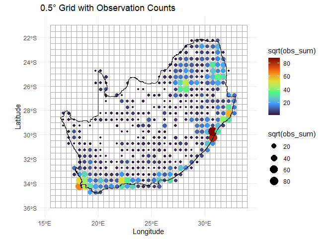

- [`dissmapr`](#dissmapr)
  - [Introduction](#introduction)
  - [Workflow Overview](#workflow-overview)

<!-- README.md is generated from README.Rmd. Please edit that file -->
<!-- badges: start -->

[](https://mybinder.org/v2/gh/nithecs-biomath/RBasicPack/master?urlpath=rstudio)
[](https://lifecycle.r-lib.org/articles/stages.html#stable)
[](https://github.com/macSands/dissmapr/actions/workflows/test-coverage.yaml)
[](https://app.codecov.io/gh/macSands/dissmapr)
[](https://github.com/macSands/dissmapr/actions/workflows/R-CMD-check.yaml)

<!-- badges: end -->

# `dissmapr`

## A Novel Framework for Automated Compositional Dissimilarity and Biodiversity Turnover Analysis

## Introduction

`dissmapr` is an R package for analysing compositional dissimilarity and
biodiversity turnover across spatial gradients. It provides scalable,
modular workflows that integrate species occurrence, environmental data,
and multi-site metrics to quantify and predict biodiversity patterns. A
core feature is the use of zeta diversity, which extends beyond pairwise
comparisons to capture shared species across multiple sites—offering
deeper insight into community assembly, turnover, and connectivity. By
incorporating modern approaches such as multi-site Generalised
Dissimilarity Modelling (MS-GDM), `dissmapr` enables robust mapping,
bioregional classification, and scenario-based forecasting. Designed for
flexibility and reproducibility, it supports biodiversity monitoring and
conservation planning at landscape to regional scales.

------------------------------------------------------------------------

## Workflow Overview

`dissmapr` implements a structured, reproducible workflow for analysing
biodiversity patterns and delineating bioregions. Each function aligns
with a specific step, guiding users from data acquisition to predictive
mapping. The workflow begins with sourcing species occurrence and
georeferenced environmental data, followed by data formatting and
calculation of compositional turnover using zeta diversity metrics (via
the `zetadiv` package). Multi-Site Generalized Dissimilarity Modelling
(MS-GDM) is then applied to model and predict dissimilarity across
landscapes. These predictions feed into the Dissimilarity Cube, which
classifies spatial clusters of species composition into distinct
bioregions. The framework supports the integration of historical and
future climate data to assess shifts in biodiversity and detect
emerging, shifting, or dissolving bioregions under global change. This
step-by-step structure, mirrored in the accompanying tutorial sections,
promotes accessibility, transparency, and ecological insight at multiple
spatial and temporal scales.

------------------------------------------------------------------------

### 1. Install and load `dissmapr`

Install and load the `dissmapr` package from GitHub, ensuring all
functions are available for use in the analysis workflow.

``` r
# install remotes if needed
# install.packages("remotes")
remotes::install_github("macSands/dissmapr")
```

``` r
# Ensure the package is loaded when knitting
library(dissmapr)

# Make sure all the functions are loaded
devtools::load_all()
```

------------------------------------------------------------------------

### 2. Load other R libraries

Load core libraries for spatial processing, biodiversity modelling, and
visualization required across the `dissmapr` analysis pipeline.

``` r
# Load necessary libraries
library(httr)       # HTTP client  
library(geodata)    # Download geographic data  
library(data.table) # Fast large-table operations  
library(dplyr)      # Data manipulation verbs  
library(tidyr)      # Tidy data reshaping  
library(zoo)        # Time series utilities  
library(sf)         # Vector spatial data  
library(terra)      # Raster spatial operations  
library(zetadiv)    # Multi-site biodiversity turnover  
library(ggplot2)    # Grammar of graphics  
library(viridis)    # Perceptual color scales  
```

------------------------------------------------------------------------

### 3. User-defined area of interest and grid resolution

Load the spatial boundary data for South Africa to serve as the
geographic reference for all subsequent biodiversity analyses and
visualizations.

``` r
# Read RSA shape file
rsa = sf::st_read('inst/extdata/rsa.shp')
#> Reading layer `rsa' from data source 
#>   `D:\Methods\R\myR_Packages\myCompletePks\dissmapr\inst\extdata\rsa.shp' 
#>   using driver `ESRI Shapefile'
#> Simple feature collection with 1 feature and 1 field
#> Geometry type: POLYGON
#> Dimension:     XY
#> Bounding box:  xmin: 16.45802 ymin: -34.83514 xmax: 32.89125 ymax: -22.12661
#> Geodetic CRS:  WGS 84
```

------------------------------------------------------------------------

### 4. Site by species matrix and sampling effort

This section focuses on automating the retrieval and pre-processing of
core data, including species occurrence and environmental variables.
These data form the basis for further ecological analysis and model
building.

#### Access occurrences of user-specified taxon or species list using `get_occurrence_data`

Use `get_occurrence_data` to automate the retrieval and pre-processing
of species occurrence data from multiple sources, including:

1)  local databases,
2)  the Global Biodiversity Information Facility (GBIF), and
3)  species occurrence cubes from B3 (specification) \[\*work in
    progress\].

The function assembles data on species distributions across specified
taxonomic groups and regions, producing presence-absence or abundance
matrices that quantify species co-occurrence within locations.

``` r
bfly_data = get_occurrence_data(
  data        = 'inst/extdata/gbif_butterflies.csv',
  source_type = 'local_csv',
  sep         = '\t'
)
dim(bfly_data)
#> [1] 81825    52
```

------------------------------------------------------------------------

### 5. Format data using `format_df`

Use `format_df` to standardise and reshape biodiversity data into long
or wide formats. The function automatically identifies key columns
(e.g., coordinates, species, and values), assigns missing site IDs, and
reformats the data for analysis. Outputs include a cleaned dataset and
species-site matrices for further processing:

• site_xy: Holds spatial coordinates of sampled sites.  
• site_sp: Site-by-species matrix for biodiversity assessments.

#### Format data into long and wide formats

``` r
bfly_result = format_df(
  data        = bfly_data,
  species_col = 'verbatimScientificName',
  value_col   = 'pa',
  extra_cols  = NULL,
  format      = 'long'
)
site_obs = bfly_result$site_obs
site_spp = bfly_result$site_sp
dim(site_obs)
#> [1] 79953     5
dim(site_spp)
#> [1] 56090  2871
```

#### Get parameters to use later

``` r
# Get parameters from processed data
# Number of species columns
(n_sp = dim(site_spp)[2] - 3)
#> [1] 2868
sp_cols = names(site_spp)[-c(1:3)]
```

------------------------------------------------------------------------

### 6. Summarise records by grid using `generate_grid`

Use `generate_grid` to divide the study area, derived from the
geographic extent of the occurrence data above, into grids of
user-defined resolution, creating a spatial grid over a specified
geographic extent. It assigns unique grid IDs to points and summarizes
selected data columns within each grid cell. The function outputs a
raster grid, grid polygons for visualization, and a data frame
summarizing the contents of each grid cell, including totals and
centroids. It is particularly useful for aggregating spatial data, such
as biodiversity observations, into predefined spatial units for further
analysis.

#### Assign records to a grid at a set resolution (e.g. 0.5°)

Aggregate species records into equal-area grid cells to enable spatially
standardized biodiversity analyses.

``` r
grid_list = generate_grid(
  data       = site_spp,
  x_col      = "x",
  y_col      = "y",
  grid_size  = 0.5,
  sum_col_range = 4:ncol(site_spp),
  crs_epsg   = 4326
)

aoi_grid = grid_list$grid_sf
grid_spp = grid_list$block_sp
dim(aoi_grid)
#> [1] 1110    8
dim(grid_spp)
#> [1]  415 2874
```

#### Generate a data frame ‘xy’ of site centroids

Extract longitude–latitude coordinates and summary metrics for each
occupied grid cell.

``` r
# Grid centroids with 'gird_id', 'centroid_lon', 'centroid_lat', 'obs_sum' and `spp_rich`
grid_xy = grid_spp[,c(1:3,5:6)]
dim(grid_xy)
#> [1] 415   5
spp_obs = site_obs
dim(spp_obs)
#> [1] 79953     5
```

#### Generate a map of RSA with occupied grid cells as centroid points

Visualize observation density across South Africa using centroid-based
mapping of gridded biodiversity data.

``` r
ggplot() +
  geom_sf(data = aoi_grid, fill = NA, color = "darkgrey", alpha = 0.5) +
  geom_point(data = grid_spp,
             aes(x = centroid_lon, y = centroid_lat,
                 size = sqrt(obs_sum),
                 color = sqrt(obs_sum))) +
  scale_color_viridis_c(option = "turbo") +
  geom_sf(data = rsa, fill = NA, color = "black") +
  theme_minimal() +
  labs(title = "0.5° Grid with Observation Counts",
       x = "Longitude", y = "Latitude")
```



------------------------------------------------------------------------

### 7. Generate site by species matrix called `site_spp`

Create a matrix of species counts per site for use in biodiversity and
dissimilarity analyses.

``` r
xy = grid_spp[,2:3]
site_spp = grid_spp[,c(1:3,5:ncol(grid_spp))]
head(site_spp[,1:10])
#>   grid_id centroid_lon centroid_lat obs_sum spp_rich
#> 1    1026        28.75    -22.25004       3        2
#> 2    1027        29.25    -22.25004      41       31
#> 3    1028        29.75    -22.25004      10       10
#> 4    1029        30.25    -22.25004       7        7
#> 5    1030        30.75    -22.25004       6        6
#> 6    1031        31.25    -22.25004     107       76
#>   Mylothris agathina subsp. agathina Pieris brassicae Tarucus thespis
#> 1                                  0                0               0
#> 2                                  0                0               0
#> 3                                  0                0               0
#> 4                                  0                0               0
#> 5                                  0                0               0
#> 6                                  0                0               0
#>   Acraea horta Danaus chrysippus
#> 1            0                 0
#> 2            0                 0
#> 3            0                 0
#> 4            0                 0
#> 5            0                 0
#> 6            0                 0
dim(site_spp)
#> [1]  415 2873
```

#### Generate record of occurrence counts called `sam_eff`

Summarize the number of species observations per grid cell to assess
sampling effort.

``` r
sam_eff = grid_spp[, c("grid_id","centroid_lon","centroid_lat","obs_sum")]
obs_cnt = grid_spp[,c(1:3,5)]
dim(obs_cnt)
#> [1] 415   4
```

#### Generate a binary data frame ‘sbs’

Convert species abundance data to presence–absence format
(`site_spp_pa`) for binary dissimilarity analyses.

``` r
sp_cols = names(site_spp)[-(1:5)]
sbs     = site_spp %>%
  mutate(across(all_of(sp_cols), ~ ifelse(. > 0, 1, 0)))

# Assuming 'sp_cols' is a vector of column names
site_spp_pa = site_spp %>%
  mutate(across(all_of(sp_cols), ~ ifelse(!is.na(.) & . > 0, 1, 0)))

head(site_spp_pa[,1:10])
#>   grid_id centroid_lon centroid_lat obs_sum spp_rich
#> 1    1026        28.75    -22.25004       3        2
#> 2    1027        29.25    -22.25004      41       31
#> 3    1028        29.75    -22.25004      10       10
#> 4    1029        30.25    -22.25004       7        7
#> 5    1030        30.75    -22.25004       6        6
#> 6    1031        31.25    -22.25004     107       76
#>   Mylothris agathina subsp. agathina Pieris brassicae Tarucus thespis
#> 1                                  0                0               0
#> 2                                  0                0               0
#> 3                                  0                0               0
#> 4                                  0                0               0
#> 5                                  0                0               0
#> 6                                  0                0               0
#>   Acraea horta Danaus chrysippus
#> 1            0                 0
#> 2            0                 0
#> 3            0                 0
#> 4            0                 0
#> 5            0                 0
#> 6            0                 0
dim(site_spp_pa)
#> [1]  415 2873
```

#### Generate richness of sbs row sums and map

Calculate species richness per site based on binary presence–absence
data.

``` r
spp_rich = grid_spp[, c("grid_id","centroid_lon","centroid_lat","spp_rich")]
```

#### Generate ‘sam.eff’ and ‘spp_rich’ raster map

Visualise sampling effort and species richness as raster layers over the
study area.

``` r
ras_effRich = grid_list$grid[[2:3]]
plot(sqrt(ras_effRich), col = turbo(100))
```


***Note**: occurrence coordinates are only used for assigning then into
grids; they are not needed beyond this step.*

------------------------------------------------------------------------

### 8. Site by environment matrix

#### Retrieve Environmental Data with `get_enviro_data`

Use `get_enviro_data` to extract environmental variables for spatial
points from either species observations or grid centroids. Data can be
sourced from online repositories (e.g. *WorldClim*, *SoilGrids* via
`geodata`) or local rasters. The function defines an area of interest
with a buffer, extracts selected variables, and interpolates missing
values using nearby non-NA points. Outputs include cropped rasters,
spatial points (as an `sf` object), and a combined site-by-environment
data frame (`site_env`) for downstream ecological analyses. Future
support will extend to *CHELSA* (`climenv`), *Google Earth Engine*
(`rgee`), and `mapme.biodiversity` for expanded environmental and
biodiversity data access.

``` r
enviro_list = get_enviro_data(
  data      = sbs,
  buffer_km = 10,
  source    = 'geodata',
  var       = "bio",
  res       = 5,
  path      = 'download_data',
  sp_cols   = 6:ncol(sbs),
  ext_cols  = c('obs_sum','spp_rich')
)
ras_enviro = enviro_list$env_rast
```

#### Add ‘eff-rich’ raster to the enviro stack raster

Combine environmental rasters with sampling effort and species richness
layers for joint spatial analysis.

``` r
ras_enviro_effRich = c(ras_effRich, resample(ras_enviro, ras_effRich))
plot(ras_enviro_effRich[[1:4]])
```


#### Extract environmental variables for site centroids ‘xy’

Link environmental data to grid centroids and visualize spatial
variation in selected climate variables.

``` r
env_df = enviro_list$env_df[,c(1:5,8:26)]
head(env_df)
#>   grid_id centroid_lon centroid_lat obs_sum...4 spp_rich...5        1        2
#> 1    1026        28.75    -22.25004           3            2 21.88425 14.47900
#> 2    1027        29.25    -22.25004          41           31 21.76921 14.61358
#> 3    1028        29.75    -22.25004          10           10 21.53492 14.00267
#> 4    1029        30.25    -22.25004           7            7 23.01796 13.67825
#> 5    1030        30.75    -22.25004           6            6 23.59879 13.83525
#> 6    1031        31.25    -22.25004         107           76 24.57367 14.64933
#>          3        4      5      6      7        8        9       10       11
#> 1 55.67347 427.1824 32.446  6.439 26.007 26.13383 16.05333 26.13383 16.05333
#> 2 53.90477 453.1160 32.977  5.867 27.110 26.47767 15.63300 26.47767 15.63300
#> 3 56.31250 392.8977 31.662  6.796 24.866 25.51400 16.11067 25.51400 16.11067
#> 4 57.83615 357.9102 32.791  9.141 23.650 26.64050 18.05417 26.64050 18.05417
#> 5 59.58590 334.4157 33.509 10.290 23.219 26.95950 18.99083 26.95950 18.99083
#> 6 61.67101 332.0319 34.788 11.034 23.754 27.88800 20.00150 27.88800 20.00150
#>    12 13 14       15  16 17  18 19
#> 1 334 68  1 88.32125 185  5 185  5
#> 2 354 74  1 85.64050 191  6 191  6
#> 3 429 90  2 86.95976 236  9 236  9
#> 4 425 88  1 90.60240 245  8 245  8
#> 5 456 98  2 93.44035 274  8 274  8
#> 6 463 97  2 94.23997 281 10 281 10
head(env_df[,15:24])
#>         10       11  12 13 14       15  16 17  18 19
#> 1 26.13383 16.05333 334 68  1 88.32125 185  5 185  5
#> 2 26.47767 15.63300 354 74  1 85.64050 191  6 191  6
#> 3 25.51400 16.11067 429 90  2 86.95976 236  9 236  9
#> 4 26.64050 18.05417 425 88  1 90.60240 245  8 245  8
#> 5 26.95950 18.99083 456 98  2 93.44035 274  8 274  8
#> 6 27.88800 20.00150 463 97  2 94.23997 281 10 281 10

# Rename `env_df` column names
names(env_df) = c('grid_id','x','y','obs_sum','spp_rich',"temp_mean", "mdr", "iso", "temp_sea", "temp_max",
                                "temp_min", "temp_rang","temp_wetQ", "temp_dryQ", "temp_warmQ",
                                "temp_coldQ", "rain_mean","rain_wet", "rain_dry", "rain_sea",
                                "rain_wetQ", "rain_dryQ","rain_warmQ", "rain_coldQ")

# Check the first few rows
head(env_df)
#>   grid_id     x         y obs_sum spp_rich temp_mean      mdr      iso temp_sea
#> 1    1026 28.75 -22.25004       3        2  21.88425 14.47900 55.67347 427.1824
#> 2    1027 29.25 -22.25004      41       31  21.76921 14.61358 53.90477 453.1160
#> 3    1028 29.75 -22.25004      10       10  21.53492 14.00267 56.31250 392.8977
#> 4    1029 30.25 -22.25004       7        7  23.01796 13.67825 57.83615 357.9102
#> 5    1030 30.75 -22.25004       6        6  23.59879 13.83525 59.58590 334.4157
#> 6    1031 31.25 -22.25004     107       76  24.57367 14.64933 61.67101 332.0319
#>   temp_max temp_min temp_rang temp_wetQ temp_dryQ temp_warmQ temp_coldQ
#> 1   32.446    6.439    26.007  26.13383  16.05333   26.13383   16.05333
#> 2   32.977    5.867    27.110  26.47767  15.63300   26.47767   15.63300
#> 3   31.662    6.796    24.866  25.51400  16.11067   25.51400   16.11067
#> 4   32.791    9.141    23.650  26.64050  18.05417   26.64050   18.05417
#> 5   33.509   10.290    23.219  26.95950  18.99083   26.95950   18.99083
#> 6   34.788   11.034    23.754  27.88800  20.00150   27.88800   20.00150
#>   rain_mean rain_wet rain_dry rain_sea rain_wetQ rain_dryQ rain_warmQ
#> 1       334       68        1 88.32125       185         5        185
#> 2       354       74        1 85.64050       191         6        191
#> 3       429       90        2 86.95976       236         9        236
#> 4       425       88        1 90.60240       245         8        245
#> 5       456       98        2 93.44035       274         8        274
#> 6       463       97        2 94.23997       281        10        281
#>   rain_coldQ
#> 1          5
#> 2          6
#> 3          9
#> 4          8
#> 5          8
#> 6         10

# Plot the results to check the conversion is accurate
ggplot() +
  # Add 0.25deg grid layer
  geom_sf(data = aoi_grid, fill = NA, color = "darkgrey", alpha = 0.5) +
  # Add bfly points layer
  geom_point(data = env_df, aes(x = x,
                                  y = y,
                                  color = temp_mean)) +
  scale_size_continuous(range = c(0.5, 5)) +  # Adjust the point size range (min, max)
  scale_color_viridis_c(option = "turbo") +  # Use turbo color scale
  # Add boundary layer
  geom_sf(data = rsa, fill = NA, color = "black", alpha = 1) +
  theme_minimal() +
  labs(
    title = "0.25° Grid Cells with temp_mean",
    x = "Longitude",
    y = "Latitude")   
```


#### Generate *Species-by-Environment* data frame ‘sbe’

Create a unified data frame of site coordinates, sampling effort,
richness, and environmental variables for modelling called `sbe`.

``` r
sbe = env_df %>%
  select(grid_id, x, y, obs_sum, spp_rich, everything())
```

### 9. If necessary project coordinates into meters projection (e.g. UTM) using `sf::st_transform`

Reproject spatial coordinates from geographic (WGS84) to a projected
system (e.g. Albers Equal Area) for analyses requiring distance in
meters, such as spatial clustering or environmental modelling.

``` r
# Convert to sf object with WGS84 geographic CRS
head(xy)
#>   centroid_lon centroid_lat
#> 1        28.75    -22.25004
#> 2        29.25    -22.25004
#> 3        29.75    -22.25004
#> 4        30.25    -22.25004
#> 5        30.75    -22.25004
#> 6        31.25    -22.25004
xy_sf = st_as_sf(xy, coords = c("centroid_lon", "centroid_lat"), crs = 4326)

# Project to Albers Equal Area (meters)
xy_utm = st_transform(xy_sf, crs = 9822)

# Extract transformed coordinates in meters
# Combine transformed coordinates back into data frame
xy_utm_df = cbind(xy, st_coordinates(xy_utm))
head(xy_utm_df)
#>   centroid_lon centroid_lat       X        Y
#> 1        28.75    -22.25004 6392274 -6836200
#> 2        29.25    -22.25004 6480542 -6808542
#> 3        29.75    -22.25004 6568648 -6780369
#> 4        30.25    -22.25004 6656587 -6751682
#> 5        30.75    -22.25004 6744357 -6722482
#> 6        31.25    -22.25004 6831955 -6692770
```

### 10. Check for inter-correlation and remove highly corrected variables using `rm_correlated`.

Identify and remove highly correlated environmental variables to reduce
multicollinearity in subsequent analyses. This step ensures model
stability by retaining only informative, non-redundant predictors based
on a user-defined correlation threshold.

``` r
# Remove the highly correlated variables
env_vars_reduced = rm_correlated(data = env_df[,c(4,6:24)],
                                 cols = NULL,
                                 threshold = 0.7,
                                 plot = TRUE)
```


    #> Variables removed due to high correlation:
    #>  [1] "temp_rang"  "temp_sea"   "mdr"        "temp_max"   "rain_mean" 
    #>  [6] "rain_dryQ"  "temp_min"   "temp_warmQ" "temp_coldQ" "rain_coldQ"
    #> [11] "rain_wetQ"  "rain_wet"   "rain_sea"  
    #> 
    #> Variables retained:
    #> [1] "obs_sum"    "temp_mean"  "iso"        "temp_wetQ"  "temp_dryQ" 
    #> [6] "rain_dry"   "rain_warmQ"
    head(env_vars_reduced)
    #>   obs_sum temp_mean      iso temp_wetQ temp_dryQ rain_dry rain_warmQ
    #> 1       3  21.88425 55.67347  26.13383  16.05333        1        185
    #> 2      41  21.76921 53.90477  26.47767  15.63300        1        191
    #> 3      10  21.53492 56.31250  25.51400  16.11067        2        236
    #> 4       7  23.01796 57.83615  26.64050  18.05417        1        245
    #> 5       6  23.59879 59.58590  26.95950  18.99083        2        274
    #> 6     107  24.57367 61.67101  27.88800  20.00150        2        281
    dim(env_vars_reduced)
    #> [1] 415   7

------------------------------------------------------------------------

### 11. Zeta decline (sbs), orders 2:15

#### Expectation of zeta diversity decline using `zetadiv::Zeta.decline.ex`

Computes the expectation of zeta diversity, the number of species shared
by multiple assemblages for a range of orders (number of assemblages or
sites), using a formula based on the occupancy of the species, and fits
the decline to an exponential and a power law relationship. *Generate
statistics and figures, no maps*

``` r
zeta_decline_ex = Zeta.decline.ex(site_spp_pa[,6:ncol(site_spp_pa)], 
                                  orders = 1:15)
```


``` r
# zeta_decline_ex
```

> - **Panel 1 (Zeta diversity decline)**: Shows how rapidly species that
>   are common across multiple sites decline as you look at groups of
>   more and more sites simultaneously (increasing zeta order). The
>   sharp drop means fewer species are shared among many sites compared
>   to just a few.
> - **Panel 2 (Ratio of zeta diversity decline)**: Illustrates the
>   proportion of shared species that remain as the number of sites
>   compared increases. A steeper curve indicates that common species
>   quickly become rare across multiple sites.
> - **Panel 3 (Exponential regression)**: Tests if the decline in shared
>   species fits an exponential decrease. A straight line here indicates
>   that species commonness decreases rapidly and consistently as more
>   sites are considered together. Exponential regression represents
>   <u>**stochastic assembly**</u> (**randomness determining species
>   distributions**).
> - **Panel 4 (Power law regression)**: Tests if the decline follows a
>   power law relationship. A straight line suggests that the loss of
>   common species follows a predictable pattern, where initially many
>   species are shared among fewer sites, but rapidly fewer are shared
>   among larger groups. Power law regression represents
>   <u>**niche-based sorting**</u> (**environmental factors shaping
>   species distributions**).

#### Zeta diversity decline using Monte Carlo sampling `zetadiv::Zeta.decline.mc`

Computes zeta diversity, the number of species shared by multiple
assemblages, for a range of orders (number of assemblages or sites),
using combinations of sampled sites, and fits the decline to an
exponential and a power law relationship. *Generate statistics and
figures, no maps*

``` r
zeta_mc_utm = Zeta.decline.mc(site_spp_pa[,-(1:6)],
                               xy_utm_df[,3:4],
                               orders = 1:15,
                               sam = 100,
                               NON = TRUE,
                               normalize = "Jaccard")
```


``` r
# zeta_mc_utm
```

> - **Panel 1 (Zeta diversity decline)**: Rapidly declining zeta
>   diversity, similar to previous plots, indicates very few species
>   remain shared across increasingly larger sets of sites, emphasizing
>   strong species turnover and spatial specialization.
> - **Panel 2 (Ratio of zeta diversity decline)**: More irregular
>   fluctuations suggest a spatial effect: nearby sites might
>   occasionally share more species by chance due to proximity. The
>   spikes mean certain groups of neighboring sites have
>   higher-than-average species overlap.
> - **Panel 3 & 4 (Exponential and Power law regressions)**: Both remain
>   linear, clearly indicating the zeta diversity declines consistently
>   following a predictable spatial pattern. However, the exact pattern
>   remains similar to previous cases, highlighting that despite spatial
>   constraints, common species become rare quickly as more sites are
>   considered.  
>   *This result demonstrates clear spatial structuring of
>   biodiversity—species are locally clustered, not randomly distributed
>   across the landscape. Spatial proximity influences which species
>   co-occur more frequently.*

### 12. Zeta decays (sbs, xy), orders 2:15

#### Zeta distance decay for a range of numbers of assemblages or sites using `zetadiv::Zeta.ddecays`

Computes the distance decay of zeta diversity for a range of orders
(number of assemblages or sites), using generalised linear models.
*Generate statistics and figures, no maps*

``` r
# zeta_decay = Zeta.ddecays(
#   xy      = xy[,c("centroid_lon","centroid_lat")],
#   data    = sbs[,-(1:5)],
#   sam     = 1000,
#   orders  = 2:15,
#   plot    = TRUE
# )

zeta_decays = Zeta.ddecays(xy_utm_df[,3:4],
                          site_spp_pa[,-(1:6)],
                          sam = 1000,
                          orders = 2:10,
                          plot = TRUE,
                          confint.level = 0.95
)
#> [1] 2
#> [1] 3
#> [1] 4
#> [1] 5
#> [1] 6
#> [1] 7
#> [1] 8
#> [1] 9
#> [1] 10
```


``` r
# zeta_decays
```

> This plot shows how zeta diversity (a metric that captures shared
> species composition among multiple sites) changes with spatial
> distance across different orders of zeta (i.e., the number of sites
> considered at once).

> - On the **x-axis**, we have the **order of zeta** (from 2 to 7).  
>   For example, zeta order 2 looks at pairs of sites, order 3 at
>   triplets, etc.
> - On the **y-axis**, we see the slope of the **relationship between
>   zeta diversity and distance** (i.e., how quickly species similarity
>   declines with distance).
> - A **negative slope** means that **sites farther apart have fewer
>   species in common** — so there’s a clear distance decay of
>   biodiversity.
> - A **slope near zero** means **distance doesn’t strongly affect how
>   many species are shared among sites**.

> **Key observations:** - At low orders (2 and 3), the slope is strongly
> negative, indicating that species turnover is high over distance when
> looking at pairs or triplets of sites. - From order 4 and up, the
> slope becomes close to zero, suggesting that at broader spatial scales
> (more sites), species similarity is less affected by distance.  
> This may reflect widespread or core species that are consistently
> shared regardless of location. - The confidence intervals (error bars)
> shrink with increasing order, indicating greater stability and
> reliability of the estimate as more sites are included.

> **Summary:** This figure shows that biodiversity patterns across space
> are strongly shaped by distance at small scales, but this effect
> weakens as you include more sites. In other words, rare or localized
> species contribute to strong distance decay, but widespread species
> dominate at higher spatial scales, leading to more uniformity.

### 13. Zeta.msgdm(sbs, sbe, xy), order 2, 3, 5, 10

#### Multi-site generalised dissimilarity modelling for a set of environmental variables and distances using `zetadiv::Zeta.msgdm`

Computes a regression model of zeta diversity for a given order (number
of assemblages or sites) against a set of environmental variables and
distances between sites. The different regression models available are
generalised linear models, generalised linear models with negative
constraints, generalised additive models, shape constrained additive
models, and I-splines. *Generate statistics and figures, no maps and
save fitted order 2 model ‘zeta2’*

``` r
# zeta2 = Zeta.msgdm(
#   sbs[,-(1:5)],
#   sbe[,6:ncol(sbe)],
#   xy[,c("centroid_lon","centroid_lat")],
#   sam        = 1000,
#   order      = c(2,3,5,10),
#   distance.type = "Euclidean",
#   normalize  = "Jaccard",
#   r

# Compute a regression model of zeta diversity order 2
zeta2 = Zeta.msgdm(site_spp_pa[,-(1:6)],
                   env_vars_reduced,
                   xy_utm_df[,3:4],
                   sam = 1000,
                   order = 2,
                   distance.type = "Euclidean",# "ortho",
                   normalize = "Jaccard",
                   reg.type = "ispline")
# zeta2

# Compute splines coordinates from I-spline-based MSGDM
zeta2.ispline = Return.ispline(zeta2,
                               env_vars_reduced,
                               # legend = FALSE,
                               distance = TRUE)
# zeta2.ispline
Plot.ispline(isplines = zeta2.ispline, distance = TRUE)
```


> This I-spline plot represents how different environmental variables
> (including distance) contribute to explaining zeta diversity of order
> 2 — that is, how many species are shared between pairs of sites, based
> on environmental similarity and geographic distance.

> **Imagine you’re comparing pairs of locations and asking:** *“Do these
> two places have similar species, and if so, why?”*

> **How to Read the Graph:** This graph shows which factors matter most
> for explaining how similar the species are between those pairs of
> places.  
> - **X-axis (Rescaled range):** Each variable has been normalized from
> 0 to 1, so we can compare their effects on the same scale.  
> - **Y-axis (I-splines):** This shows how much each variable
> contributes to the similarity in species between two locations.  
> - A **steeper or higher curve** indicates a more important variable.

> **Main Takeaways from the Plot:**
>
> \- **Geographic distance** (blue line) has the strongest effect:  
> As distance increases (from 0 to 1), species similarity drops —
> locations far apart share fewer species. This confirms classic
> distance decay in ecology.  
> - **obs_sum** (sampling effort or richness) shows a steep, high
> I-spline curve: - Strong initial effect: Differences in richness
> between sites strongly influence shared species, especially when
> large. Plateau effect: Beyond a point, further increases in richness
> don’t lead to more shared species, possibly due to detection limits or
> saturation. Overall importance: The curve remains high, indicating
> consistent influence.  
> - **Temperature** and **rainfall seasonality** have moderate effects:
> \> Variables like `temp_mean`, `rain_warmQ`, and `temp_wetQ`
> contribute, but their curves are lower, indicating weaker influence. -
> Other climatic variables (e.g., isothermality, coldest quarter rain)
> show minimal contribution: These gradients affect biodiversity weakly
> in this context.

> **Summary:**  
> Beyond geographic distance, the total number of species observed at a
> site (`obs_sum`) is a strong predictor of shared species. However,
> once richness is high enough, its added influence plateaus.

``` r
# Deviance explained summary results
with(summary(zeta2$model), 1 - deviance/null.deviance) 
#> [1] 0.2033946
# [1] 0.04414301
# 0.04414301 means that approximately 4.41% of the variability in the response
# variable is explained by your model. This is relatively low, suggesting that the
# model may not be capturing much of the underlying pattern in the data.

# Model summary results
summary(zeta2$model)
#> 
#> Call:
#> glm.cons(formula = zeta.val ~ ., family = family, data = data.tot, 
#>     control = control, method = "glm.fit.cons", cons = cons, 
#>     cons.inter = cons.inter)
#> 
#> Coefficients:
#>              Estimate Std. Error t value Pr(>|t|)    
#> (Intercept)  0.084272   0.007866  10.713  < 2e-16 ***
#> obs_sum1    -0.049532   0.003942 -12.565  < 2e-16 ***
#> obs_sum2     0.000000   0.018984   0.000  1.00000    
#> obs_sum3    -0.004360   0.033647  -0.130  0.89693    
#> temp_mean1   0.000000   0.043960   0.000  1.00000    
#> temp_mean2   0.000000   0.014570   0.000  1.00000    
#> temp_mean3  -0.002049   0.017560  -0.117  0.90713    
#> iso1         0.000000   0.014279   0.000  1.00000    
#> iso2         0.000000   0.009377   0.000  1.00000    
#> iso3         0.000000   0.015613   0.000  1.00000    
#> temp_wetQ1   0.000000   0.012651   0.000  1.00000    
#> temp_wetQ2   0.000000   0.011376   0.000  1.00000    
#> temp_wetQ3   0.000000   0.014879   0.000  1.00000    
#> temp_dryQ1  -0.015966   0.037311  -0.428  0.66881    
#> temp_dryQ2  -0.014025   0.012191  -1.151  0.25022    
#> temp_dryQ3   0.000000   0.012423   0.000  1.00000    
#> rain_dry1   -0.021985   0.007853  -2.800  0.00522 ** 
#> rain_dry2    0.000000   0.009982   0.000  1.00000    
#> rain_dry3    0.000000   0.014310   0.000  1.00000    
#> rain_warmQ1  0.000000   0.008823   0.000  1.00000    
#> rain_warmQ2 -0.010885   0.010973  -0.992  0.32143    
#> rain_warmQ3  0.000000   0.018963   0.000  1.00000    
#> distance1   -0.018723   0.012071  -1.551  0.12122    
#> distance2    0.000000   0.012773   0.000  1.00000    
#> distance3   -0.030636   0.019029  -1.610  0.10773    
#> ---
#> Signif. codes:  0 '***' 0.001 '**' 0.01 '*' 0.05 '.' 0.1 ' ' 1
#> 
#> (Dispersion parameter for gaussian family taken to be 0.001993948)
#> 
#>     Null deviance: 2.4405  on 999  degrees of freedom
#> Residual deviance: 1.9441  on 975  degrees of freedom
#> AIC: -3353.1
#> 
#> Number of Fisher Scoring iterations: 2
```

------------------------------------------------------------------------

### 14. Predict(zeta2) with ‘sam.eff’

- In the ‘sbe’ add ‘sam.max’, a constant for all sites = max(sam.eff)  
- Predict for the updated sbe and xy  
- Produce a site by site matrix of predicted zeta ‘zeta.now’ :::

``` r
# sbe_now = sbe %>% mutate(sam_max = max(obs_sum))
# zeta_now = Predict.zeta(zeta2, sbe_now, xy[,3:4])
```

- Run nmds for the predicted zeta matrix  
- Plot RGB of the 3 component scores ::: ————————————————————————

### 15. Clustering analyses directly using zeta.now

- Generate maps of dissimilarity (the rgb plot)  
- Generate map of bioregions (from clustering) :::

``` r
# e.g. perform clustering on zeta_now & plot bioregions
```

------------------------------------------------------------------------

### 16. Predict(zeta2)

- with appended (future scenarios) environmental variables and ‘sam.max’
  in sbe  
- For m number of scenarios plus the present scenario (step 14) and n
  sites of xy  
- Updated sbe.future will have k = (m+1) x n number of rows  
- ‘xy’ also updated with k rows  
- Predict a k by k matrix of predicted zeta ‘zeta.future’ :::

``` r
# e.g. perform clustering on zeta_now & plot bioregions
```

- Nmds of zeta.future  
- clustering of zeta.future  
- Map sub matrices to indicate predicted future dissimilarity  
- Map predicted future bioregions  
- Map temporal turnover.  
  *Note: step 14 is redundant if step 16 is needed*  
  *Note: step 16 has the same code but more results including those from
  step 6 but potentially computational demanding*

------------------------------------------------------------------------

### 17. Deposit all data frames, tables, maps, and standard metadata to zenodo

``` r
# save(occ, sbs, sbe, zeta2, zeta_now, zeta_future, file="dissmapr_results.Rdata")
# use zen4R or Zenodo UI to upload archive
```

------------------------------------------------------------------------
