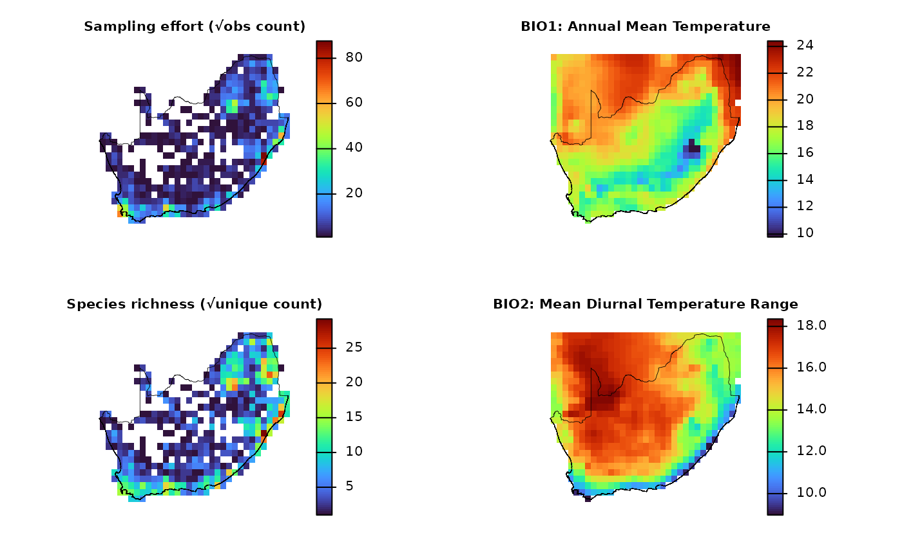
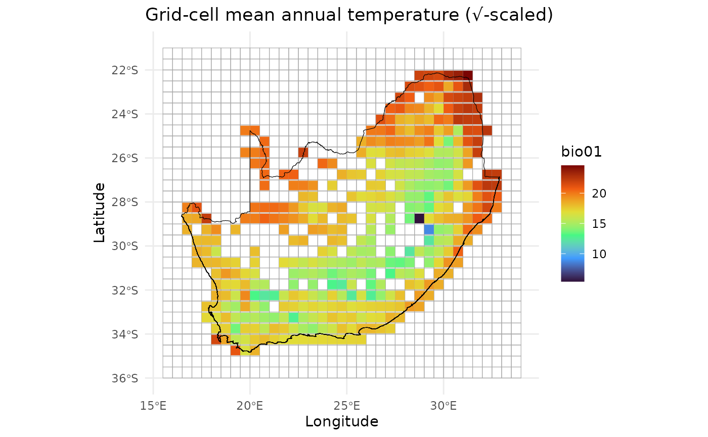
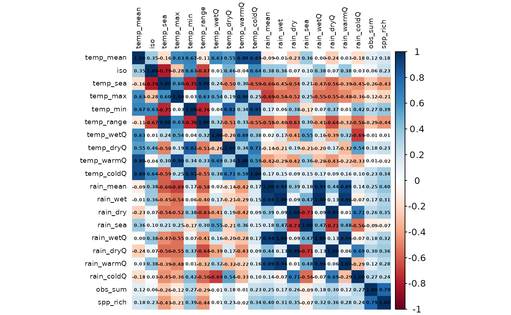

# Environmental data for sites

## `dissmapr`

### Extracting Environmental Predictors for Biodiversity Modelling

This vignette shows how to attach environmental predictor data to the
analysis grid. These predictors provide the environmental context needed
for modelling spatial patterns in biodiversity, compositional turnover,
and species richness.

To keep the example reproducible and quick to run, we use a small set of
example objects bundled with `dissmapr`. The setup chunk below loads the
required packages, reads the bundled data snapshot, and unpacks the
spatial, species, and raster objects needed for the environmental-data
workflow.

``` r

# Load the packages used in this vignette.
library(dissmapr)
library(ggplot2)
library(dplyr)

# Load the bundled example data snapshot.
# This keeps the vignette reproducible and avoids requiring external downloads.
inputs = readRDS(system.file("extdata", "dissmapr_vignettes.rds", package = "dissmapr"))

# Unpack the example objects used throughout this vignette:
# Unpack the bundled example data into named objects used below.
rsa = inputs$rsa                         # South Africa boundary
grid_sf = inputs$grid_sf                 # Analysis grid as an sf object
grid_spp = inputs$grid_spp               # Grid-level species data
effRich_r = terra::unwrap(inputs$effRich_r) # Effective richness raster
grid_spp_pa = inputs$grid_spp_pa         # Presence-absence species data
sp_cols = inputs$sp_cols                 # Species column names
grid_r = terra::rast(system.file("extdata", "grid_r.tif", package = "dissmapr")) # Raster template
```

#### 1. Generate site by environment matrix using `get_enviro_data()`

Spatial models are most informative when each sampling unit couples a
biological response (in this example, **sampling effort** and **species
richness**) with the same suite of environmental predictors.  
[`get_enviro_data()`](https://b-cubed-eu.github.io/dissmapr/reference/get_enviro_data.md)
attaches environmental predictors to each grid cell via a six-stage
routine:  
o **buffer** *the analysis lattice*,  
o **retrieve** *or read the required rasters*,  
o **crop** *them to the buffered extent*,  
o **extract** *raster values at every grid-cell centroid*,  
o **interpolate** *any missing data gaps*, and  
o **append** *the finished covariate set to the grid summary*.

The subsections below implement this workflow:

1.  **Download and sample 19 WorldClim bioclim variables**: obtains the
    5-arc-min (~10 km) [WorldClim
    v2.1](https://worldclim.org/data/worldclim21.html), returns `bio`
    stack via [`geodata`](https://github.com/rspatial/geodata), crops
    it, and attaches climate values to every centroid.
2.  **Bind climate, effort, and richness into one raster stack**:
    combines √-scaled effort (`obs_sum`), √-scaled richness
    (`spp_rich`), and the 19 climate layers into a single `SpatRast`
    aligned to the 0.5° grid.
3.  **Inspect the extracted covariates**: produces a quick map
    (e.g. mean annual temperature) and previews the data to verify
    alignment and plausibility.
4.  **Assemble a modelling matrix**: consolidates coordinates, effort,
    richness, and all climate predictors into a tidy data frame
    (`grid_env`) ready for statistical modelling.
5.  *Optional \>\>* **Reproject centroids for metric-space analyses**:
    converts centroid coordinates from `WGS-84`
    ([EPSG:4326](https://epsg.io/4326)) to a `Albers Equal-Area`
    projection ([EPSG:9822](https://epsg.io/9822)) when analyses require
    distances in metres.

**Download and sample 19 WorldClim bioclim variables**  
Fetch the 5-arc-min (~10 km) bioclim stack via `geodata` package and
attach values to every centroid.

``` r

# Retrieve 19 bioclim layers (≈10-km, WorldClim v2.1) for all grid centroids
data_path = system.file("extdata", package = "dissmapr")               # cache folder for rasters
enviro_list = dissmapr::get_enviro_data(
  data       = grid_spp,                  # centroids + obs_sum + spp_rich
  buffer_km  = 10,                        # pad the AOI slightly
  source     = "geodata",                 # WorldClim/SoilGrids interface
  var        = "bio",                     # bioclim variable set
  res        = 5,                         # 5-arc-min ≈ 10 km
  path       = data_path,
  sp_cols    = 7:ncol(grid_spp),          # ignore species columns
  ext_cols   = c("obs_sum", "spp_rich")   # carry effort & richness through
)

# Quick checks 
str(enviro_list, max.level = 1)
#> List of 3
#>  $ env_rast:S4 class 'SpatRaster' [package "terra"]
#>  $ sites_sf: sf [415 × 2] (S3: sf/tbl_df/tbl/data.frame)
#>   ..- attr(*, "sf_column")= chr "geometry"
#>   ..- attr(*, "agr")= Factor w/ 3 levels "constant","aggregate",..: NA
#>   .. ..- attr(*, "names")= chr "grid_id"
#>  $ env_df  : tibble [415 × 24] (S3: tbl_df/tbl/data.frame)

# (Optional) Assign concise layer names for readability
# Find names here https://www.worldclim.org/data/bioclim.html
names_env = c("temp_mean","mdr","iso","temp_sea","temp_max","temp_min",
              "temp_range","temp_wetQ","temp_dryQ","temp_warmQ",
              "temp_coldQ","rain_mean","rain_wet","rain_dry",
              "rain_sea","rain_wetQ","rain_dryQ","rain_warmQ","rain_coldQ")
names(enviro_list$env_rast) = names_env

# (Optional) Promote frequently-used objects
env_r = enviro_list$env_rast    # cropped climate stack
env_df = enviro_list$env_df      # site × environment data-frame

# Quick checks 
env_r
#> class       : SpatRaster
#> size        : 154, 195, 19  (nrow, ncol, nlyr)
#> resolution  : 0.08333333, 0.08333333  (x, y)
#> extent      : 16.66667, 32.91667, -34.91667, -22.08333  (xmin, xmax, ymin, ymax)
#> coord. ref. : lon/lat WGS 84 (EPSG:4326)
#> source(s)   : memory
#> names       : temp_mean,       mdr,       iso,   temp_sea,  temp_max, temp_min, ...
#> min values  :  5.158916,  5.891667, 45.320835,  143.07431,    14.832,   -6.284, ...
#> max values  : 24.796417, 18.659584, 67.097374, 701.333496, 38.518002,     13.8, ...
dim(env_df); head(env_df)
#> [1] 415  24
#> # A tibble: 6 × 24
#>   grid_id centroid_lon centroid_lat bio01 bio02 bio03 bio04 bio05 bio06 bio07
#>   <chr>          <dbl>        <dbl> <dbl> <dbl> <dbl> <dbl> <dbl> <dbl> <dbl>
#> 1 1026            28.8        -22.3  21.9  14.5  55.7  427.  32.4  6.44  26.0
#> 2 1027            29.2        -22.3  21.8  14.6  53.9  453.  33.0  5.87  27.1
#> 3 1028            29.7        -22.3  21.5  14.0  56.3  393.  31.7  6.80  24.9
#> 4 1029            30.3        -22.3  23.0  13.7  57.8  358.  32.8  9.14  23.7
#> 5 1030            30.8        -22.3  23.6  13.8  59.6  334.  33.5 10.3   23.2
#> 6 1031            31.3        -22.3  24.6  14.6  61.7  332.  34.8 11.0   23.8
#> # ℹ 14 more variables: bio08 <dbl>, bio09 <dbl>, bio10 <dbl>, bio11 <dbl>,
#> #   bio12 <dbl>, bio13 <dbl>, bio14 <dbl>, bio15 <dbl>, bio16 <dbl>,
#> #   bio17 <dbl>, bio18 <dbl>, bio19 <dbl>, obs_sum <dbl>, spp_rich <dbl>
```

*[`get_enviro_data()`](https://b-cubed-eu.github.io/dissmapr/reference/get_enviro_data.md)
buffered the grid centroids by 10 km, fetched the requested rasters,
cropped them, extracted values at each centroid, filled isolated NAs,
and merged the results with `obs_sum` and `spp_rich`.*

#### 2. Bind climate, effort, and richness into one raster stack

Fuse the √-scaled sampling‐effort (`obs_sum`) and richness (`spp_rich`)
layers with the 19 `bioclim` rasters into a single, co-registered
`SpatRast.` A unified stack ensures that all predictors share the same
grid, streamlining downstream map algebra, multivariate modelling, and
spatial cross-validation.

``` r

# --- Rebuild rasters inside the vignette ---
effRich_r = sqrt(
  grid_r[[c("obs_sum", "spp_rich")]]
)

# Use first layer as template explicitly
template = effRich_r[[1]]

env_resampled = terra::resample(
  env_r,
  template,
  method = "bilinear"
)

env_effRich_r = c(effRich_r, env_resampled)

# --- Safe plotting ---
old_par = par(no.readonly = TRUE)
on.exit(par(old_par), add = TRUE)

layout(matrix(1:4, nrow = 2))

titles = c(
  "Sampling effort (√obs count)",
  "Species richness (√unique count)",
  "BIO1: Annual Mean Temperature",
  "BIO2: Mean Diurnal Temperature Range"
)

for (i in 1:4) {
  terra::plot(
    env_effRich_r[[i]],
    col    = viridisLite::turbo(100),
    type   = "continuous",
    colNA  = NA_character_,
    axes   = FALSE,
    main   = titles[i],
    cex.main = 0.8
  )
  terra::plot(terra::vect(rsa), add = TRUE, border = "black", lwd = 0.4)
}
```



#### 3. Inspect the extracted covariates

Environmental data were linked to grid centroids using
[`get_enviro_data()`](https://b-cubed-eu.github.io/dissmapr/reference/get_enviro_data.md),
now visualise the spatial variation in selected climate variables to
check results.

``` r

# Make column headers explicit
# names(env_df)[1:5] = c("grid_id","centroid_lon","centroid_lat","obs_sum","spp_rich")

# Simple check of dimensions and first rows
dim(env_df)
#> [1] 415  24
head(env_df[, 1:6])
#> # A tibble: 6 × 6
#>   grid_id centroid_lon centroid_lat bio01 bio02 bio03
#>   <chr>          <dbl>        <dbl> <dbl> <dbl> <dbl>
#> 1 1026            28.8        -22.3  21.9  14.5  55.7
#> 2 1027            29.2        -22.3  21.8  14.6  53.9
#> 3 1028            29.7        -22.3  21.5  14.0  56.3
#> 4 1029            30.3        -22.3  23.0  13.7  57.8
#> 5 1030            30.8        -22.3  23.6  13.8  59.6
#> 6 1031            31.3        -22.3  24.6  14.6  61.7

# Quick map of mean annual temperature (√-scaled bubble size)
ggplot() +
  geom_sf(data = grid_sf, fill = NA, colour = "darkgrey", alpha = 0.4) +
  geom_point(data = env_df,
             aes(x = centroid_lon, 
                 y = centroid_lat,
                 colour = bio01),
             shape = 15,
             size = 3) +
  # scale_size_continuous(range = c(2,6)) +
  scale_colour_viridis_c(option = "turbo") +
  geom_sf(data = rsa, fill = NA, colour = "black") +
  theme_minimal() +
  labs(title = "Grid-cell mean annual temperature (√-scaled)",
       x = "Longitude", y = "Latitude")
```



*Goal of this plot is to quickly check that the environmental predictors
(e.g. `bio01` \>\> mean annual temperature) line up with the 0.5° grid.*

#### 4. Assemble the modelling matrix `grid_env`

Compile a *site × environment* data frame (`grid_env`) in which each
0.5° cell contributes one row containing centroid coordinates, √-scaled
sampling effort, species richness, and the 19 `bioclim` predictors. The
resulting matrix is immediately usable for GLMs, GAMs, machine-learning,
ordination, and β-diversity analyses.

``` r

# Build the final site × environment table
grid_env = env_df %>%
  dplyr::select(grid_id, centroid_lon, centroid_lat,
                obs_sum, spp_rich, dplyr::everything())

str(grid_env, max.level = 1)
#> tibble [415 × 24] (S3: tbl_df/tbl/data.frame)
head(grid_env)
#> # A tibble: 6 × 24
#>   grid_id centroid_lon centroid_lat obs_sum spp_rich bio01 bio02 bio03 bio04
#>   <chr>          <dbl>        <dbl>   <dbl>    <dbl> <dbl> <dbl> <dbl> <dbl>
#> 1 1026            28.8        -22.3       3        2  21.9  14.5  55.7  427.
#> 2 1027            29.2        -22.3      41       31  21.8  14.6  53.9  453.
#> 3 1028            29.7        -22.3      10       10  21.5  14.0  56.3  393.
#> 4 1029            30.3        -22.3       7        7  23.0  13.7  57.8  358.
#> 5 1030            30.8        -22.3       6        6  23.6  13.8  59.6  334.
#> 6 1031            31.3        -22.3     107       76  24.6  14.6  61.7  332.
#> # ℹ 15 more variables: bio05 <dbl>, bio06 <dbl>, bio07 <dbl>, bio08 <dbl>,
#> #   bio09 <dbl>, bio10 <dbl>, bio11 <dbl>, bio12 <dbl>, bio13 <dbl>,
#> #   bio14 <dbl>, bio15 <dbl>, bio16 <dbl>, bio17 <dbl>, bio18 <dbl>,
#> #   bio19 <dbl>
```

#### 5. Reproject centroids for metric-space analyses\*\* using `sf::st_transform()`\[OPTIONAL\]

Certain analyses (e.g. spatial clustering, variogram modelling) require
coordinates in metres rather than degrees. The snippet below converts
the centroid layer to an `Albers Equal-Area` projection.

``` r

# Convert the centroid columns to an sf object
centroids_sf = sf::st_as_sf(
  grid_env,
  coords = c("centroid_lon", "centroid_lat"),
  crs    = 4326,          # WGS-84
  remove = FALSE
)

# Reproject to Albers Equal Area (EPSG 9822)
centroids_aea = sf::st_transform(centroids_sf, 9822)

# Append projected X–Y back onto the data-frame
grid_env = cbind(
  grid_env,
  sf::st_coordinates(centroids_aea) |>
    as.data.frame() |>
    setNames(c("x_aea", "y_aea"))   # rename within the pipeline
)
names(grid_env)
#>  [1] "grid_id"      "centroid_lon" "centroid_lat" "obs_sum"      "spp_rich"    
#>  [6] "bio01"        "bio02"        "bio03"        "bio04"        "bio05"       
#> [11] "bio06"        "bio07"        "bio08"        "bio09"        "bio10"       
#> [16] "bio11"        "bio12"        "bio13"        "bio14"        "bio15"       
#> [21] "bio16"        "bio17"        "bio18"        "bio19"        "x_aea"       
#> [26] "y_aea"
head(grid_env[, c("grid_id","centroid_lon","centroid_lat","x_aea","y_aea")])
#>   grid_id centroid_lon centroid_lat   x_aea    y_aea
#> 1    1026        28.75    -22.25004 6392274 -6836200
#> 2    1027        29.25    -22.25004 6480542 -6808542
#> 3    1028        29.75    -22.25004 6568648 -6780369
#> 4    1029        30.25    -22.25004 6656587 -6751682
#> 5    1030        30.75    -22.25004 6744357 -6722482
#> 6    1031        31.25    -22.25004 6831955 -6692770
```

*At this point every grid cell has species metrics, climate predictors,
and is optionally projected into metre coordinates, all in a single tidy
object.*

#### 6. Diagnose and mitigate collinearity with `rm_correlated()`

Highly inter-correlated predictors inflate variance, bias coefficient
estimates, and complicate ecological inference.  
[`rm_correlated()`](https://b-cubed-eu.github.io/dissmapr/reference/rm_correlated.md)
screens the environmental matrix for pairwise correlations that exceed a
user-defined threshold (here \|r\| \> 0.70), then iteratively prunes the
variable with the highest average absolute correlation. The routine

1.  Computes a Pearson (default) **Correlation** matrix for the supplied
    columns;  
2.  **Ranks** variables by their mean absolute correlation;  
3.  **Discards** the worst offender, recomputes the matrix, and repeats
    until all remaining pairs lie below the threshold;  
4.  *Optional \>\>* displays the final **Correlation heat-map** for
    visual QC.

The result is a reduced predictor set that retains maximal information
while minimising multicollinearity.

``` r

# (Optional) Rename BIO
names(env_df) = c("grid_id", "centroid_lon", "centroid_lat", names_env, "obs_sum", "spp_rich")
  
# Run the filter and compare dimensions
# Filter environmental predictors for |r| > 0.70
env_vars_reduced = dissmapr::rm_correlated(
  data       = env_df[, c(4, 6:24)],  # drop ID + coord columns
  cols       = NULL,                  # infer all numeric cols
  threshold  = 0.70,
  plot       = TRUE                   # show heat-map of retained vars
)
```



``` r


# Before vs after
c(original = ncol(env_df[, c(4, 6:24)]),
  reduced  = ncol(env_vars_reduced))
#> original  reduced 
#>       20        7
```

*`env_vars_reduced` now contains a decorrelated subset of climate
predictors suitable for stable GLMs, GAMs, machine-learning, or
ordination workflows.*

``` r

sessionInfo()
#> R version 4.6.1 (2026-06-24)
#> Platform: x86_64-pc-linux-gnu
#> Running under: Ubuntu 24.04.4 LTS
#> 
#> Matrix products: default
#> BLAS:   /usr/lib/x86_64-linux-gnu/openblas-pthread/libblas.so.3 
#> LAPACK: /usr/lib/x86_64-linux-gnu/openblas-pthread/libopenblasp-r0.3.26.so;  LAPACK version 3.12.0
#> 
#> locale:
#>  [1] LC_CTYPE=C.UTF-8       LC_NUMERIC=C           LC_TIME=C.UTF-8       
#>  [4] LC_COLLATE=C.UTF-8     LC_MONETARY=C.UTF-8    LC_MESSAGES=C.UTF-8   
#>  [7] LC_PAPER=C.UTF-8       LC_NAME=C              LC_ADDRESS=C          
#> [10] LC_TELEPHONE=C         LC_MEASUREMENT=C.UTF-8 LC_IDENTIFICATION=C   
#> 
#> time zone: UTC
#> tzcode source: system (glibc)
#> 
#> attached base packages:
#> [1] stats     graphics  grDevices datasets  utils     methods   base     
#> 
#> other attached packages:
#> [1] dplyr_1.2.1    ggplot2_4.0.3  dissmapr_0.2.0
#> 
#> loaded via a namespace (and not attached):
#>   [1] DBI_1.3.0            pbapply_1.7-4        geodata_0.6-9       
#>   [4] pROC_1.19.0.1        s2_1.1.11            permute_0.9-10      
#>   [7] rlang_1.3.0          magrittr_2.0.5       otel_0.2.0          
#>  [10] e1071_1.7-17         compiler_4.6.1       mgcv_1.9-4          
#>  [13] systemfonts_1.3.2    vctrs_0.7.3          maps_3.4.3          
#>  [16] reshape2_1.4.5       stringr_1.6.0        wk_0.9.5            
#>  [19] pkgconfig_2.0.3      fastmap_1.2.0        labeling_0.4.3      
#>  [22] utf8_1.2.6           rmarkdown_2.31       prodlim_2026.03.11  
#>  [25] ragg_1.5.2           purrr_1.2.2          xfun_0.60           
#>  [28] cachem_1.1.0         jsonlite_2.0.0       recipes_1.3.3       
#>  [31] terra_1.9-34         parallel_4.6.1       cluster_2.1.8.2     
#>  [34] R6_2.6.1             bslib_0.11.0         stringi_1.8.7       
#>  [37] RColorBrewer_1.1-3   parallelly_1.48.0    rpart_4.1.27        
#>  [40] estimability_2.0.0   lubridate_1.9.5      jquerylib_0.1.4     
#>  [43] Rcpp_1.1.2           iterators_1.0.14     knitr_1.51          
#>  [46] future.apply_1.20.2  fields_17.3          zoo_1.8-15          
#>  [49] Matrix_1.7-5         splines_4.6.1        nnet_7.3-20         
#>  [52] timechange_0.4.0     tidyselect_1.2.1     yaml_2.3.12         
#>  [55] vegan_2.7-5          timeDate_4052.112    codetools_0.2-20    
#>  [58] listenv_1.0.0        lattice_0.22-9       tibble_3.3.1        
#>  [61] plyr_1.8.9           withr_3.0.3          S7_0.2.2            
#>  [64] geosphere_1.6-8      evaluate_1.0.5       sf_1.1-1            
#>  [67] future_1.70.0        desc_1.4.3           survival_3.8-6      
#>  [70] units_1.0-1          proxy_0.4-29         mclust_6.1.3        
#>  [73] pillar_1.11.1        KernSmooth_2.23-26   corrplot_0.95       
#>  [76] renv_1.1.4           foreach_1.5.2        stats4_4.6.1        
#>  [79] generics_0.1.4       zetadiv_1.3.0        scales_1.4.0        
#>  [82] xtable_1.8-8         globals_0.19.1       class_7.3-23        
#>  [85] glue_1.8.1           clValid_0.7          emmeans_2.0.3       
#>  [88] tools_4.6.1          data.table_1.18.4    ModelMetrics_1.2.2.2
#>  [91] gower_1.0.2          mvtnorm_1.4-2        fs_2.1.0            
#>  [94] dotCall64_1.2        grid_4.6.1           tidyr_1.3.2         
#>  [97] ipred_0.9-15         nlme_3.1-169         patchwork_1.3.2     
#> [100] cli_3.6.6            rappdirs_0.3.4       textshaping_1.0.5   
#> [103] NbClust_3.0.1        spam_2.11-4          viridisLite_0.4.3   
#> [106] scam_1.2-22          lava_1.9.2           gtable_0.3.6        
#> [109] sass_0.4.10          digest_0.6.39        classInt_0.4-11     
#> [112] caret_7.0-1          ggrepel_0.9.8        htmlwidgets_1.6.4   
#> [115] farver_2.1.2         entropy_1.3.2        htmltools_0.5.9     
#> [118] pkgdown_2.2.1        lifecycle_1.0.5      factoextra_2.1.0    
#> [121] hardhat_1.4.3        httr_1.4.8           MASS_7.3-65
```
