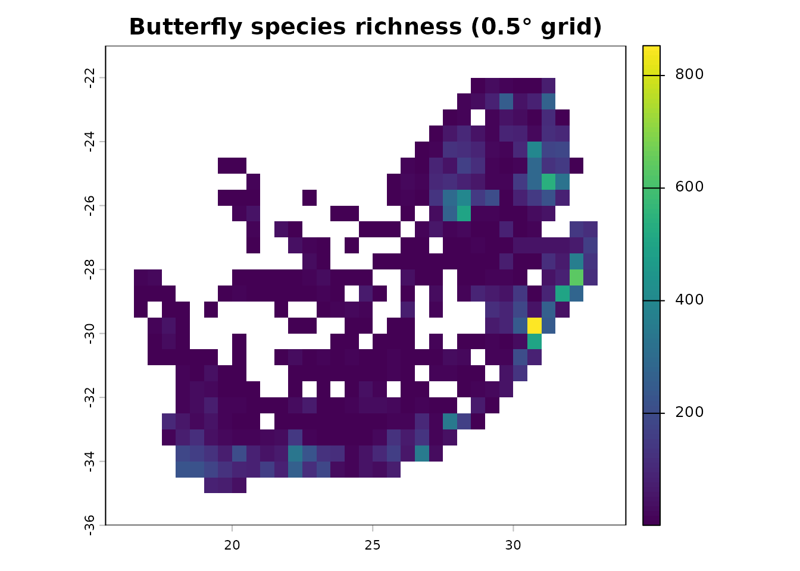

# Get started with dissmapr

`dissmapr` provides a reproducible, end-to-end workflow for computing
and mapping compositional dissimilarity and biodiversity turnover across
large spatial scales. This short guide runs a complete,
**self-contained** workflow on the example GBIF butterfly dataset for
South Africa that ships with the package, taking you from raw
**occurrence records** to a gridded **species-richness** map.

For the full, step-by-step tutorials (environmental linking, zeta
diversity, MS-GDM, bioregional mapping and change detection), see the
**Articles** on the [package
website](https://b-cubed-eu.github.io/dissmapr/articles/).

## Installation

``` r

# install.packages("remotes")
remotes::install_github("b-cubed-eu/dissmapr")
```

## A minimal, reproducible workflow

``` r

library(dissmapr)

# 1. Load the example occurrence dataset shipped with the package
load(system.file("extdata", "gbif_butterflies_csv.RData", package = "dissmapr"))

# 2. Import and harmonise the occurrence records
occ <- get_occurrence_data(
  data        = gbif_butterflies_csv,
  source_type = "data_frame"
)

# 3. Reshape into long (site_obs) and wide (site_spp) tables
fmt <- format_df(
  data        = occ,
  species_col = "verbatimScientificName",
  value_col   = "pa",
  format      = "long"
)
site_spp <- fmt$site_spp

# 4. Summarise records onto a 0.5-degree grid
grid <- generate_grid(
  data      = site_spp,
  x_col     = "x",
  y_col     = "y",
  grid_size = 0.5,
  sum_cols  = 4:ncol(site_spp),
  crs_epsg  = 4326
)

# 5. Map gridded species richness
terra::plot(grid$grid_r[["spp_rich"]],
            main = "Butterfly species richness (0.5° grid)")
```



Each function can be used on its own or chained into an end-to-end
pipeline. From here, the **Articles** walk through the rest of the
workflow in detail.
