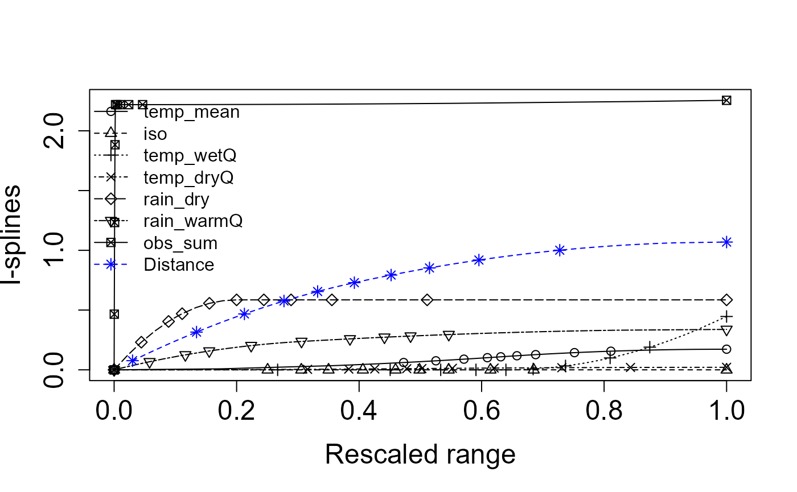
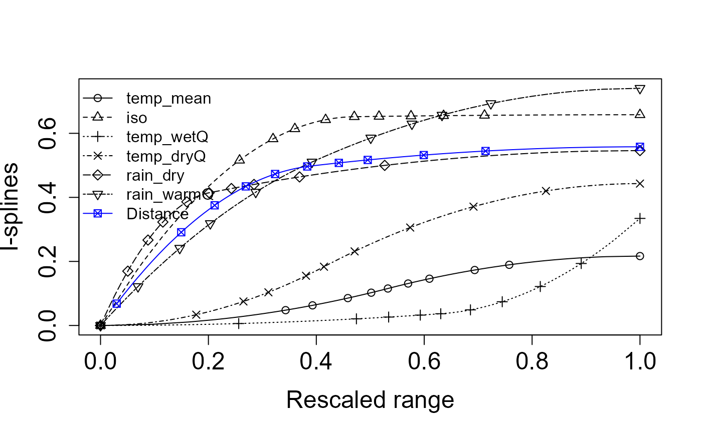

# Zeta diversity

## `dissmapr`

### Measuring Multi-Site Compositional Turnover with Zeta Diversity

This vignette introduces zeta diversity as a multi-site measure of
compositional change. Instead of considering only pairwise differences
between sites, zeta diversity describes how species are shared across
increasing numbers of sites, offering a broader view of biodiversity
turnover.

To keep the example reproducible and quick to run, we use a small set of
example objects bundled with `dissmapr`. The setup chunk below loads the
required packages, reads the bundled data snapshot, and unpacks the
environmental and presence-absence data needed for the zeta-diversity
examples.

``` r
# Load the packages used in this vignette.
library(dissmapr)
library(zetadiv)

# Load the bundled example data snapshot.
# This keeps the vignette reproducible and avoids requiring external downloads.
inputs = readRDS(system.file("extdata", "dissmapr_vignettes.rds", package = "dissmapr"))

# Unpack the example objects used below.
grid_env = inputs$grid_env                 # Grid-level environmental data
env_vars_reduced = inputs$env_vars_reduced # Selected environmental variables
grid_spp_pa = inputs$grid_spp_pa           # Presence-absence species data
sp_cols = inputs$sp_cols                   # Species column names
```

#### 1. Zeta diversity in **`dissmapr`**: a multi-site view of compositional change

Classical β-diversity evaluates how species composition differs
**between pairs** of sites, but many ecological questions, like how
wide-ranging species structure whole landscapes, require a perspective
that spans *three, four or more* assemblages at once. **Zeta diversity
(ζ-diversity)** meets this need by counting the number of species
jointly shared by *i* sites (ζ₁, ζ₂, … ζᵢ). As *i* increases, ζ
declines; the *shape* of that decline summarises how rarity and
commonness are distributed across the region. *See Guillaume Latombe
(2015). zetadiv: Functions to Compute Compositional Turnover Using Zeta
Diversity. R package version 1.3.0,
[https://cran.r-project.org/web/packages/zetadiv](https://rpkg.net/package/zetadiv).
Accessed 30 Jun. 2025*.

`dissmapr` embeds the **zetadiv** toolkit so that automated pipelines of
compositional dissimilarity can incorporate higher-order turnover
metrics alongside conventional pairwise indices. Four core functions are
central:

1.  **Expectation of ζ-decline** using
    [`Zeta.decline.ex()`](https://rdrr.io/pkg/zetadiv/man/Zeta.decline.ex.html):
    Calculates the *exact* mean ζ for successive orders (ζ₁ … ζₖ) when
    the site × species matrix is small enough for exhaustive
    enumeration, giving the theoretical baseline against which observed
    patterns can be compared [function
    details](https://rpkg.net/packages/zetadiv/reference/Zeta.decline.ex.ob).  
2.  **Monte-Carlo ζ-decline** using
    [`Zeta.decline.mc()`](https://rdrr.io/pkg/zetadiv/man/Zeta.decline.mc.html):
    Uses random subsampling to approximate the same decline in large
    matrices where exhaustive combinations are infeasible, trading a
    small sampling error for orders-of-magnitude speed-ups [function
    details](https://rpkg.net/packages/zetadiv/reference/Zeta.decline.mc.ob).  
3.  **ζ distance-decay**using
    [`Zeta.ddecays()`](https://rdrr.io/pkg/zetadiv/man/Zeta.ddecays.html):
    Fits a distance–decay curve for several ζ orders simultaneously,
    revealing how rapidly shared species drop away with spatial
    separation and whether higher-order overlap is lost faster or slower
    than pairwise similarity [function
    details](https://rpkg.net/packages/zetadiv/reference/Zeta.ddecays.ob).  
4.  **Multi-site GDM** using
    [`Zeta.msgdm()`](https://rdrr.io/pkg/zetadiv/man/Zeta.msgdm.html):
    Extends Generalised Dissimilarity Modelling to *multi-site*
    similarity. For a chosen order *i* it regresses ζᵢ against
    environmental gradients and geographic distance using GLMs, GAMs or
    shape-constrained splines, quantifying how each predictor controls
    the retention of shared species across landscapes [function
    details](https://rpkg.net/packages/zetadiv/reference/Zeta.msgdm.ob).

**Why this matters for automated turnover analysis**

- **Scale-explicit turnover**: ζ-decline distinguishes processes that
  shape local richness (ζ₁) from those structuring regional overlap (ζ₄,
  ζ₅ …), adding nuance to the pairwise β view.  
- **Process insight**: An *exponential* ζ-decline suggests stochastic
  assembly while a *power-law* decline implies niche structure or
  dispersal limitations.  
- **Predictive mapping**:
  [`Zeta.msgdm()`](https://rdrr.io/pkg/zetadiv/man/Zeta.msgdm.html)
  generates response surfaces for ζᵢ across continuous environmental
  space, enabling `dismapr` to project multi-site similarity under
  current or future scenarios.  
- **Integrated workflow**: Within `dismapr` the outputs
  (`Zeta.decline.*`,
  [`Zeta.ddecays()`](https://rdrr.io/pkg/zetadiv/man/Zeta.ddecays.html),
  [`Zeta.msgdm()`](https://rdrr.io/pkg/zetadiv/man/Zeta.msgdm.html))
  slot directly into the same site-by-environment matrices and raster
  stacks already produced for GLM/GAM pipelines, ensuring a seamless
  transition from data wrangling to advanced turnover modelling.

In summary, **ζ-diversity counts the species that an entire network of
sites share**. Imagine moving from one natural area to the next across a
region. In the first few nearby places most species still overlap, but
as you add more, especially those separated by greater distance or
harsher conditions, the list of species found everywhere quickly
narrows. ζ-diversity tracks how fast that shared list shrinks,
highlighting which species are resilient and widespread versus those
confined to only a handful of sites. The faster the shared-species list
shrinks, the clearer it becomes which species are robust and occur
almost everywhere, and which persist only in a few isolated spots.
Viewing many sites at once exposes conservation gaps that simple
*pairwise* comparisons can overlook.

The next sections offer a simple, step-by-step guide to spot where
shared biodiversity is weakest and direct protection where it’s needed
most.

#### 2. Expectation curve for ζ-diversity decline using `zetadiv::Zeta.decline.ex()`

[`Zeta.decline.ex()`](https://rdrr.io/pkg/zetadiv/man/Zeta.decline.ex.html)
calculates the theoretical number of species that should be shared by 1,
2, … k sites (orders 1–15 here) using a closed-form formula based solely
on each species’ occupancy frequency. Because no resampling is involved,
the output is an exact expectation of how ζ-diversity ought to fall as
more sites are considered, assuming site identity plays no role. The
function also fits exponential and power-law models to the expected
curve, yielding parameters and fit statistics that provide a baseline
against which observed or Monte-Carlo ζ-decline patterns can be
evaluated.

``` r
op = par(no.readonly = TRUE)
on.exit(par(op), add = TRUE)
par(mfrow = c(1,1), mar = c(4,4,1,1), oma = c(0,0,0,0))

set.seed(123)
zeta_decline_ex = zetadiv::Zeta.decline.ex(grid_spp_pa[,7:ncol(grid_spp_pa)], # Only species columns
                                  orders = 1:15, plot = FALSE)
zetadiv::Plot.zeta.decline(zeta_decline_ex, sd.plot = TRUE)
```


> - **Panel 1 (Zeta diversity decline)**: Shows how rapidly species that
>   are common across multiple sites decline as you look at groups of
>   more and more sites simultaneously (increasing zeta order). The
>   sharp drop means fewer species are shared among many sites compared
>   to just a few.
> - **Panel 2 (Ratio of zeta diversity decline)**: Illustrates the
>   proportion of shared species that remain as the number of sites
>   compared increases. A steeper curve indicates that common species
>   quickly become rare across multiple sites.
> - **Panel 3 (Exponential regression)**: Tests if the decline in shared
>   species fits an exponential decrease. A straight line here indicates
>   that species commonness decreases rapidly and consistently as more
>   sites are considered together. Exponential regression represents
>   ***stochastic assembly*** (**randomness determining species
>   distributions**).
> - **Panel 4 (Power law regression)**: Tests if the decline follows a
>   power law relationship. A straight line suggests that the loss of
>   common species follows a predictable pattern, where initially many
>   species are shared among fewer sites, but rapidly fewer are shared
>   among larger groups. Power law regression represents ***niche-based
>   sorting*** (**environmental factors shaping species
>   distributions**).
>
> **Interpretation**: *The near‐perfect straight line in the exponential
> panel (high R²) indicates that an exponential model provides the most
> parsimonious description of how species shared across sites decline as
> you add more sites—consistent with a stochastic, memory-less decline
> in common species. A power law will also fit in broad strokes, but
> deviates at high orders, suggesting exponential decay is the better
> choice for these data.*

#### 3. Empirical ζ-diversity decline via Monte-Carlo using `zetadiv::Zeta.decline.mc()`

[`Zeta.decline.mc()`](https://rdrr.io/pkg/zetadiv/man/Zeta.decline.mc.html)
estimates how the number of species shared by 1, 2, … k sites drops when
exhaustive combinations are impractical. It repeatedly draws random sets
of sites (Monte-Carlo sampling), averages the shared-species count for
each order, and reports both the mean and its variability. The resulting
curve is then fitted with exponential and power-law models, providing
parameter estimates and confidence bands that capture real-world
turnover while accounting for sampling uncertainty. In other words, a
**sharp drop** in the curve means **species change quickly from place to
place (communities are unique)**, while a **gentle drop** means **many
species are found in most places (communities are similar)**.

``` r
set.seed(123)
zeta_mc_utm = zetadiv::Zeta.decline.mc(grid_spp_pa[,-(1:6)], # Different way to get only species columns
                              # grid_env[, c("centroid_lon", "centroid_lat")], # WGS84 - decimal degrees
                              grid_env[, c("x_aea", "y_aea")], # AEA - meters
                              orders = 1:15,
                              sam = 100, # Sample size
                              NON = TRUE,
                              normalize = "Jaccard")
```


> - **Panel 1 (Zeta diversity decline)**: Rapidly declining zeta
>   diversity, similar to previous plots, indicates very few species
>   remain shared across increasingly larger sets of sites, emphasizing
>   strong species turnover and spatial specialization.
> - **Panel 2 (Ratio of zeta diversity decline)**: More irregular
>   fluctuations suggest a spatial effect: nearby sites might
>   occasionally share more species by chance due to proximity. The
>   spikes mean certain groups of neighboring sites have
>   higher-than-average species overlap.
> - **Panel 3 & 4 (Exponential and Power law regressions)**: Both remain
>   linear, clearly indicating the zeta diversity declines consistently
>   following a predictable spatial pattern. However, the exact pattern
>   remains similar to previous cases, highlighting that despite spatial
>   constraints, common species become rare quickly as more sites are
>   considered.  
>
> **Interpretation**: *This result demonstrates clear spatial
> structuring of biodiversity i.e. species are locally clustered, not
> randomly distributed across the landscape. Spatial proximity
> influences which species co-occur more frequently. In practice
> [`Zeta.decline.mc()`](https://rdrr.io/pkg/zetadiv/man/Zeta.decline.mc.html)
> is used for real‐world biodiversity data—both because it scales and
> because the Monte Carlo envelope is invaluable when ζₖ gets noisier at
> higher orders.*

#### 4. ζ-diversity distance-decay (orders 2–8) using `zetadiv::Zeta.ddecays()`

[`Zeta.ddecays()`](https://rdrr.io/pkg/zetadiv/man/Zeta.ddecays.html)measures
the **drop in shared species as geographic distance increases**. In this
example it evaluates **orders 2 through 8** by first binning site pairs
(or groups) into many distance classes, then computing the average
number of species they share in each class, and finally fitting an
**exponential distance-decay model** via a generalized linear
regression. The function returns the slope and intercept of each fitted
curve, goodness-of-fit statistics, and diagnostic plots that together
show **how quickly multisite similarity breaks down with space at
different zeta orders**.

``` r
# Calculate Zeta.ddecays
set.seed(123)
zeta_decays = zetadiv::Zeta.ddecays(#grid_env[, c("centroid_lon", "centroid_lat")],  # WGS84 - decimal degrees
                           grid_env[, c("x_aea", "y_aea")], # AEA - meters
                           grid_spp_pa[,-(1:6)],
                           sam = 1000, # Sample size
                           orders = 2:8,
                           plot = TRUE,
                           confint.level = 0.95
)
#> [1] 2
#> [1] 3
#> [1] 4
#> [1] 5
#> [1] 6
#> [1] 7
#> [1] 8
```


> This plot shows how zeta diversity (remember, it’s a metric that
> captures shared species composition among multiple sites) changes with
> spatial distance across different orders of zeta (i.e., the number of
> sites considered at once).
>
> - On the **x-axis**, we have the **order of zeta** (from 2 to 8).  
>   For example, zeta order 2 looks at pairs of sites, order 3 at
>   triplets, etc.
> - On the **y-axis**, we see the slope of the **relationship between
>   zeta diversity and distance** (i.e., how quickly species similarity
>   declines with distance).
> - A **negative slope** means that **sites farther apart have fewer
>   species in common** — so there’s a clear distance decay of
>   biodiversity.
> - A **slope near zero** means **distance doesn’t strongly affect how
>   many species are shared among sites**.
>
> **Interpretation**: *When you look at just two or three sites,
> distance really matters because sites far apart share far fewer
> species, so the decay curve is steep. Once you include four or more
> sites, that curve flattens out: most widespread species still overlap
> no matter the distance, so spatial separation has little effect. The
> tighter confidence bands at higher orders show these broader‐scale
> patterns are more reliable because they average over many sites. In
> plain terms, rare or localized species drive strong turnover at small
> scales, but a core of common species holds communities together across
> larger regions.*

#### 5. Model drivers of compositional turnover with `zetadiv::Zeta.msgdm()`

[`Zeta.msgdm()`](https://rdrr.io/pkg/zetadiv/man/Zeta.msgdm.html)
extends **Generalised Dissimilarity Modelling** (GDM) from simple
pairwise similarity to any order of ζ-diversity. Order 2 is, by
definition, the pairwise case as it counts the species shared by two
sites. In other words, the results are directly comparable to
conventional β-diversity models. The advantage of the ζ framework is
that you can raise the order (ζ₃, ζ₄, …) with the same function to
reveal higher-order patterns without changing tools.

**Here we fit an order-2 model to ask**:  
- How strongly do climate, geography, or other predictors control the
chance that two sites share species?  
- How does that control change along each environmental gradient?

**[`Zeta.msgdm()`](https://rdrr.io/pkg/zetadiv/man/Zeta.msgdm.html)
proceeds in three stages**:

1.  **Sampling**: draws 1 000 random site pairs (`sam = 1000`) to keep
    computation tractable.  
2.  **Normalisation**: converts order-2 ζ counts to a Jaccard similarity
    (`normalize = "Jaccard"`) so coefficients range between 0 and 1.  
3.  **Regression**: fits an I-spline MSGDM (`reg.type = "ispline"`) that
    separates monotonic environmental effects from Euclidean geographic
    distance (`distance.type = "Euclidean"`).

The fitted model (`zeta2`) contains partial I-splines for every
predictor (note: higher splines imply stronger turnover per unit
change).

``` r
set.seed(246)
# Fit order-2 MSGDM on the presence–absence matrix and reduced covariate set
zeta2 = zetadiv::Zeta.msgdm(
  grid_spp_pa[,-(1:6)],                            # species matrix (rows = sites, cols = spp)
  env_vars_reduced,                                # decorrelated environmental variables
  # env_vars_reduced[,-7],                         # without sampling effort included
  grid_env[, c("centroid_lon", "centroid_lat")],   # longitude & latitude (°)
  # grid_env[, c("x_aea", "y_aea")],               # longitude & latitude (meters)
  sam           = 2000,
  order         = 2,
  distance.type = "Euclidean",
  normalize     = "Jaccard",
  reg.type      = "ispline"
)

# Extract and plot the fitted I-splines
# splines = Return.ispline(zeta2, env_vars_reduced[,-7], distance = TRUE) # Without sampling effort
splines = Return.ispline(zeta2, env_vars_reduced, distance = TRUE)
Plot.ispline(splines, distance = TRUE)
```



**General Interpretation**:

- **I-spline height**: The taller the curve, the more a variable drives
  species turnover.  
- **Curve shape**: Steep early rises mark thresholds where small
  environmental changes cause large compositional shifts; flatter tails
  suggest saturation.  
- **Distance spline**: Shows the residual spatial decay once
  environmental effects are removed, highlighting dispersal limits or
  unmeasured factors.

By isolating each driver’s effect, this MSGDM pinpoints which gradients
most erode shared biodiversity and where management actions could most
effectively slow that loss.

> **Specific Interpretation**: This figure shows the fitted I-splines
> from a multi-site generalized dissimilarity model (via `Zeta.msgdm`),
> which represent the partial, monotonic relationship between each
> predictor and community turnover (ζ-diversity) over its 0–1 “rescaled”
> range. A few key take-aways:
>
> 1.  **Distance (blue asterisks)** has by far the largest I-spline
>     amplitude—rising from ~0 at zero distance to ~0.05 at the maximum.
>     That tells us spatial separation is the strongest driver of
>     multi‐site turnover, and even small increases in distance yield a
>     substantial drop in shared species.
> 2.  **Sampling intensity (`obs_sum`, open circles)** comes next, with
>     a gentle but steady rise to ~0.045. This indicates that sites with
>     more observations tend to share more species (or, conversely, that
>     incomplete sampling can depress apparent turnover).
> 3.  **Precipitation variables**: **Rain in the warm quarter
>     (`rain_warmQ`, squares)** and **Rain in the dry quarter
>     (`rain_dry`, triangles-down)** both show moderate effects
>     (I-spline heights ~0.02–0.03). This means differences in seasonal
>     rainfall regimes contribute noticeably to changes in community
>     composition.
> 4.  **Temperature metrics**: **Mean temperature** *(`temp_mean`,
>     triangles-up)*, **Wet‐quarter temperature** *(`temp_wetQ`, X’s)*,
>     **Dry‐quarter temperature** *(`temp_dryQ`, diamonds)*, and the
>     **isothermality index** *(`iso`, plus signs)* all have very low,
>     almost flat I-splines (max heights ≲0.01). In other words, these
>     thermal variables explain very little additional turnover once
>     you’ve accounted for distance and rainfall.
>
> **Key point:** Spatial distance is the dominant structuring factor in
> these data i.e. sites further apart share markedly fewer species.
> After accounting for that, differences in observation effort and, to a
> lesser degree, seasonal rainfall still shape multisite community
> similarity. Temperature and seasonality metrics, by contrast, appear
> to have only a minor independent influence on zeta‐diversity in this
> landscape.

``` r
# Deviance explained summary results
with(summary(zeta2$model), 1 - deviance/null.deviance) 
#> [1] 0.3265057
# [1] 0.3733073
# 0.3733073 means that approximately 37% of the variability in the response
# variable is explained by your model. This is relatively low, suggesting that the
# model may not be capturing much of the underlying pattern in the data.

# Model summary results
summary(zeta2$model)
#> 
#> Call:
#> glm.cons(formula = zeta.val ~ ., family = family, data = data.tot, 
#>     control = control, method = "glm.fit.cons", cons = cons, 
#>     cons.inter = cons.inter)
#> 
#> Coefficients:
#>             Estimate Std. Error z value Pr(>|z|)    
#> (Intercept) -2.16968    0.59939  -3.620 0.000295 ***
#> temp_mean1   0.00000    4.21534   0.000 1.000000    
#> temp_mean2   0.00000    1.32559   0.000 1.000000    
#> temp_mean3   0.00000    1.70928   0.000 1.000000    
#> iso1        -0.66083    1.51472  -0.436 0.662639    
#> iso2        -0.23047    0.88345  -0.261 0.794186    
#> iso3        -0.09082    1.47082  -0.062 0.950764    
#> temp_wetQ1   0.00000    1.15499   0.000 1.000000    
#> temp_wetQ2  -0.50916    0.93824  -0.543 0.587353    
#> temp_wetQ3   0.00000    1.44449   0.000 1.000000    
#> temp_dryQ1  -0.25546    3.76827  -0.068 0.945951    
#> temp_dryQ2   0.00000    1.17904   0.000 1.000000    
#> temp_dryQ3   0.00000    1.19974   0.000 1.000000    
#> rain_dry1   -0.51688    0.77003  -0.671 0.502061    
#> rain_dry2    0.00000    0.85157   0.000 1.000000    
#> rain_dry3    0.00000    1.09211   0.000 1.000000    
#> rain_warmQ1  0.00000    0.88632   0.000 1.000000    
#> rain_warmQ2 -0.16285    1.06003  -0.154 0.877907    
#> rain_warmQ3  0.00000    1.71132   0.000 1.000000    
#> obs_sum1    -2.36497    0.52951  -4.466 7.96e-06 ***
#> obs_sum2     0.00000    1.32135   0.000 1.000000    
#> obs_sum3     0.00000    1.88062   0.000 1.000000    
#> distance1    0.00000    0.92268   0.000 1.000000    
#> distance2   -0.68238    1.27321  -0.536 0.591992    
#> distance3   -0.15209    2.11481  -0.072 0.942668    
#> ---
#> Signif. codes:  0 '***' 0.001 '**' 0.01 '*' 0.05 '.' 0.1 ' ' 1
#> 
#> (Dispersion parameter for binomial family taken to be 1)
#> 
#>     Null deviance: 125.418  on 1999  degrees of freedom
#> Residual deviance:  84.468  on 1975  degrees of freedom
#> AIC: 137.85
#> 
#> Number of Fisher Scoring iterations: 7
```

#### 6. Uneven sampling can disguise the true drivers of biodiversity

**With sampling effort** (`obs_sum`) included, all sites with lots of
records suddenly look far more alike than poorly sampled ones, and the
climate curves flatten, and distance drops too.

``` r
# Fit order-2 MSGDM on the presence–absence matrix and reduced covariate set
set.seed(123) # set.seed to generate exactly the same random results i.e. sam=100
zeta2_noEff = zetadiv::Zeta.msgdm(
  grid_spp_pa[,-(1:6)],                            # species matrix (rows = sites, cols = spp)
  # env_vars_reduced,                              # decorrelated environmental variables
  env_vars_reduced[,-7],                           # without sampling effort included
  grid_env[, c("centroid_lon", "centroid_lat")],   # longitude & latitude (°)
  # grid_env[, c("x_aea", "y_aea")],               # longitude & latitude (meters)
  sam           = 1000,
  order         = 2,
  distance.type = "Euclidean",
  normalize     = "Jaccard",
  reg.type      = "ispline"
)

# Extract and plot the fitted I-splines
splines_noEff = Return.ispline(zeta2_noEff, env_vars_reduced[,-7], distance = TRUE) # Without sampling effort
Plot.ispline(splines_noEff, distance = TRUE)
```



**Without sampling effort** (`obs_sum`) temperature and rainfall curves
climb high and fast: climate looks like the main reason sites stop
sharing species. Distance (blue line) still matters, but less than
several climate variables.

``` r
# Deviance explained summary results
with(summary(zeta2_noEff$model), 1 - deviance/null.deviance) 
#> [1] 0.08242887
# [1] 0.09495599
# 0.09495599 means that approximately 1% of the variability in the response
# variable is explained by your model. This is relatively low, suggesting that the
# model may not be capturing much of the underlying pattern in the data.

# Model summary results
summary(zeta2_noEff$model)
#> 
#> Call:
#> glm.cons(formula = zeta.val ~ ., family = family, data = data.tot, 
#>     control = control, method = "glm.fit.cons", cons = cons, 
#>     cons.inter = cons.inter)
#> 
#> Coefficients:
#>              Estimate Std. Error z value Pr(>|z|)   
#> (Intercept) -2.305665   0.721583  -3.195   0.0014 **
#> temp_mean1   0.000000   5.272996   0.000   1.0000   
#> temp_mean2  -0.007144   1.832550  -0.004   0.9969   
#> temp_mean3   0.000000   2.455501   0.000   1.0000   
#> iso1        -0.725358   1.979856  -0.366   0.7141   
#> iso2         0.000000   1.361781   0.000   1.0000   
#> iso3         0.000000   1.855354   0.000   1.0000   
#> temp_wetQ1   0.000000   1.590499   0.000   1.0000   
#> temp_wetQ2  -0.171044   1.323550  -0.129   0.8972   
#> temp_wetQ3  -0.245516   2.004941  -0.122   0.9025   
#> temp_dryQ1   0.000000   4.616254   0.000   1.0000   
#> temp_dryQ2  -0.383231   1.607844  -0.238   0.8116   
#> temp_dryQ3   0.000000   1.705142   0.000   1.0000   
#> rain_dry1   -0.393946   1.102893  -0.357   0.7209   
#> rain_dry2   -0.100671   1.235874  -0.081   0.9351   
#> rain_dry3    0.000000   1.648886   0.000   1.0000   
#> rain_warmQ1 -0.305178   1.152042  -0.265   0.7911   
#> rain_warmQ2 -0.282474   1.498679  -0.188   0.8505   
#> rain_warmQ3  0.000000   2.172401   0.000   1.0000   
#> distance1   -0.566301   1.239956  -0.457   0.6479   
#> distance2   -0.245639   1.595763  -0.154   0.8777   
#> distance3    0.000000   2.453409   0.000   1.0000   
#> ---
#> Signif. codes:  0 '***' 0.001 '**' 0.01 '*' 0.05 '.' 0.1 ' ' 1
#> 
#> (Dispersion parameter for binomial family taken to be 1)
#> 
#>     Null deviance: 65.233  on 999  degrees of freedom
#> Residual deviance: 59.856  on 978  degrees of freedom
#> AIC: 106.99
#> 
#> Number of Fisher Scoring iterations: 7
```

With sampling effort removed the model explains only ≈ 8% of the
deviance, compared to 37%. In other words, after discounting chance,
less than one-tenth of the variation in shared-species counts is
captured by climate and distance alone, confirming that survey effort
had been the primary driver of the much higher explanatory power in the
full model.

**Key point**: *Uneven sampling can hide the real drivers of
biodiversity. Without accounting for effort, the model attributes most
turnover to climate. Adding effort shows that well-surveyed sites appear
more similar simply because thorough searches record more species, while
lightly sampled sites miss many and seem distinct. Correcting for effort
is essential; only then can we see how climate and distance truly shape
species turnover.*

``` r
sessionInfo()
#> R version 4.5.2 (2025-10-31 ucrt)
#> Platform: x86_64-w64-mingw32/x64
#> Running under: Windows 11 x64 (build 26200)
#> 
#> Matrix products: default
#>   LAPACK version 3.12.1
#> 
#> locale:
#> [1] LC_COLLATE=English_South Africa.utf8  LC_CTYPE=English_South Africa.utf8   
#> [3] LC_MONETARY=English_South Africa.utf8 LC_NUMERIC=C                         
#> [5] LC_TIME=English_South Africa.utf8    
#> 
#> time zone: Africa/Johannesburg
#> tzcode source: internal
#> 
#> attached base packages:
#> [1] stats     graphics  grDevices datasets  utils     methods   base     
#> 
#> other attached packages:
#> [1] zetadiv_1.3.0  scam_1.2-22    dissmapr_0.2.0
#> 
#> loaded via a namespace (and not attached):
#>   [1] DBI_1.3.0            pbapply_1.7-4        geodata_0.6-9       
#>   [4] pROC_1.19.0.1        glm2_1.2.1           permute_0.9-10      
#>   [7] rlang_1.2.0          magrittr_2.0.5       otel_0.2.0          
#>  [10] e1071_1.7-17         compiler_4.5.2       mgcv_1.9-4          
#>  [13] systemfonts_1.3.2    vctrs_0.7.3          maps_3.4.3          
#>  [16] reshape2_1.4.5       stringr_1.6.0        pkgconfig_2.0.3     
#>  [19] fastmap_1.2.0        rmarkdown_2.31       prodlim_2026.03.11  
#>  [22] ragg_1.5.2           purrr_1.2.2          xfun_0.59           
#>  [25] cachem_1.1.0         jsonlite_2.0.0       recipes_1.3.3       
#>  [28] terra_1.9-34         parallel_4.5.2       cluster_2.1.8.2     
#>  [31] R6_2.6.1             bslib_0.11.0         stringi_1.8.7       
#>  [34] RColorBrewer_1.1-3   parallelly_1.47.0    rpart_4.1.27        
#>  [37] estimability_1.5.1   lubridate_1.9.5      jquerylib_0.1.4     
#>  [40] Rcpp_1.1.1-1.1       iterators_1.0.14     knitr_1.51          
#>  [43] future.apply_1.20.2  fields_17.3          zoo_1.8-15          
#>  [46] nnls_1.6             Matrix_1.7-5         splines_4.5.2       
#>  [49] nnet_7.3-20          timechange_0.4.0     tidyselect_1.2.1    
#>  [52] rstudioapi_0.19.0    yaml_2.3.12          vegan_2.7-5         
#>  [55] timeDate_4052.112    codetools_0.2-20     listenv_1.0.0       
#>  [58] lattice_0.22-9       tibble_3.3.1         plyr_1.8.9          
#>  [61] withr_3.0.3          S7_0.2.2             geosphere_1.6-8     
#>  [64] evaluate_1.0.5       sf_1.1-1             future_1.70.0       
#>  [67] desc_1.4.3           survival_3.8-6       units_1.0-1         
#>  [70] proxy_0.4-29         mclust_6.1.2         pillar_1.11.1       
#>  [73] KernSmooth_2.23-26   corrplot_0.95        renv_1.1.4          
#>  [76] foreach_1.5.2        stats4_4.5.2         generics_0.1.4      
#>  [79] ggplot2_4.0.3        scales_1.4.0         xtable_1.8-8        
#>  [82] globals_0.19.1       class_7.3-23         glue_1.8.1          
#>  [85] clValid_0.7          emmeans_2.0.3        tools_4.5.2         
#>  [88] data.table_1.18.4    ModelMetrics_1.2.2.2 gower_1.0.2         
#>  [91] mvtnorm_1.4-1        fs_2.1.0             dotCall64_1.2       
#>  [94] grid_4.5.2           tidyr_1.3.2          ipred_0.9-15        
#>  [97] nlme_3.1-169         patchwork_1.3.2      cli_3.6.6           
#> [100] rappdirs_0.3.4       textshaping_1.0.5    NbClust_3.0.1       
#> [103] spam_2.11-4          viridisLite_0.4.3    lava_1.9.1          
#> [106] dplyr_1.2.1          gtable_0.3.6         sass_0.4.10         
#> [109] digest_0.6.39        classInt_0.4-11      caret_7.0-1         
#> [112] ggrepel_0.9.8        htmlwidgets_1.6.4    farver_2.1.2        
#> [115] entropy_1.3.2        htmltools_0.5.9      pkgdown_2.2.0       
#> [118] lifecycle_1.0.5      factoextra_2.0.0     hardhat_1.4.3       
#> [121] httr_1.4.8           MASS_7.3-65
```
