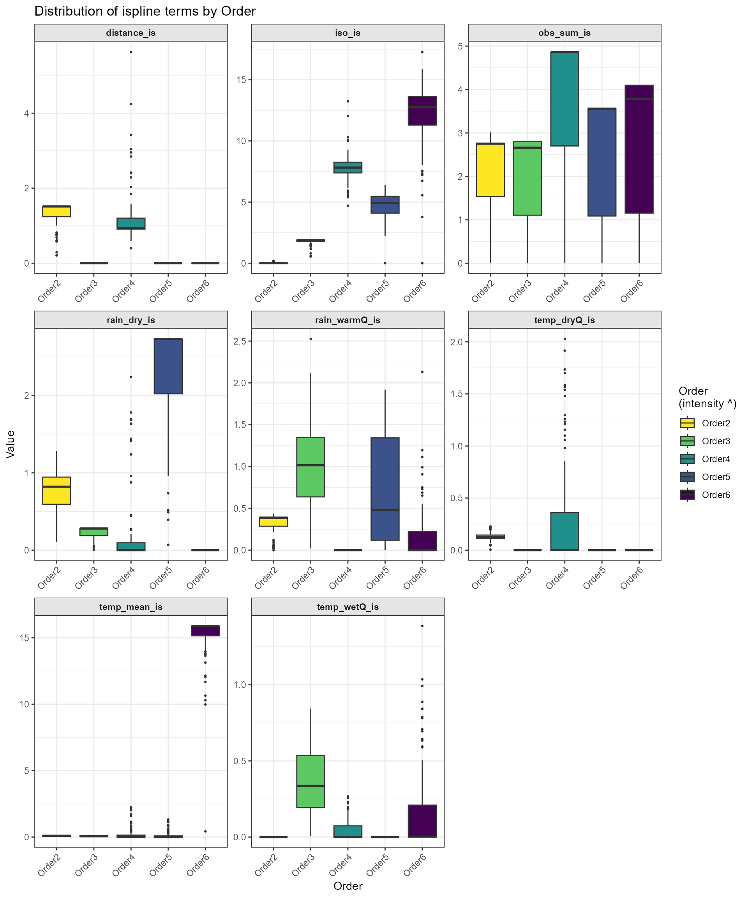

# Zeta-MSGDM with dissmapr

## `dissmapr`

### Modelling Zeta Diversity Across Environmental Gradients

This vignette demonstrates a more complete zeta-diversity workflow,
moving from prepared species and environmental data to model fitting and
interpretation. It is intended to show how the main zeta-based
components of `dissmapr` can be combined in practice.

To keep the example reproducible and quick to run, we use a small set of
example objects bundled with `dissmapr`. The setup chunk below loads the
required packages, reads the bundled data snapshot, and unpacks the
objects needed for the automated zeta-modelling workflow.

``` r
# Load the packages used in this vignette.
library(dissmapr)
library(patchwork)

# Load the bundled example data snapshot.
inputs = readRDS(system.file("extdata", "dissmapr_vignettes.rds", package = "dissmapr"))

# Unpack the example objects used below.
grid_spp_pa = inputs$grid_spp_pa           # Presence-absence species data
env_vars_reduced = inputs$env_vars_reduced # Selected environmental variables
grid_env = inputs$grid_env                 # Grid-level environmental data
sp_cols = inputs$sp_cols                   # Species column names
```

#### 1. Automated Ispline Modeling & Visualization

To streamline the exploration of multi‐site turnover drivers, we now
introduce an **automated sub-workflow** that fits, extracts and
visualizes I-spline models for any set of zeta orders in just three
function calls. Rather than manually looping over orders, binding
tables, and crafting bespoke plots, you can:

1.  **Run and combine** all ispline GLMs via
    [`run_ispline_models()`](https://b-cubed-eu.github.io/dissmapr/reference/run_ispline_models.md),
    which:\>
    - Calls
      [`Zeta.msgdm()`](https://rdrr.io/pkg/zetadiv/man/Zeta.msgdm.html)
      for each order of interest (e.g. ζ₂…ζ₆)
    - Extracts both the raw covariates (including geographic distance)
      and their spline bases
    - Returns one tidy tibble tagged by `zOrder`, ready for plotting or
      further analysis
2.  **Inspect partial-dependence curves** with
    [`plot_ispline_lines()`](https://b-cubed-eu.github.io/dissmapr/reference/plot_ispline_lines.md),
    which:\>
    - Automatically locates the spline column matching any chosen
      covariate (e.g. “dist” → `dist_is`)
    - Draws each zeta-order’s I-spline curve with thin lines
    - Overlays small markers at user-specified quantiles of the raw
      predictor and a larger symbol at each curve’s minimum
3.  **Summarize overall variation** using
    [`plot_ispline_boxplots()`](https://b-cubed-eu.github.io/dissmapr/reference/plot_ispline_boxplots.md),
    which:
    - Detects every `_is` spline column in your data
    - Pivots to long format and produces facetted boxplots for each term
    - Applies a color-blind–safe Viridis palette with independent scales
      per facet

By packaging these steps into self-documented functions, we embed
ispline modeling and visualization into our RMarkdown workflow with a
single, transparent call. The parameters (orders, covariate name,
colors, shapes, etc.) are fully customizable, while sensible defaults
minimize boilerplate, ensuring reproducibility, readability and ease of
maintenance in automated biodiversity turnover analyses.

#### 2. Fit and combine ispline models

The following chunk uses our
[`run_ispline_models()`](https://b-cubed-eu.github.io/dissmapr/reference/run_ispline_models.md)
helper to fit `Zeta.msgdm(reg.type = “ispline”)` for orders 2–6, extract
both raw covariates (including distance) and their spline bases, and
bind everything into one tidy table tagged by `zOrder`.

``` r
# Fit & gather ispline outputs for orders 2:6
set.seed(123) # set.seed to generate exactly the same random results i.e. sam=100
ispline_gdm_tab = dissmapr::run_ispline_models(
  spp_df    = grid_spp_pa[,-(1:6)],
  env_df    = env_vars_reduced,
  xy_df     = grid_env[, c("centroid_lon", "centroid_lat")],
  orders    = 2:6,
  sam       = 100, # Set really low to run fast
  normalize = "Jaccard",
  reg_type  = "ispline"
)
```

``` r
str(ispline_gdm_tab, max.level=1)
#> List of 2
#>  $ zeta_gdm_list:List of 5
#>  $ ispline_table:'data.frame':   500 obs. of  17 variables:

ispline_tabs_all = ispline_gdm_tab$ispline_table
head(ispline_tabs_all)
#>   temp_mean        iso  temp_wetQ temp_dryQ   rain_dry rain_warmQ obs_sum
#> 1 0.0000000 0.00000000 0.00000000 0.0000000 0.00000000 0.00000000       0
#> 2 0.2896355 0.09884044 0.01960870 0.1041687 0.00000000 0.00877193       0
#> 3 0.3842598 0.15863757 0.03114836 0.1160104 0.00000000 0.01096491       0
#> 4 0.3874364 0.16800387 0.06060482 0.1609354 0.00000000 0.02412281       0
#> 5 0.3927655 0.17380612 0.09836887 0.1903078 0.00000000 0.02631579       0
#> 6 0.3973209 0.18186992 0.11965861 0.2000578 0.02272727 0.03070175       0
#>     distance temp_mean_is iso_is temp_wetQ_is temp_dryQ_is rain_dry_is
#> 1 0.03214127            0      0            0   0.02831627   0.1529665
#> 2 0.03214127            0      0            0   0.04242732   0.1529665
#> 3 0.04545457            0      0            0   0.04380618   0.1529665
#> 4 0.09642380            0      0            0   0.04861907   0.1529665
#> 5 0.09642380            0      0            0   0.05140793   0.1529665
#> 6 0.10163911            0      0            0   0.05227112   0.2890950
#>   rain_warmQ_is obs_sum_is distance_is zOrder
#> 1             0          0   0.2105816 Order2
#> 2             0          0   0.2105816 Order2
#> 3             0          0   0.2935477 Order2
#> 4             0          0   0.5881165 Order2
#> 5             0          0   0.5881165 Order2
#> 6             0          0   0.6161951 Order2
```

#### 3. Plot Partial‐Dependence Curves for All Covariates

Here we produce a unified, multi‐panel display of each predictor’s
I‐spline partial‐dependence curve using our
[`plot_ispline_lines()`](https://b-cubed-eu.github.io/dissmapr/reference/plot_ispline_lines.md)
helper. That function will:

- Auto‐detect the spline column for each covariate (e.g. “dist” →
  `dist_is`).
- Draw a thin line for each zeta‐order.
- Mark selected quantiles along the raw covariate with small symbols.
- Highlight each curve’s minimum value with a larger marker.

We then loop over all raw covariates (those ending in `_is`), generate a
separate plot per variable, and assemble them into a cohesive
multi‐panel layout using the `patchwork` package. This makes it possible
to compare turnover responses across the full suite of environmental
drivers.

``` r

# 1. Identify all raw covariates with a spline term
raw_vars = sub("_is$", "",
                grep("_is$", names(ispline_tabs_all), value = TRUE))

# 2. Generate one plot per covariate
plots = lapply(raw_vars, function(var) {
  dissmapr::plot_ispline_lines(
    ispline_data = ispline_tabs_all,
    x_var        = var,
    orders       = paste("Order", 2:6),
    cols         = c('green','cyan','purple','blue','black'),
    shapes       = c(15,16,17,18,19)
  ) +
  ggplot2::ggtitle(paste("I-Spline Partial Effect of", var))
})

# 3. Combine into a grid (2 columns here; adjust ncol as needed)
patchwork::wrap_plots(plots, ncol = 2) +
  patchwork::plot_annotation(
    title = "Multi-Panel I-Spline Curves Across Covariates",
    theme = ggplot2::theme(plot.title = ggplot2::element_text(size = 16, face = "bold"))
  )
```


``` r

# # Simle single covariate line plot for "dist"
# plot_ispline_lines(
#   ispline_data = ispline_tabs_all,
#   x_var        = "dist",  
#   orders       = paste("Order", 2:6),
#   cols         = c('green','cyan','purple','blue','black'),
#   shapes       = c(15,16,17,18,19)
# )
```

**Ecological Interpretation and Conservation Implications**  
Which predictors drive turnover shifts with the number of sites:  
\* **Two‐sites**: Distance dominates. Shared species drop off steeply as
sites become farther apart.  
\* **Three‐sites**: Isothermality (stable day–night vs. seasonal
temperature swings) is most important, suggesting communities in areas
with steady daily temperatures stay more similar.  
\* **Four‐sites**: Mean temperature and wet‐quarter temperature have the
strongest effects, indicating thermal limits filter species across
moderate clusters of sites.  
\* **Five‐sites**: Sampling effort peaks in influence, warning that
uneven survey intensity can masquerade as real ecological turnover at
this scale.  
\* **Six‐sites**: Rainfall variables—especially warm‐quarter and
dry‐season rainfall—become the key filters, showing that moisture
availability during extreme seasons governs species overlap in larger
site groups.

**Key point**: At the smallest scale, dispersal barriers (distance) set
the stage for which species can overlap. As you expand to three, four or
more sites, environmental filters—first thermal, then
hydric—sequentially take over. This scale‐dependent shift reveals that
different ecological processes dominate community assembly at different
spatial extents, with direct implications for how we design surveys and
target conservation under changing climates.

#### 4. Facetted boxplots of all spline terms

Finally, we summarize the distribution of every \_is basis across orders
using
[`plot_ispline_boxplots()`](https://b-cubed-eu.github.io/dissmapr/reference/plot_ispline_boxplots.md).
Each spline term is facetted with free scales, and fills are mapped to
zOrder via a color-blind–friendly Viridis palette.

``` r
# Facetted boxplots of all *_is columns
dissmapr::plot_ispline_boxplots(
  ispline_data   = ispline_tabs_all,
  ispline_suffix = "_is",
  order_col      = "zOrder",
  palette        = "viridis",
  direction      = -1,
  ncol           = 3
)
```



**Ecological Interpretation and Conservation Implications** Which
factors matter depends on how many sites you compare at once:  
- **Two sites:** Geographic distance dominates. Nearby sites share many
species, distant sites very few.  
- **Three sites:** Isothermality (day–night versus seasonal swings) has
its strongest effect, suggesting that stable daily temperatures support
more consistent communities.  
- **Four sites:** Temperature (mean and seasonal highs) becomes the key
driver, indicating that thermal limits filter which species can persist
across moderate clusters.  
- **Five sites:** Dry-season rainfall peaks in importance, showing that
moisture availability determines whether species can survive across
larger groups.  
- **Four sites (again):** Sampling effort bias is highest, meaning
uneven survey intensity can look like an ecological signal at this
scale.

**Key points**:  
- At **small scales** (two sites), where species must actually move
between locations, distance is the main barrier to sharing species.  
- At **medium scales** (three to five sites), local climate steps in:
only species that can tolerate the same temperature and moisture levels
hang on across multiple sites.  
- Breaking up habitat makes it even harder for species to move, while
hotter, drier conditions shrink the range where they can survive—driving
faster loss of biodiversity.  
- Protecting connected corridors and a variety of microclimates helps
species disperse and find refuge, slowing turnover and preserving the
common “backbone” species that keep ecosystems stable and healthy.

``` r
sessionInfo()
#> R version 4.5.2 (2025-10-31 ucrt)
#> Platform: x86_64-w64-mingw32/x64
#> Running under: Windows 11 x64 (build 26200)
#> 
#> Matrix products: default
#>   LAPACK version 3.12.1
#> 
#> locale:
#> [1] LC_COLLATE=English_South Africa.utf8  LC_CTYPE=English_South Africa.utf8   
#> [3] LC_MONETARY=English_South Africa.utf8 LC_NUMERIC=C                         
#> [5] LC_TIME=English_South Africa.utf8    
#> 
#> time zone: Africa/Johannesburg
#> tzcode source: internal
#> 
#> attached base packages:
#> [1] stats     graphics  grDevices datasets  utils     methods   base     
#> 
#> other attached packages:
#> [1] patchwork_1.3.2 dissmapr_0.2.0 
#> 
#> loaded via a namespace (and not attached):
#>   [1] DBI_1.3.0            pbapply_1.7-4        geodata_0.6-9       
#>   [4] pROC_1.19.0.1        permute_0.9-10       rlang_1.2.0         
#>   [7] magrittr_2.0.5       otel_0.2.0           e1071_1.7-17        
#>  [10] compiler_4.5.2       mgcv_1.9-4           systemfonts_1.3.2   
#>  [13] vctrs_0.7.3          maps_3.4.3           reshape2_1.4.5      
#>  [16] stringr_1.6.0        pkgconfig_2.0.3      fastmap_1.2.0       
#>  [19] labeling_0.4.3       rmarkdown_2.31       prodlim_2026.03.11  
#>  [22] ragg_1.5.2           purrr_1.2.2          xfun_0.59           
#>  [25] cachem_1.1.0         jsonlite_2.0.0       recipes_1.3.3       
#>  [28] terra_1.9-34         parallel_4.5.2       cluster_2.1.8.2     
#>  [31] R6_2.6.1             bslib_0.11.0         stringi_1.8.7       
#>  [34] RColorBrewer_1.1-3   parallelly_1.47.0    rpart_4.1.27        
#>  [37] estimability_1.5.1   lubridate_1.9.5      jquerylib_0.1.4     
#>  [40] Rcpp_1.1.1-1.1       iterators_1.0.14     knitr_1.51          
#>  [43] future.apply_1.20.2  fields_17.3          zoo_1.8-15          
#>  [46] nnls_1.6             Matrix_1.7-5         splines_4.5.2       
#>  [49] nnet_7.3-20          timechange_0.4.0     tidyselect_1.2.1    
#>  [52] rstudioapi_0.19.0    yaml_2.3.12          vegan_2.7-5         
#>  [55] timeDate_4052.112    codetools_0.2-20     listenv_1.0.0       
#>  [58] lattice_0.22-9       tibble_3.3.1         plyr_1.8.9          
#>  [61] withr_3.0.3          S7_0.2.2             geosphere_1.6-8     
#>  [64] evaluate_1.0.5       sf_1.1-1             future_1.70.0       
#>  [67] desc_1.4.3           survival_3.8-6       units_1.0-1         
#>  [70] proxy_0.4-29         mclust_6.1.2         pillar_1.11.1       
#>  [73] KernSmooth_2.23-26   corrplot_0.95        renv_1.1.4          
#>  [76] foreach_1.5.2        stats4_4.5.2         generics_0.1.4      
#>  [79] zetadiv_1.3.0        ggplot2_4.0.3        scales_1.4.0        
#>  [82] xtable_1.8-8         globals_0.19.1       class_7.3-23        
#>  [85] glue_1.8.1           clValid_0.7          emmeans_2.0.3       
#>  [88] tools_4.5.2          data.table_1.18.4    ModelMetrics_1.2.2.2
#>  [91] gower_1.0.2          mvtnorm_1.4-1        fs_2.1.0            
#>  [94] dotCall64_1.2        grid_4.5.2           tidyr_1.3.2         
#>  [97] ipred_0.9-15         nlme_3.1-169         cli_3.6.6           
#> [100] rappdirs_0.3.4       textshaping_1.0.5    NbClust_3.0.1       
#> [103] spam_2.11-4          viridisLite_0.4.3    scam_1.2-22         
#> [106] lava_1.9.1           dplyr_1.2.1          gtable_0.3.6        
#> [109] sass_0.4.10          digest_0.6.39        classInt_0.4-11     
#> [112] caret_7.0-1          ggrepel_0.9.8        htmlwidgets_1.6.4   
#> [115] farver_2.1.2         entropy_1.3.2        htmltools_0.5.9     
#> [118] pkgdown_2.2.0        lifecycle_1.0.5      factoextra_2.0.0    
#> [121] hardhat_1.4.3        httr_1.4.8           MASS_7.3-65
```
