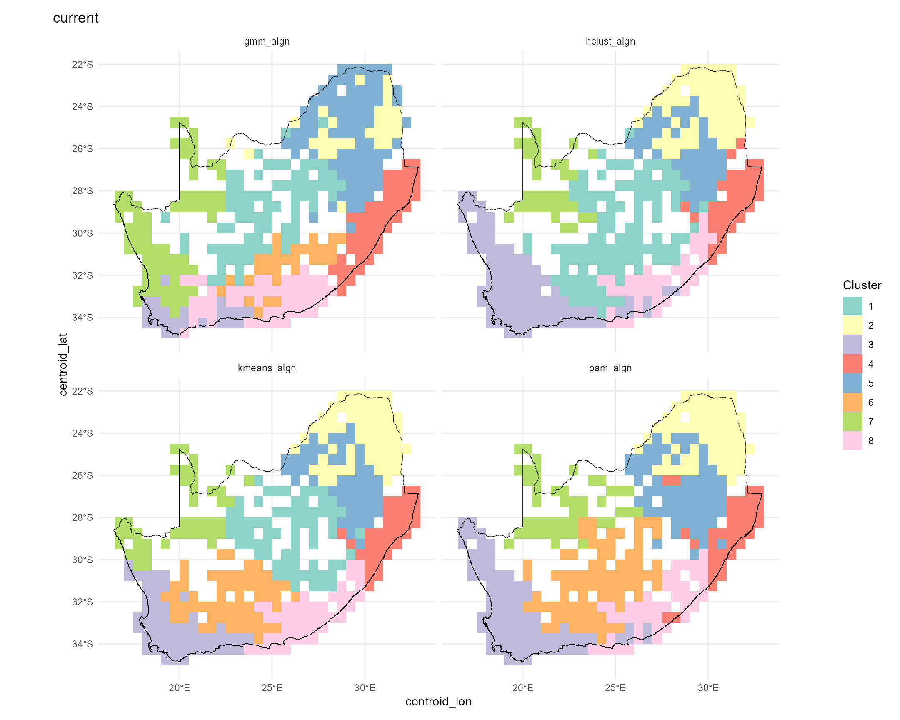
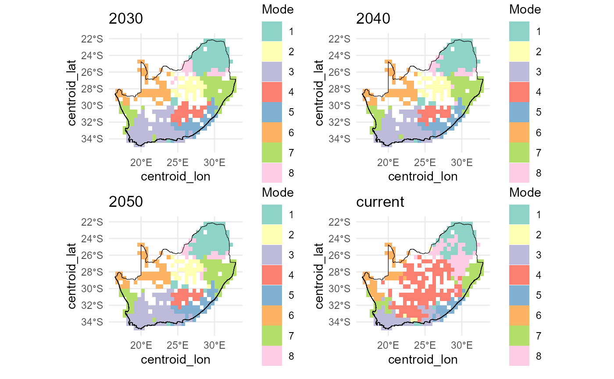
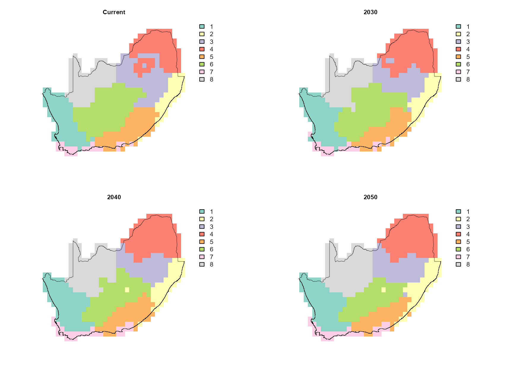

# Map bioregions

## `dissmapr`

### A Novel Framework for Automated Compositional Dissimilarity and Biodiversity Turnover Analysis

#### 1. Run clustering analyses using `map_bioreg()` to map bioregions

In this step we translate our site‐level ζ₂ predictions into spatial
bioregions. Calling
[`map_bioreg()`](https://b-cubed-eu.github.io/dissmapr/reference/map_bioreg.md)
on the predictors_df does the following:

1.  z-scales the predicted turnover, longitude and latitude;
2.  fits four clustering algorithms (k-means, PAM, hierarchical and
    GMM);

- **k-means** partitions points around centroids and is fast for large
  data sets.
- **PAM** (Partitioning Around Medoids) is a medoid-based analogue of
  k-means that is more robust to outliers.
- **Hierarchical** agglomerative clustering builds a dendrogram and then
  “cuts” it at the chosen k, capturing nested structure in the data.
- **GMM** (Gaussian Mixture Model) treats clusters as multivariate
  normal distributions and assigns each point by maximum likelihood.

3.  realigns each method’s labels to the k-means solution for
    consistency;
4.  builds both nearest-neighbour and thin-plate-spline interpolated
    surfaces;
5.  returns the raw cluster assignments and gridded rasters, and—because
    `show_plot=TRUE`—draws a 2×2 panel of maps.

The result is a set of complementary bioregion maps and rasters you can
use to compare how different algorithms partition the landscape based on
compositional turnover and geography.

``` r
# Add this to {, fig.width=11.25, fig.height=9, warning=FALSE, message=FALSE}
# Run `map_bioreg` function to generate and plot clusters
bioreg_current = dissmapr::map_bioreg(
  data = predictors_df,
  scale_cols = c("pred_zetaExp", "centroid_lon", "centroid_lat"),
  method = 'all', # Options: c("kmeans","pam","hclust","gmm","all"),
  k_override  = 8,
  interpolate = 'nn', # Options: c("none","nn","tps","all"),
  x_col ='centroid_lon',
  y_col ='centroid_lat',
  res = 0.5, 
  crs = "EPSG:4326",
  plot = TRUE,
  bndy_fc = rsa)
```



``` r

# Check results
str(bioreg_current, max.level=1)
#> List of 6
#>  $ none   :List of 1
#>  $ nn     :List of 1
#>  $ tps    : NULL
#>  $ table  :'data.frame': 415 obs. of  24 variables:
#>  $ plots  :List of 1
#>  $ methods: chr [1:4] "kmeans" "pam" "hclust" "gmm"
```

#### 2. Map future bioregions using `map_bioreg()`

Below we expand our workflow to map the forecasted ζ₂ bioregions under
three extreme climate futures (2030, 2040, 2050) alongside the current
scenario. To see how the bioregional partitions shift, we split
`all_preds` by scenario and apply
[`map_bioreg()`](https://b-cubed-eu.github.io/dissmapr/reference/map_bioreg.md)
(k-means + hierarchical, both NN and TPS interpolation). We then extract
the hierarchical cluster layers, mask them to our study area, and plot
all four maps in a 2×2 layout:

``` r
# Split your combined predictions by scenario into a named list
by_scn = split(all_preds, all_preds$scenario)

# For each scenario, call map_bioreg() with all algorithms
bioreg_future = dissmapr::map_bioreg(
  data = by_scn,
  scale_cols = c("pred_zetaExp", "centroid_lon", "centroid_lat"),
  method = 'all', # Options: c("kmeans","pam","hclust","gmm","all"),
  k_override  = 8,
  interpolate = 'nn', # Options: c("none","nn","tps","all"),
  x_col ='centroid_lon',
  y_col ='centroid_lat',
  res = 0.5, 
  crs = "EPSG:4326",
  plot = TRUE,
  bndy_fc = rsa)
```



``` r

# Check results
str(bioreg_future, max.level=1)
#> List of 6
#>  $ none   :List of 4
#>  $ nn     :List of 4
#>  $ tps    : NULL
#>  $ table  :'data.frame': 1660 obs. of  24 variables:
#>  $ plots  :List of 4
#>  $ methods: chr [1:4] "kmeans" "pam" "hclust" "gmm"
```

Below we visualise the nearest-neighbour interpolated future‐scenario
cluster outputs. First, we list the structure of the `bioreg_future`
result to confirm available components. We then combine the k-means
nearest-neighbour rasters for “current” and each future year into a
single `SpatRaster` stack (`future_nn`), and resample, then mask it to
the RSA boundary (`mask_future_nn`). Finally, we lay out a 2×2 plot
grid, compute a discrete colour palette for each layer based on its
unique classes, and render each masked layer with its boundary overlay
for a quick inspection of bioregion changes across time.

``` r
# Check results
str(bioreg_future, max.level=1)
#> List of 6
#>  $ none   :List of 4
#>  $ nn     :List of 4
#>  $ tps    : NULL
#>  $ table  :'data.frame': 1660 obs. of  24 variables:
#>  $ plots  :List of 4
#>  $ methods: chr [1:4] "kmeans" "pam" "hclust" "gmm"

# Create SpatRast
# future_nn = c(bioreg_future$nn$current$kmeans_current,
#              bioreg_future$nn$`2030`$kmeans_2030,
#              bioreg_future$nn$`2040`$kmeans_2040,
#              bioreg_future$nn$`2050`$kmeans_2050)
names(future_nn)
#> [1] "kmeans_current" "kmeans_2030"    "kmeans_2040"    "kmeans_2050"

# 4) Mask `result_bioregDiff` to the RSA boundary
mask_future_nn = terra::mask(resample(future_nn, grid_masked, method = "modal"), grid_masked)

# 5) Quick visual QC in a 2×2 layout
old_par = par(mfrow = c(2, 2), mar = c(1, 1, 1, 5))
titles = c("Current",
            "2030",
            "2040",
            "2050")

for (i in 1:4) {
  ## 1. how many distinct classes in this layer?
  cls  = sort(unique(values(mask_future_nn[[i]])))
  cls  = cls[!is.na(cls)]
  n    = length(cls)

  ## 2. build a discrete palette of n colours
  pal = if (n <= 12) {
           RColorBrewer::brewer.pal(n, "Set3")                      # native Set3
         } else {
           colorRampPalette(brewer.pal(12, "Set3"))(n) # extended Set3
         }

  ## 3. plot
  plot(mask_future_nn[[i]],
       col      = pal,
       type     = "classes",          # treats values as categories
       colNA    = NA,
       axes     = FALSE,
       legend   = TRUE,
       main     = titles[i],
       cex.main = 0.8)

  plot(terra::vect(rsa), add = TRUE, border = "black", lwd = .4)
}
```



``` r

par(old_par)
```

This end-to-end workflow shows how predicted turnover patterns and
resulting bioregions might shift as climate warms and rainfall changes,
highlighting potential future reorganization of biodiversity hotspots.

``` r
sessionInfo()
#> R version 4.5.2 (2025-10-31 ucrt)
#> Platform: x86_64-w64-mingw32/x64
#> Running under: Windows 11 x64 (build 26200)
#> 
#> Matrix products: default
#>   LAPACK version 3.12.1
#> 
#> locale:
#> [1] LC_COLLATE=English_South Africa.utf8  LC_CTYPE=English_South Africa.utf8   
#> [3] LC_MONETARY=English_South Africa.utf8 LC_NUMERIC=C                         
#> [5] LC_TIME=English_South Africa.utf8    
#> 
#> time zone: Africa/Johannesburg
#> tzcode source: internal
#> 
#> attached base packages:
#> [1] stats     graphics  grDevices datasets  utils     methods   base     
#> 
#> other attached packages:
#> [1] RColorBrewer_1.1-3 terra_1.9-34      
#> 
#> loaded via a namespace (and not attached):
#>   [1] DBI_1.3.0            pbapply_1.7-4        geodata_0.6-9       
#>   [4] pROC_1.19.0.1        permute_0.9-10       rlang_1.2.0         
#>   [7] magrittr_2.0.5       otel_0.2.0           e1071_1.7-17        
#>  [10] compiler_4.5.2       mgcv_1.9-4           systemfonts_1.3.2   
#>  [13] vctrs_0.7.3          maps_3.4.3           reshape2_1.4.5      
#>  [16] stringr_1.6.0        pkgconfig_2.0.3      fastmap_1.2.0       
#>  [19] rmarkdown_2.31       prodlim_2026.03.11   dissmapr_0.2.0      
#>  [22] ragg_1.5.2           purrr_1.2.2          xfun_0.59           
#>  [25] cachem_1.1.0         jsonlite_2.0.0       recipes_1.3.3       
#>  [28] parallel_4.5.2       cluster_2.1.8.2      R6_2.6.1            
#>  [31] bslib_0.11.0         stringi_1.8.7        parallelly_1.47.0   
#>  [34] rpart_4.1.27         lubridate_1.9.5      jquerylib_0.1.4     
#>  [37] estimability_1.5.1   Rcpp_1.1.1-1.1       iterators_1.0.14    
#>  [40] knitr_1.51           future.apply_1.20.2  fields_17.3         
#>  [43] zoo_1.8-15           Matrix_1.7-5         splines_4.5.2       
#>  [46] nnet_7.3-20          timechange_0.4.0     tidyselect_1.2.1    
#>  [49] rstudioapi_0.19.0    yaml_2.3.12          vegan_2.7-5         
#>  [52] timeDate_4052.112    codetools_0.2-20     listenv_1.0.0       
#>  [55] lattice_0.22-9       tibble_3.3.1         plyr_1.8.9          
#>  [58] withr_3.0.3          S7_0.2.2             geosphere_1.6-8     
#>  [61] evaluate_1.0.5       sf_1.1-1             future_1.70.0       
#>  [64] desc_1.4.3           survival_3.8-6       units_1.0-1         
#>  [67] proxy_0.4-29         mclust_6.1.2         pillar_1.11.1       
#>  [70] KernSmooth_2.23-26   corrplot_0.95        renv_1.1.4          
#>  [73] foreach_1.5.2        stats4_4.5.2         generics_0.1.4      
#>  [76] zetadiv_1.3.0        ggplot2_4.0.3        scales_1.4.0        
#>  [79] globals_0.19.1       xtable_1.8-8         class_7.3-23        
#>  [82] glue_1.8.1           clValid_0.7          emmeans_2.0.3       
#>  [85] tools_4.5.2          data.table_1.18.4    ModelMetrics_1.2.2.2
#>  [88] gower_1.0.2          fs_2.1.0             mvtnorm_1.4-1       
#>  [91] dotCall64_1.2        grid_4.5.2           tidyr_1.3.2         
#>  [94] ipred_0.9-15         patchwork_1.3.2      nlme_3.1-169        
#>  [97] cli_3.6.6            rappdirs_0.3.4       textshaping_1.0.5   
#> [100] NbClust_3.0.1        spam_2.11-4          viridisLite_0.4.3   
#> [103] lava_1.9.1           scam_1.2-22          dplyr_1.2.1         
#> [106] gtable_0.3.6         sass_0.4.10          digest_0.6.39       
#> [109] classInt_0.4-11      caret_7.0-1          ggrepel_0.9.8       
#> [112] htmlwidgets_1.6.4    farver_2.1.2         entropy_1.3.2       
#> [115] htmltools_0.5.9      pkgdown_2.2.0        lifecycle_1.0.5     
#> [118] factoextra_2.0.0     httr_1.4.8           hardhat_1.4.3       
#> [121] MASS_7.3-65
```
