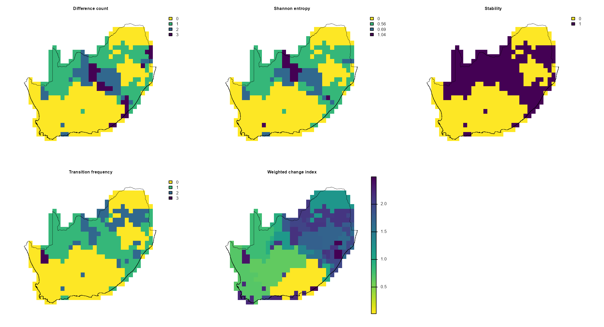
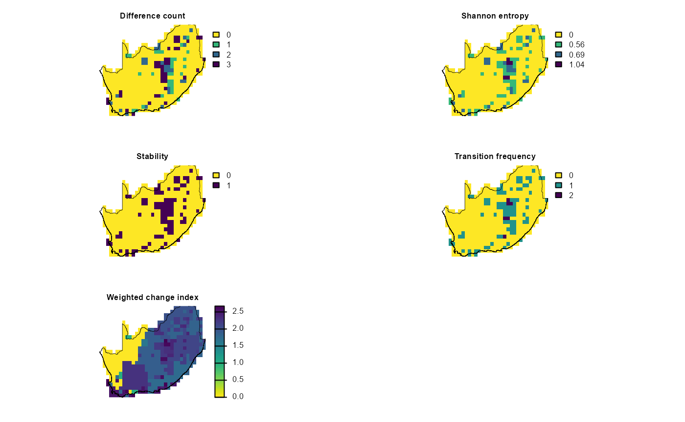

# Map bioregion change

## `dissmapr`

### A Novel Framework for Automated Compositional Dissimilarity and Biodiversity Turnover Analysis

#### 1. Map sensitivity of bioregion delineation to clustering method using `map_bioregDiff()`

In the sections below we use
[`map_bioregDiff()`](https://b-cubed-eu.github.io/dissmapr/reference/map_bioregDiff.md)
to assess how much our four clustering algorithms disagree (a
sensitivity check). Here we treat the various cluster maps generated
with
[`map_bioreg()`](https://b-cubed-eu.github.io/dissmapr/reference/map_bioreg.md)
(k-means, PAM, hierarchical and GMM) as a sensitivity analysis. By
feeding all four algorithm outputs into
[`map_bioregDiff()`](https://b-cubed-eu.github.io/dissmapr/reference/map_bioregDiff.md),
we quantify where and how much those methods disagree. This shows which
areas are robust to algorithm choice and which are method‐dependent.

**Change-metric options in
[`map_bioregDiff()`](https://b-cubed-eu.github.io/dissmapr/reference/map_bioregDiff.md)
include** (`approach` argument):

- **difference_count**: counts how many times a cell’s label deviates
  from the first layer.  
- **shannon_entropy**: Shannon entropy of the label sequence, a measure
  of within-cell diversity.  
- **stability**: proportion of layers in which the label is unchanged (1
  = always stable, 0 = always different).  
- **transition_frequency**: total number of label flips between
  consecutive layers, showing how often change occurs.  
- **weighted_change_index**: cumulative change weighted by a
  dissimilarity matrix so rare or large transitions score higher.  
- **all** (default): returns a five-layer `SpatRaster` containing every
  metric.

``` r
# Get current nn rasters
# current_nn = c(bioreg_current$nn$current$kmeans_algn_current,
#              bioreg_current$nn$current$pam_algn_current,
#              bioreg_current$nn$current$hclust_algn_current,
#              bioreg_current$nn$current$gmm_algn_current)
names(current_nn)
#> [1] "kmeans_algn_current" "pam_algn_current"    "hclust_algn_current"
#> [4] "gmm_algn_current"

# Run `map_bioregDiff`
# 'approach', specifies which metric to compute:
sens_bioregDiff = dissmapr::map_bioregDiff(
  current_nn,
  approach = "all"
)

# Inspect the output layers
sens_bioregDiff
#> class       : SpatRaster
#> size        : 25, 32, 5  (nrow, ncol, nlyr)
#> resolution  : 0.5, 0.4999984  (x, y)
#> extent      : 16.75, 32.75, -34.75, -22.25004  (xmin, xmax, ymin, ymax)
#> coord. ref. : lon/lat WGS 84 (EPSG:4326)
#> source(s)   : memory
#> varnames    : 
#>               
#>               
#>               current_nn
#>               
#> names       : Differ~_Count, Shanno~ntropy, Stability, Transi~quency, Weight~_Index
#> min values  :             0,            -0,         0,             0,      0.016949
#> max values  :             3,      1.039721,         1,             3,      2.990113

# Crop to our study area and prepare for plotting
mask_sens_bioregDiff = terra::mask(
  terra::resample(sens_bioregDiff, grid_masked, method = "near"),
  grid_masked
)

# Quick visual QC in a 3×2 layout
old_par = par(mfrow = c(3, 2), mar = c(1, 1, 1, 5))
titles = c("Difference count", "Shannon entropy", "Stability",
           "Transition frequency", "Weighted change index")

for (i in seq_along(titles)) {
  plot(mask_sens_bioregDiff[[i]],
       col      = viridis(100, direction = -1),
       colNA    = NA,
       axes     = FALSE,
       main     = titles[i],
       cex.main = 0.8)
  plot(terra::vect(rsa), add = TRUE, border = "black", lwd = 0.4)
}
par(old_par)
```



#### 2. Map bioregion sensitivity to future change using `map_bioregDiff()`

Here we use
[`map_bioregDiff()`](https://b-cubed-eu.github.io/dissmapr/reference/map_bioregDiff.md)
to track how the hierarchical‐cluster map itself changes under three
future climate scenarios. Focusing solely on the hierarchical solution
we map bioregion change across time. First we stack the hierarchical
clusters for today, 2030, 2040 and 2050, run
[`map_bioregDiff()`](https://b-cubed-eu.github.io/dissmapr/reference/map_bioregDiff.md)
on that series, and highlight how bioregions shift under these future
climate projections. In this way we isolate climate-driven
reorganization in the hierarchical map itself.

``` r
# 1. Build a multi‐layer SpatRaster of hierarchical clusters for each scenario
# Create SpatRast
# future_hclt = c(bioreg_future$nn$current$hclust_current,
#              bioreg_future$nn$`2030`$hclust_2030,
#              bioreg_future$nn$`2040`$hclust_2040,
#              bioreg_future$nn$`2050`$hclust_2050)
names(future_hclt)
#> [1] "hclust_current" "hclust_2030"    "hclust_2040"    "hclust_2050"

# 2. Compute change metrics across those four layers
future_bioregDiff = dissmapr::map_bioregDiff(future_hclt, approach = "all")

# 3. Mask to your RSA boundary (assuming 'grid_masked' is your template)
mask_future_bioregDiff = terra::mask(
  terra::resample(future_bioregDiff, grid_masked, method = "near"),
  grid_masked
)

# 4. Plot all five metrics in a 3×2 panel
old_par = par(mfrow = c(3, 2), mar = c(1, 1, 1, 5))
titles = c(
  "Difference count",
  "Shannon entropy",
  "Stability",
  "Transition frequency",
  "Weighted change index"
)
for (i in seq_along(titles)) {
  plot(
    mask_future_bioregDiff[[i]],
    # col      = viridisLite::turbo(100),
    col      = viridis(100, direction = -1),
    colNA    = NA,
    axes     = FALSE,
    main     = titles[i],
    cex.main = 0.8
  )
  plot(terra::vect(rsa), add = TRUE, border = "black", lwd = 0.4)
}
par(old_par)
```



``` r
sessionInfo()
#> R version 4.5.2 (2025-10-31 ucrt)
#> Platform: x86_64-w64-mingw32/x64
#> Running under: Windows 11 x64 (build 26200)
#> 
#> Matrix products: default
#>   LAPACK version 3.12.1
#> 
#> locale:
#> [1] LC_COLLATE=English_South Africa.utf8  LC_CTYPE=English_South Africa.utf8   
#> [3] LC_MONETARY=English_South Africa.utf8 LC_NUMERIC=C                         
#> [5] LC_TIME=English_South Africa.utf8    
#> 
#> time zone: Africa/Johannesburg
#> tzcode source: internal
#> 
#> attached base packages:
#> [1] stats     graphics  grDevices datasets  utils     methods   base     
#> 
#> other attached packages:
#> [1] terra_1.9-34      viridis_0.6.5     viridisLite_0.4.3
#> 
#> loaded via a namespace (and not attached):
#>   [1] DBI_1.3.0            pbapply_1.7-4        geodata_0.6-9       
#>   [4] pROC_1.19.0.1        gridExtra_2.3        permute_0.9-10      
#>   [7] rlang_1.2.0          magrittr_2.0.5       otel_0.2.0          
#>  [10] e1071_1.7-17         compiler_4.5.2       mgcv_1.9-4          
#>  [13] systemfonts_1.3.2    vctrs_0.7.3          maps_3.4.3          
#>  [16] reshape2_1.4.5       stringr_1.6.0        pkgconfig_2.0.3     
#>  [19] fastmap_1.2.0        rmarkdown_2.31       prodlim_2026.03.11  
#>  [22] dissmapr_0.2.0       ragg_1.5.2           purrr_1.2.2         
#>  [25] xfun_0.59            cachem_1.1.0         jsonlite_2.0.0      
#>  [28] recipes_1.3.3        parallel_4.5.2       cluster_2.1.8.2     
#>  [31] R6_2.6.1             bslib_0.11.0         stringi_1.8.7       
#>  [34] RColorBrewer_1.1-3   parallelly_1.47.0    rpart_4.1.27        
#>  [37] lubridate_1.9.5      jquerylib_0.1.4      estimability_1.5.1  
#>  [40] Rcpp_1.1.1-1.1       iterators_1.0.14     knitr_1.51          
#>  [43] future.apply_1.20.2  fields_17.3          zoo_1.8-15          
#>  [46] Matrix_1.7-5         splines_4.5.2        nnet_7.3-20         
#>  [49] timechange_0.4.0     tidyselect_1.2.1     rstudioapi_0.19.0   
#>  [52] yaml_2.3.12          vegan_2.7-5          timeDate_4052.112   
#>  [55] codetools_0.2-20     listenv_1.0.0        lattice_0.22-9      
#>  [58] tibble_3.3.1         plyr_1.8.9           withr_3.0.3         
#>  [61] S7_0.2.2             geosphere_1.6-8      evaluate_1.0.5      
#>  [64] sf_1.1-1             future_1.70.0        desc_1.4.3          
#>  [67] survival_3.8-6       units_1.0-1          proxy_0.4-29        
#>  [70] mclust_6.1.2         pillar_1.11.1        KernSmooth_2.23-26  
#>  [73] corrplot_0.95        renv_1.1.4           foreach_1.5.2       
#>  [76] stats4_4.5.2         generics_0.1.4       zetadiv_1.3.0       
#>  [79] ggplot2_4.0.3        scales_1.4.0         globals_0.19.1      
#>  [82] xtable_1.8-8         class_7.3-23         glue_1.8.1          
#>  [85] clValid_0.7          emmeans_2.0.3        tools_4.5.2         
#>  [88] data.table_1.18.4    ModelMetrics_1.2.2.2 gower_1.0.2         
#>  [91] fs_2.1.0             mvtnorm_1.4-1        dotCall64_1.2       
#>  [94] grid_4.5.2           tidyr_1.3.2          ipred_0.9-15        
#>  [97] patchwork_1.3.2      nlme_3.1-169         cli_3.6.6           
#> [100] rappdirs_0.3.4       textshaping_1.0.5    NbClust_3.0.1       
#> [103] spam_2.11-4          lava_1.9.1           scam_1.2-22         
#> [106] dplyr_1.2.1          gtable_0.3.6         sass_0.4.10         
#> [109] digest_0.6.39        classInt_0.4-11      caret_7.0-1         
#> [112] ggrepel_0.9.8        htmlwidgets_1.6.4    farver_2.1.2        
#> [115] entropy_1.3.2        htmltools_0.5.9      pkgdown_2.2.0       
#> [118] lifecycle_1.0.5      factoextra_2.0.0     httr_1.4.8          
#> [121] hardhat_1.4.3        MASS_7.3-65
```
