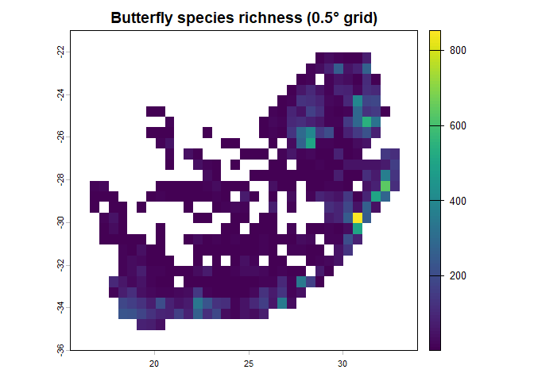

# dissmapr

## A Workflow for Compositional Dissimilarity and Biodiversity Turnover Analysis

`dissmapr` is an open-source R package that provides a complete,
reproducible workflow for analysing how biological communities change
across space and time. Rather than focusing on the predicted occurrence
of individual species, it quantifies variation in **assemblage
composition** — a *community-level* perspective on biodiversity change.
It is designed to work with standardised species-occurrence records from
biodiversity data infrastructures such as [GBIF](https://www.gbif.org/),
and can be applied to any taxon, region, or time period where sufficient
occurrence data are available.

The framework combines occurrence records with environmental covariates
to compute **multi-site compositional turnover** using order-wise
metrics such as **zeta diversity**. These dissimilarities are linked to
environmental and geographic drivers through predictive models, allowing
users to generate **turnover surfaces**, delineate **bioregions**, and
assess how community structure may **reorganise under future
conditions** — all fully scripted, from raw data to final mapped
outputs.

The result is the **Dissimilarity Cube**: one of the
[B-Cubed](https://b-cubed.eu/) family of biodiversity data products
(alongside Suitability and Invasibility Cubes) that turns biodiversity
records into mappable signals of community change, helping to identify
stable regions, shifting assemblages, and areas at risk of ecological
reorganisation.

## Why community-level analysis?

Single-species models are powerful for targeted assessments, but they
cannot reveal the *emergent* properties of assemblages — the coherence
of species pools, the integrity of functional groups, or the degree to
which novel community combinations are forming. Traditional **beta
diversity** captures differences between two assemblages, yet ecological
processes operate simultaneously across **many** sites. `dissmapr`
formalises **multi-site** dissimilarity, enabling consistent
quantification and modelling of compositional change across spatial and
temporal scales.

This matters for policy. Frameworks such as the **Kunming-Montreal
Global Biodiversity Framework** and the **EU Biodiversity Strategy for
2030** increasingly require indicators that reflect the state and
trajectory of ecosystems *as a whole*, not merely the status of
individual species. By linking compositional turnover to environmental
drivers, `dissmapr` also enables **scenario-based** assessment that
informs proactive — rather than reactive — management.

## Zeta diversity: beyond pairwise comparisons

**Zeta diversity** (ζ) generalises beta diversity by quantifying the
number of species shared across *i* sites, extending analysis beyond
pairwise comparisons. Lower orders (ζ₂, ζ₃) represent turnover among
**rare or localised** species, whereas higher orders capture turnover in
**widespread, common** species. The rate of **zeta decline** with
increasing order quantifies the overall rate of compositional turnover:
steep declines indicate high turnover (few species in common among
sites), while shallow declines suggest more homogeneous assemblages.


*Conceptual Venn diagram of zeta diversity, showing species shared
across increasing numbers of sites (zeta-orders). At ζ₁ (a single site)
zeta equals local species richness; at ζ₂ it counts species shared
between pairs of sites; at higher orders progressively fewer species are
held in common.*

## The dissmapr workflow

The workflow is modular and fully scripted, so each stage is transparent
and repeatable. It is organised in three phases:

1.  **Inputs & setup** — define the study region and spatial resolution,
    acquire species-occurrence data (e.g. from GBIF via `rgbif`),
    assemble environmental predictor layers, and harmonise everything
    onto a common grid as site-by-species and site-by-environment
    matrices.
2.  **From data to dissimilarity** — compute order-wise **zeta**
    diversity (via the
    [`zetadiv`](https://cran.r-project.org/package=zetadiv) package) and
    relate it to environmental and geographic predictors using
    **Multi-Site Generalised Dissimilarity Modelling (MS-GDM)** with
    monotonic i-splines.
3.  **Prediction, mapping & scenarios** — predict continuous turnover
    surfaces, cluster them into **bioregions**, and propagate the fitted
    models to alternative (e.g. future-climate) scenarios to forecast
    shifting community boundaries.


## Installation

Install from GitHub using:

``` r

# install.packages("remotes")
remotes::install_github("b-cubed-eu/dissmapr")
```

## A minimal, reproducible example

The example below runs end-to-end on the GBIF butterfly dataset for
South Africa that ships with the package, moving from **occurrence
records** to a gridded **species-richness** map. Every input is loaded
with [`system.file()`](https://rdrr.io/r/base/system.file.html), so the
example is fully self-contained and reproducible.

``` r

library(dissmapr)

# 1. Load the example occurrence dataset shipped with the package
load(system.file("extdata", "gbif_butterflies_csv.RData", package = "dissmapr"))

# 2. Import and harmonise the occurrence records
occ <- get_occurrence_data(
  data        = gbif_butterflies_csv,
  source_type = "data_frame"
)

# 3. Reshape into long (site_obs) and wide (site_spp) tables
fmt <- format_df(
  data        = occ,
  species_col = "verbatimScientificName",
  value_col   = "pa",
  format      = "long"
)
site_spp <- fmt$site_spp

# 4. Summarise records onto a 0.5-degree grid
grid <- generate_grid(
  data      = site_spp,
  x_col     = "x",
  y_col     = "y",
  grid_size = 0.5,
  sum_cols  = 4:ncol(site_spp),
  crs_epsg  = 4326
)

# 5. Map gridded species richness
terra::plot(grid$grid_r[["spp_rich"]],
            main = "Butterfly species richness (0.5° grid)")
```



The full, step-by-step tutorials — from data acquisition through MS-GDM,
prediction, and bioregionalisation — are available under
[Articles](https://b-cubed-eu.github.io/dissmapr/articles/) on the
package website.

## From turnover to bioregions

The complete workflow turns occurrence records into interpretable,
mapped products. The MS-GDM engine
([`run_ispline_models()`](https://b-cubed-eu.github.io/dissmapr/reference/run_ispline_models.md))
fits monotonic **i-spline** curves that quantify how compositional
turnover responds to each environmental gradient:


*I-spline partial-dependence curves from the MS-GDM. Steeper slopes mark
environmental ranges where small changes drive large shifts in community
composition; flat regions indicate relative compositional stability.*

Predicted turnover surfaces are then clustered into **data-driven
bioregions**
([`map_bioreg()`](https://b-cubed-eu.github.io/dissmapr/reference/map_bioreg.md))
— ecologically coherent units defined by species co-occurrence rather
than administrative boundaries:


*Bioregional partitions of South Africa derived from butterfly
assemblage turnover (ζ₂), shown for several clustering algorithms. Areas
of consistent classification mark core bioregions; divergent areas mark
transition zones.*

Finally,
[`map_bioregDiff()`](https://b-cubed-eu.github.io/dissmapr/reference/map_bioregDiff.md)
compares baseline and scenario-projected bioregions to highlight where
communities are expected to **reorganise** under environmental change:


*Areas of expected community reorganisation under alternative
environmental futures — flagging priority areas for monitoring and
adaptive management.*

## Package functions

The package consists of **10 core functions** spanning the full
pipeline, three **ζ-MSGDM** workflow helpers, and a suite of
**order-wise metrics**.

### Core functions

- [`get_occurrence_data()`](https://b-cubed-eu.github.io/dissmapr/reference/get_occurrence_data.md)
  – Import and harmonise biodiversity-occurrence data.
- [`generate_grid()`](https://b-cubed-eu.github.io/dissmapr/reference/generate_grid.md)
  – Generate spatial grids and gridded summaries.
- [`assign_mapsheet()`](https://b-cubed-eu.github.io/dissmapr/reference/assign_mapsheet.md)
  – Add nearest mapsheet codes and centre coordinates.
- [`get_enviro_data()`](https://b-cubed-eu.github.io/dissmapr/reference/get_enviro_data.md)
  – Retrieve, crop, resample, and link environmental rasters to sites.
- [`format_df()`](https://b-cubed-eu.github.io/dissmapr/reference/format_df.md)
  – Format biodiversity records to long/wide forms for analysis.
- [`compute_orderwise()`](https://b-cubed-eu.github.io/dissmapr/reference/compute_orderwise.md)
  – Compute order-wise metrics, including zeta diversity and
  dissimilarities.
- [`rm_correlated()`](https://b-cubed-eu.github.io/dissmapr/reference/rm_correlated.md)
  – Remove highly correlated predictors to avoid redundancy.
- [`predict_dissim()`](https://b-cubed-eu.github.io/dissmapr/reference/predict_dissim.md)
  – Predict pairwise compositional turnover (zeta-dissimilarity) with
  richness.
- [`map_bioreg()`](https://b-cubed-eu.github.io/dissmapr/reference/map_bioreg.md)
  – Raster-based clustering and interpolation of bioregional data.
- [`map_bioregDiff()`](https://b-cubed-eu.github.io/dissmapr/reference/map_bioregDiff.md)
  – Map bioregional change metrics between categorical raster layers.

### ζ-MSGDM workflow

- [`run_ispline_models()`](https://b-cubed-eu.github.io/dissmapr/reference/run_ispline_models.md)
  – Fit multiple
  [`zetadiv::Zeta.msgdm`](https://rdrr.io/pkg/zetadiv/man/Zeta.msgdm.html)
  i-spline models and return the models plus a combined i-spline table.
- [`plot_ispline_lines()`](https://b-cubed-eu.github.io/dissmapr/reference/plot_ispline_lines.md)
  – Plot i-spline partial effects with quantile and start-point markers.
- [`plot_ispline_boxplots()`](https://b-cubed-eu.github.io/dissmapr/reference/plot_ispline_boxplots.md)
  – Plot facetted boxplots for all i-spline basis functions.

### Available metrics

Use `helper_indices` to choose a metric for the `func` argument of
[`compute_orderwise()`](https://b-cubed-eu.github.io/dissmapr/reference/compute_orderwise.md):
[`richness()`](https://b-cubed-eu.github.io/dissmapr/reference/richness.md),
[`turnover()`](https://b-cubed-eu.github.io/dissmapr/reference/turnover.md),
[`abund()`](https://b-cubed-eu.github.io/dissmapr/reference/abund.md),
[`phi_coef()`](https://b-cubed-eu.github.io/dissmapr/reference/phi_coef.md),
[`cor_spear()`](https://b-cubed-eu.github.io/dissmapr/reference/cor_spear.md),
[`cor_pears()`](https://b-cubed-eu.github.io/dissmapr/reference/cor_pears.md),
[`diss_bcurt()`](https://b-cubed-eu.github.io/dissmapr/reference/diss_bcurt.md)
(Bray–Curtis),
[`orderwise_diss_gower()`](https://b-cubed-eu.github.io/dissmapr/reference/orderwise_diss_gower.md)
(Gower),
[`mutual_info()`](https://b-cubed-eu.github.io/dissmapr/reference/mutual_info.md),
and
[`geodist_helper()`](https://b-cubed-eu.github.io/dissmapr/reference/geodist_helper.md)
(Haversine geographic distance).

## Applications

- **Researchers** – a standardised, reproducible platform for
  investigating the drivers and spatial patterns of community turnover;
  supports comparative studies across taxa, temporal change analyses,
  and methodological experiments.
- **Conservation planners** – a data-driven foundation for spatial
  prioritisation and network design: bioregional maps identify
  management units, turnover surfaces highlight transition zones, and
  change maps pinpoint areas of anticipated reorganisation.
- **Policy** – community-level indicators (rate of community change,
  stability of bioregional boundaries, emergence of novel assemblages)
  that complement species-level indicators required by the
  Kunming-Montreal Global Biodiversity Framework and the EU Biodiversity
  Strategy for 2030.

## Citation

When using `dissmapr`, please cite the package — run
`citation("dissmapr")` for the current entry — together with the methods
it builds on:

- Hui, C. & McGeoch, M.A. (2014). Zeta diversity as a concept and metric
  that unifies incidence-based biodiversity patterns. *The American
  Naturalist*, 184, 684–694.
- Latombe, G., Hui, C. & McGeoch, M.A. (2017). Multi-site generalised
  dissimilarity modelling: using zeta diversity to differentiate drivers
  of turnover in rare and widespread species. *Methods in Ecology and
  Evolution*, 8, 431–442.
- McGeoch, M.A., Latombe, G., Andrew, N.R., *et al.* (2019). Measuring
  continuous compositional change using decline and decay in zeta
  diversity. *Ecology*, 100, e02832.
- Ferrier, S., Manion, G., Elith, J. & Richardson, K. (2007). Using
  generalised dissimilarity modelling to analyse and predict patterns of
  beta diversity in regional biodiversity assessment. *Diversity and
  Distributions*, 13, 252–264.

------------------------------------------------------------------------

`dissmapr` was developed within the [B-Cubed](https://b-cubed.eu/)
project (Biodiversity Building Blocks for policy), funded by
